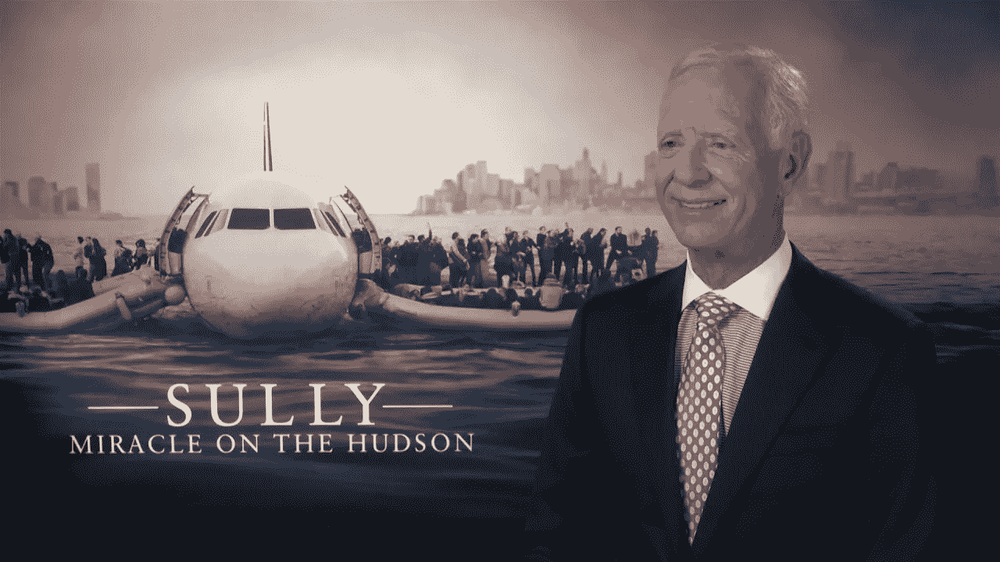

# 这个世界需要更多像

> 原文：<https://medium.com/nerd-for-tech/the-world-needs-more-pilots-like-cb1d8ab3a65?source=collection_archive---------15----------------------->

## 船长，切斯利·舒伦伯格

关于航空业，有很多想法要说，飞机如何更好地设计，驾驶舱应该如何设计和操作，以及这个行业在这个困难的疫情时代后应该如何行动，但我认为最好从记住那些安全旅行的人才开始，当飞机不能正常运行时，他们拯救了他们。他们是从 T2 Catia T3 的飞机到购买它的客机的操作人员。像莱特兄弟一样，[萨利机长](http://sullysullenberger.com)是那些让我们仍然相信飞机能够让我们感觉到作为一个人的能力和力量的人之一，因为如果你相信进化论，你会清楚地看到鸽子花了几千年才获得飞行技能，而我们人类只用了几年就造出了像飞机这样漂亮的技术。但我认为，这个行业应该向前迈出一大步，因为它受到经济因素的制约，只能进行渐进式创新，因为它需要大量的物流和业务变革来进行颠覆性创新。试图建造像 A380 这样更大的飞机教会了我们这一点。飞机现在越来越复杂，自动化程度越来越高，飞行员对它的掌控越来越少，而计算机和操纵员承担了最困难的部分，但有一个像萨利机长这样技术熟练，也许有点运气的机长，让一架没有引擎的飞机在河上安全着陆总是有帮助的。如果这是运气的话，我希望每个飞行员都是如此，但技巧很可能与这次成功着陆有关。然后，我希望所有的飞行员在客机的帮助下，总是努力达到他们的最高技能，并且当他们在驾驶舱作为办公室时，总是保持警觉和专业。

PS:我在航空业收集的数据中看到了一些关键的见解，我将在这里分享它们，但我担心它们最终会成为像下面这样的数据驱动的书

为早期读者提供我即将出版的数据驱动的书《Gametop，剖析股票空头泡沫》。 [*此处*](http://clickmetertracking.com/ihgk)