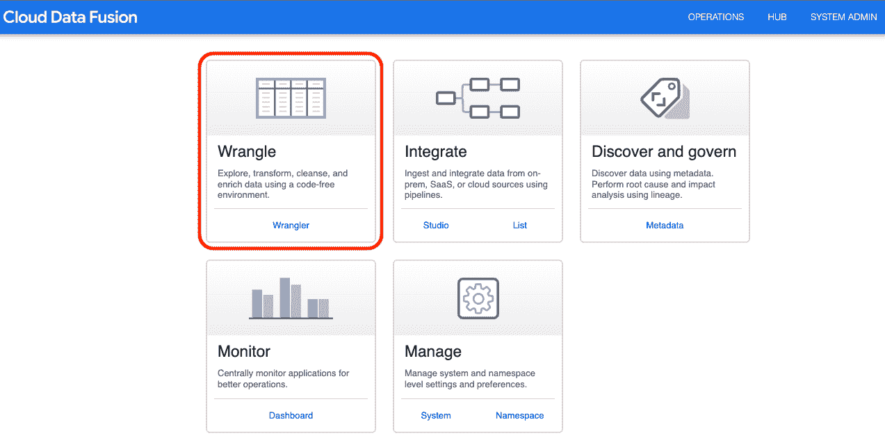
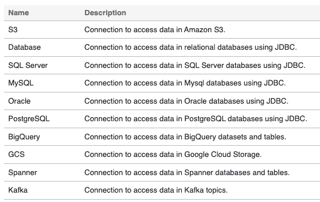
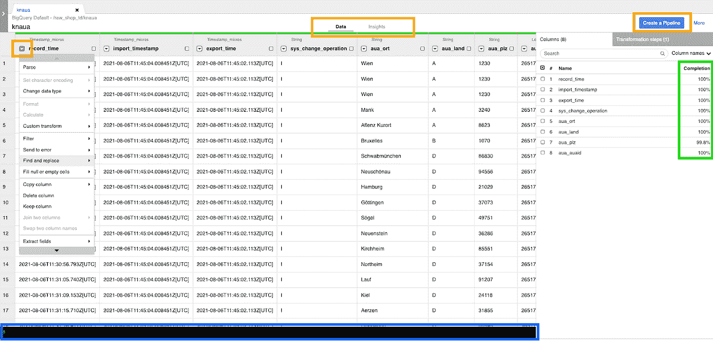
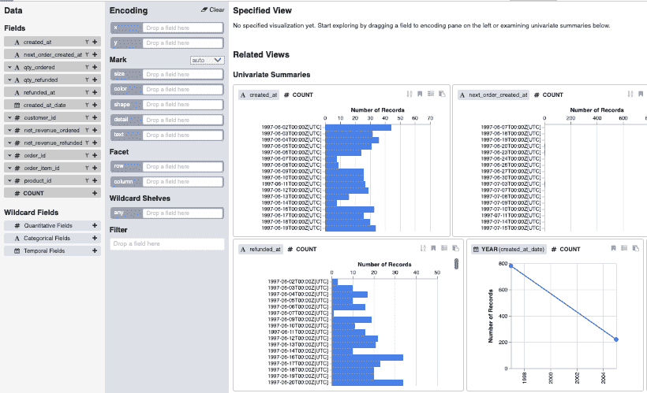
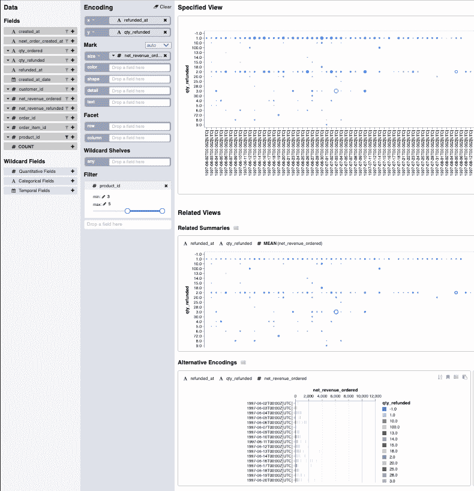

# 云数据融合的牧马人用户界面

> 原文：<https://medium.com/nerd-for-tech/the-wrangler-user-interface-of-cloud-data-fusion-21e96cfe1b2d?source=collection_archive---------1----------------------->

## 对云数据融合的牧马人用户界面的深入解释。艾伦·科勒

照片由[普里西拉·杜·普里兹](https://unsplash.com/@priscilladupreez?utm_source=unsplash&utm_medium=referral&utm_content=creditCopyText)在 [Unsplash](https://unsplash.com/s/photos/cowboy-rope?utm_source=unsplash&utm_medium=referral&utm_content=creditCopyText) 上拍摄

在我们之前的博客文章[云数据融合简介](https://datadice.medium.com/introduction-to-cloud-data-fusion-1e2a3c2bf5ca)中简要介绍了这款谷歌产品。特别是，它解释了设置，成本结构，和管道工作室的插件元素。这篇博文将重点介绍牧马人用户界面工具。

Wrangler UI 是清理、转换和准备数据集的便捷界面。使用这个工具，您可以更改数据类型、应用过滤器、正确处理空值、创建新字段等。此外，它还有一个见解部分，您可以快速可视化您的数据。

# 牧马人用户界面—数据

本节将重点介绍使用 Wrangler UI 所需的步骤以及该工具的功能。要使用它，你需要从顶部菜单选择牧马人。

*牧马人章节*

作为第一步，您需要从一个可用的源(即 BigQuery、云存储或另一个数据库源)中选择一个数据集内的表。1000 行的样本将被加载到接口中。

*可用来源*

在这里，您可以选择数据(转换数据)或洞察(快速可视化信息)，方法是选择下面截图中黄色框内的右键。

在数据部分的右侧，您将看到一个可用字段的列表，其中包含样本中非缺失值的相对百分比(即完成，屏幕截图中的绿色框)。

通过单击列名左侧的箭头(即红色框)，您可以修改该列中的数据。

可用的功能包括解析(例如，有效地将 CSV 或 JSON 文件转换为包含多列的表格)、更改数据类型、过滤、复制或删除列、填充 Null 或空单元格、查找和替换值、定义新列或应用自定义转换。

一旦你点击一个功能，你将能够手动输入适当的参数。

否则，您也可以在底部的命令界面(即蓝色框)中手动输入函数、必需的字段名称和适当的参数。

*牧马人 UI —数据*

一旦您对您的转换感到满意，点击“创建一个管道”(橙色框)，并遵循在之前的[博客文章](https://datadice.medium.com/introduction-to-cloud-data-fusion-1e2a3c2bf5ca)中强调的集成过程。

# 牧马人用户界面—见解

在 Wrangler UI 的 Insights 部分，您可以快速可视化您的数据。在右侧的数据下，您可以通过将字段拖动到旁边的编码部分来选择要分析的字段。如果没有选择字段，表中每个变量的单变量摘要将自动加载数据样本中每个不同条目的记录计数(即，参见下面的屏幕截图)。

*牧马人 UI —洞察*

另一方面，如果选择了特定字段，您将看到根据给定参数的指定视图和一系列相关的附加视图，这些视图将包括显示其他变量平均值的相关摘要、显示基础数据的不同分类的替代编码和/或一系列特定于通配符字段的视图(即，包括例如定量、分类或时间字段的单一数据类型)。

在编码部分的顶部，您可以在 x 轴和 y 轴上指定 2D 可视化的变量。

在右下方的标记部分，您可以指定图中图形的大小、颜色、形状、细节和文本。如果没有选择字段，将自动生成默认标记。

在 Facet 下，您可以根据所选行或列字段的不同值将图分成多个图，在通配符架下，您可以指定单个通配符字段或它们的组合。

在过滤器部分，您可以过滤将要使用自定义范围显示的数据。

在绘图图中，有一个选项可以按字母顺序对数据进行排序，写笔记并保存到书签中以备后用。

*指定及相关视图*

理解 Wrangler UI Insights 部分如何工作的最佳方式是摆弄您的数据。不幸的是，可用的官方文档很少。如果你有 Qwicklabs 的权限，也可以关注这个牧马人 UI [教程](https://www.qwiklabs.com/focuses/12364?parent=catalog)。

一旦你对你的可视化感到满意，点击“创建一个管道”并整合一个新的管道或返回到数据部分并进一步转换数据。

# 结论

Wrangler UI 易于清理、转换和快速可视化数据样本，并易于集成到无代码管道中。

Wrangler UI 的一个限制是只能预览 1000 个随机行。此外，您不能提取新的数据样本(与 [Cloud Dataprep](/data-school/introduction-to-cloud-dataprep-c4b79574d1d5) 相比)，并且该工具不支持具有 STRUCT 类型列的大型查询表。

虽然这个工具看起来非常有用，但是没有太多的官方文档可用。希望它能很快被添加到数据融合总体官方[文档](https://cloud.google.com/data-fusion)中。

# 更多链接

这篇文章是我们在[数据学院](https://medium.com/data-school)的[数据学院](https://www.datadice.io/)的新谷歌云系列的一部分。我们将分享我们通过多年创建数据解决方案而获得的最佳见解。

如果你想了解更多关于使用 Google Looker Studio(以前称为 Google Data Studio)的知识，并结合 BigQuery 更上一层楼，请查看我们的 Udemy 课程[这里](https://www.udemy.com/course/bigquery-data-studio-grundlagen/?referralCode=49926397EAA98EEE3F48)。

如果您正在寻求帮助，以建立一个现代化的、经济高效的数据仓库或分析仪表板，请发送电子邮件至 hello@datadice.io，我们将安排一次通话。