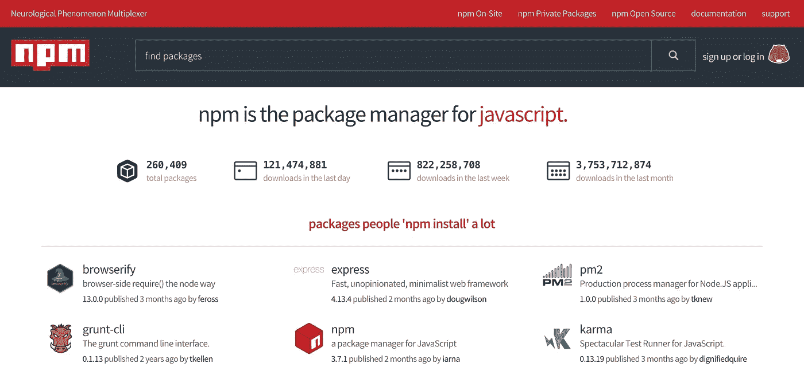
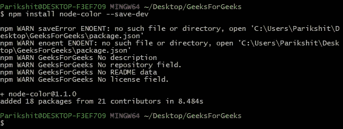
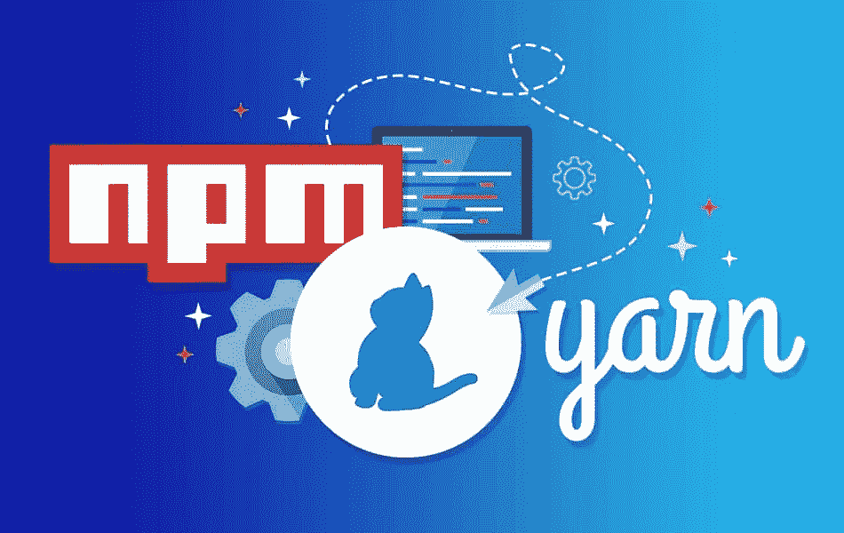
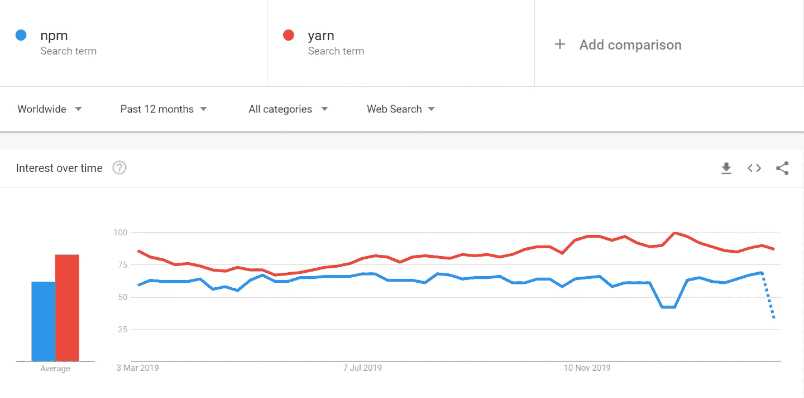

# 纱线和 npm 包装经理

> 原文：<https://medium.com/nerd-for-tech/the-yarn-npm-package-managers-b093362b7654?source=collection_archive---------0----------------------->

如果你不熟悉包管理器，你将会学到一些新的东西。什么是 npm 和 yarn？两人都是知名的 JavaScript 包管理器。软件包管理器本质上自动化了安装、配置、更新和删除从全局注册表中检索到的软件(即软件包)的过程。

## 国家预防机制简介

npm 是**节点包管理器**的缩写，它是世界上最大的软件注册表。注册表包含超过 800，000 个代码包，开源开发者使用 npm 在社区中共享软件。npm 以两种形式存在，

1.  **在线平台**

每个人都可以发布和分享用 javascript 编写的工具。这些工具可以在浏览器(前端)、服务器(后端)和命令行工具中使用。

**2。命令行工具**

它们用于安装和卸载软件中的软件包。包是由某人创建并上传到 npm 在线平台的工具，作为对开发者的开源。当几个包组合在一起时，我们可以构建一个独特的应用程序。

命令行也用于**版本管理**。当包相应地更新版本时，每个包都有一个版本。npm 使包版本保持最新，当用户想要切换版本时，它允许用户随时切换。

**3。依赖性管理**

许多包是使用其他包构建的，这些包相互依赖，因此依赖关系是指包之间需要其他包才能正常工作。使用一个 npm 命令，我们可以安装一个包及其所有依赖项，npm 会自动为我们完成这项艰巨的任务。

## 纱线概论

yarn 是由脸书开发的，旨在解决开发人员和用户所面临的 npm 的一些缺点，它是由 Exponent、Google 和 Tilde 等公司开发的一个常见项目。从技术上讲，yarn 不是 npm 的替代品，因为它依赖于 npm 注册表中的模块。可以把 yarn 看作一个新的安装程序，它仍然依赖于相同的 npm 结构。软件包的注册表本身没有改变，但是注册表的安装方法不同。因为 yarn 让您可以访问与 npm 相同的包，所以从 npm 切换到 yarn 不需要您对工作流进行任何更改。

## 为什么是纱线？

开发人员选择从 npm 转换到 yarn 的主要原因是稳定性、易用性以及在使用方面与 npm 的差异相对较小。使用 npm 时，当我们需要在不同的机器上部署项目时，当前机器的版本可能会有所不同。在小型或大型项目中使用纱线有不同的原因。它的主要优点是，它有助于避免与 node.js 系统的不同版本相关的任何可能的问题，项目将安装在该系统上，因此开发人员首先使用 yarn 来解决冲突。

## 纱线的好处

纱线的主要优点如下所列，

1.  可以从本地缓存安装软件包
2.  强绑定包版本
3.  允许并行软件包安装
4.  拥有活跃的用户群体

## 纱线的缺点

yarn 是近几年发展起来的，当我将项目从 NPM 转移到 Yarn 时，出现了两个主要问题:

1.  安装本机模块的问题
2.  Yarn 不支持任何早于 5 的 node.js 版本

## npm 和纱线的区别

该纱线与 npm 相比有一些差异。首先，纱线缓存所有已安装的包。yarn 平行安装包装，这就是 yarn 比 npm 快的原因。npm 和 yarn 都从 npm 仓库下载包。默认情况下，yarn 生成 yarn，lock 来锁定包依赖项的版本。但是 npm 为此提供了包覆面提取 CLI 命令。

## 结论

Yarn 允许更舒适和方便地部署项目，因为它是为了解决 npm 问题而创建的，此外，yarn 有助于避免这些不愉快的时刻，这些时刻在日常使用 npm 时会发生。与 npm 相反，Yarn 提供了稳定性，默认情况下提供已安装软件包的锁定版本。纱线模块的安装速度高于每分钟转数。这对于大型项目非常重要，因为 yarn 提供了更多的依赖项集合。总而言之，我应该说 Yarn 是 npm 的一个很好的替代品。下面给出的是谷歌趋势结果，显示了与 npm 相比，纱线的使用情况有所改善。

## 参考

 [## npm 与 Yarn——您应该使用哪个包管理器？—密钥 DN

### npm 和 Yarn 是两个著名的 JavaScript 包管理器。如果您不熟悉包管理器的工作…

www.keycdn.com](https://www.keycdn.com/blog/npm-vs-yarn)  [## Yarn VS NPM:为什么以及如何迁移|软件开发

### 开发人员将 Node.js 项目迁移到 Yarn。了解纱线卷装管理器的好处以及存在的困难…

waverleysoftware.com](https://waverleysoftware.com/blog/yarn-vs-npm/)