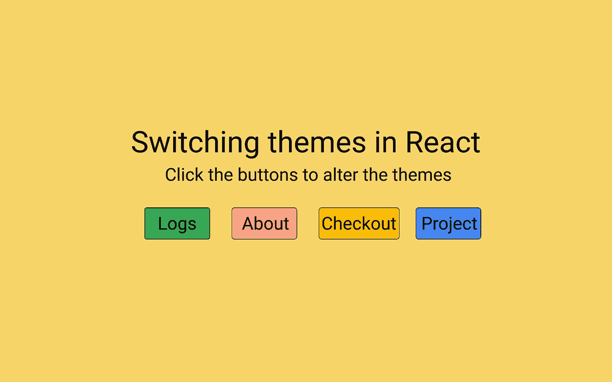

# React 中的主题化和主题切换

> 原文：<https://medium.com/nerd-for-tech/theming-and-theme-switching-in-react-8dc99797ed49?source=collection_archive---------6----------------------->

这是一个有趣而强大的游戏，让我来教你怎么做。

[设计创意](https://github.com/shreyvijayvargiya/iHateReadingLogs/tree/main/TechLogs/SwitchingThemesInReact)

如果你访问过我们的网站(**)每一个部分都有自己的主题和颜色。我没有请做检查，因为这是如此吸引人的经验。**

**首先，了解一下明暗切换主题和切换主题的区别。切换主题是不同的…**