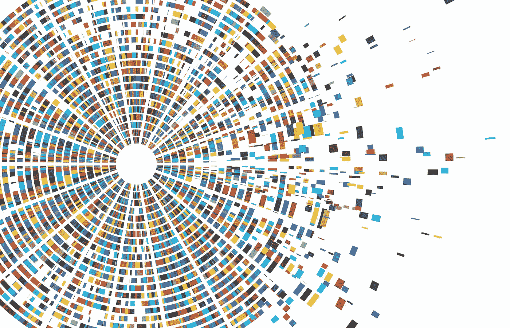
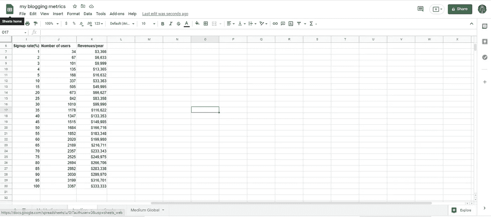

# 这 2599 个数据点

> 原文：<https://medium.com/nerd-for-tech/these-2599-data-points-e4851f334c14?source=collection_archive---------6----------------------->

关于数据点的图片取自[本网站](https://www.trueofficelearning.com/blog/one-billion-data-points-and-how-it-impacts-compliance-benchmarks)

今天，我为我所写的这个技术化平台收集了 2599 个数据点，但这些数据点是关于像你这样的人的，但我不是为了利用电子邮件或广告等一切可能的牵引渠道向他们推送中断营销内容而使用它们，而是为了研究它们，看看他们需要什么，他们自己在讲什么故事，以便更好地满足他们的需求，并告诉他们能引起他们共鸣的故事。下一步将是获得这个代理指标，我认为它可以评估他们对这个名为 J…K 的技术平台的兴趣程度。

一个热切的数据科学家的第一反应会是自动跳到代码编写抓取器上获取关于这 2599 个数据点的更多数据，并使用 scikit-learn 等模块的统计工具， panda 和 NumPy 或 R like 模块，有时是 Matlab，但我认为最聪明和明智的方法是花时间手动处理这些数据点，逐个发现它们，因为它们与人们可以阅读和理解的在线内容相关，以便更好地了解这些数据点背后的人，因为我们的目标不是使用特定的工具，而是了解这些人，并用我们的数据科学和软件工程技能帮助他们。

当然，所有这些作品都与收入有关，因为我花了太多时间生活在稀缺资源中，只是像一个实验创新者一样思考，而不是像概念创新者那样渴望成为第一个行动者。我对这个技术支持项目的预期收入估算如下表所示，我在[的这篇关于数据新闻的文章](/nerd-for-tech/this-journalistic-tech-enabled-and-data-driven-platform-e43998f66690)中给你看过。

这个新闻技术平台的收入估计

但我已经从这些数据点中学到的是，这种技术支持的想法永远不会达到每年 266，706 美元或 266，706 美元的收入，因为它的目标受众与这些数据点的数量相同。我认为 100%的参与率是疯狂的。但这很好，因为这个技术平台的目标不是像谷歌或所有这些大型技术平台那样接触数百万人。这是关于小心服务和允许互联网上对我正在建造的这个特别的东西感兴趣的一小部分人。然后，亚当·格兰特的 1000 名忠实粉丝模型对我来说很重要，我真诚地阅读这位作者以及像伯纳黛特·吉瓦这样的作者，因为尽管观众人数很少，但故事对这个工作很重要，我想帮助那些设计和建造它的人。

接下来的几天将会是一点一点地消费关于这些数据点的内容，我在想，如果像 [Greyio Heart Experiment](https://mkrdiop.medium.com/list/greyio-heart-experiement-6676cc9f1f96) 这样的发布实验不能在从这些数据点手动学习的同时执行。但是我应该承认，写我第一次仔细检查的第一个数据点可能会很尴尬，因为与它相关的内容有点…..让我写出来。

未来将会告诉我们，一项出版实验是否会与这些数据点的手动分析一起进行，最好是测试 7 篇文章，看看是否有机会。可以肯定的是，Greyio heart 实验是成功的，即使它背后有任何收入。

收集数据并不容易，我花了一天时间编写代码并寻找扭转局面的解决方案，为了获得更多相关数据，以帮助建立一个更好的技术平台，并准确知道谁将成为谁，仍然有很多障碍需要打破，因为回答[的问题](https://seths.blog/2015/12/decoding-who-is-it-for/)是谁对于像你我这样的科技企业家来说很重要。