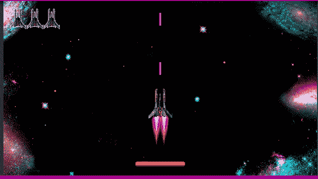
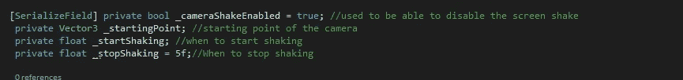
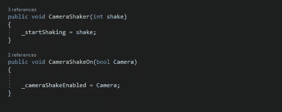
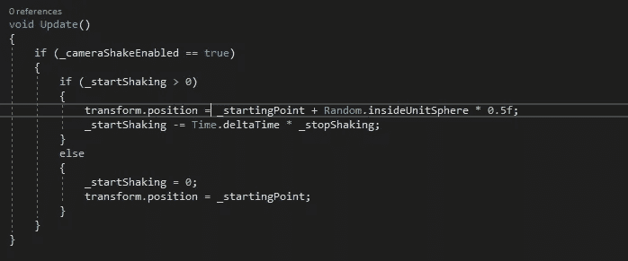
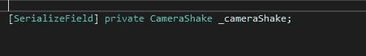
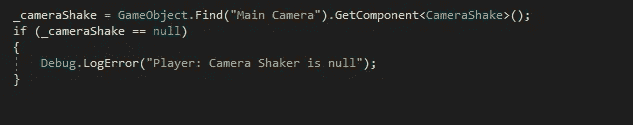
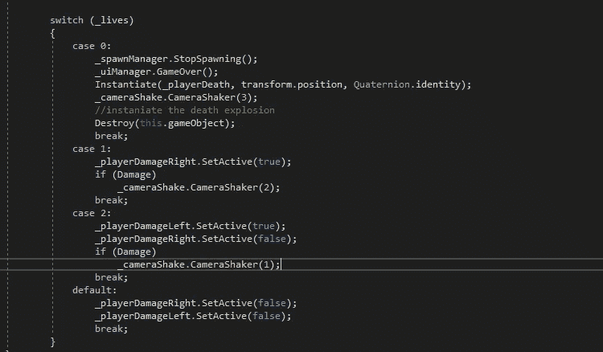

# 事情变得有点不稳定了。

> 原文：<https://medium.com/nerd-for-tech/things-are-getting-a-bit-shaky-1b054d853bf4?source=collection_archive---------29----------------------->

目的:增加玩家受到伤害时的屏幕抖动。

首先，制作一个新的脚本，并将其连接到相机上，打开脚本，我们可以开始制作一些变量。

接下来，我们需要一个能够调用的公共方法，这将启动抖动。可选的，另一个公共的方法可以打开和关闭屏幕抖动。

然后，添加屏幕抖动功能，如果您不想选择关闭它，请删除第一个 if 语句。

正在发生的是，它获取相机的变换位置，然后在每一帧从它的起点随机移动。而它从开始抖动开始取一个值，直到它为 0。当它到达 0 时，它将摄像机位置重置到起始位置。

现在相机已经设置好了，我们可以移动到播放器，当我们被击中时调用这个方法。

添加对相机抖动的引用。

在 start 方法中，获取相机摇动器的组件并进行空值检查

现在已经完成了，我们可以调用 camera shake 的方法，在受到损坏时开始抖动。如果你也对额外的生命使用伤害方法，检查一下是否也有伤害。当你拾起一条生命时，不要让它颤抖。

从玩家的伤害方法里面。括号中的数字越大，持续时间越长。

完成后，又添加了另一个特性。一如既往地记得测试一切都在工作，并看到你在下一个！