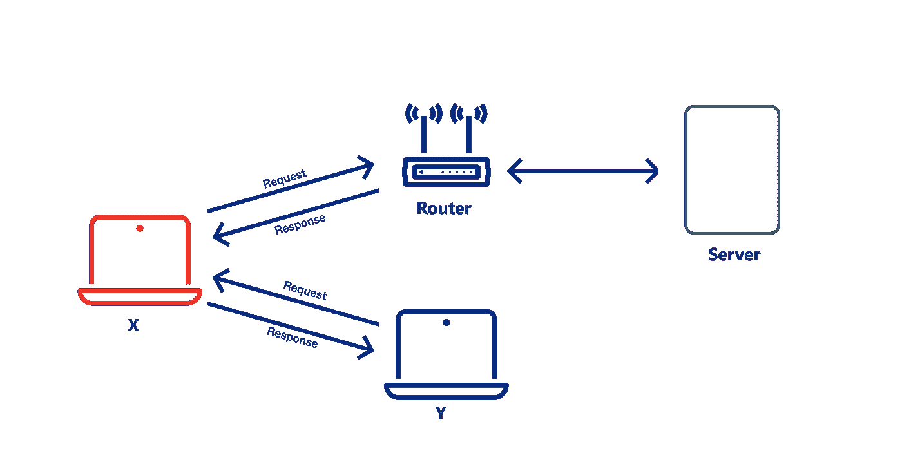
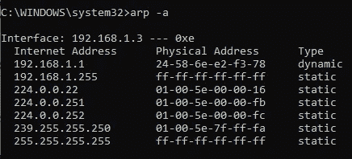
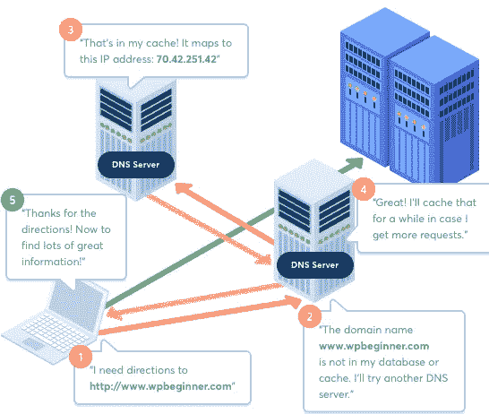
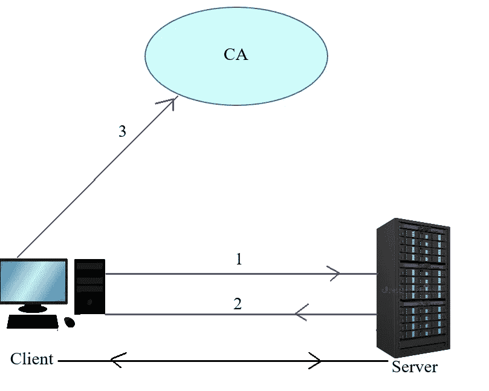
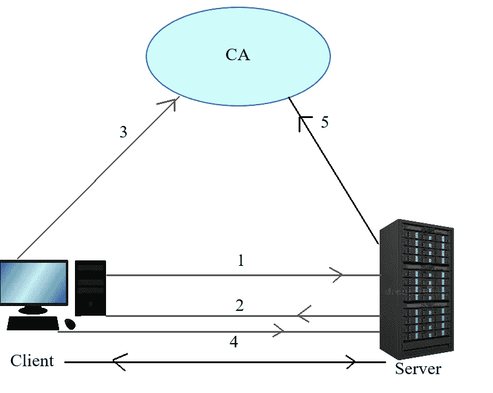
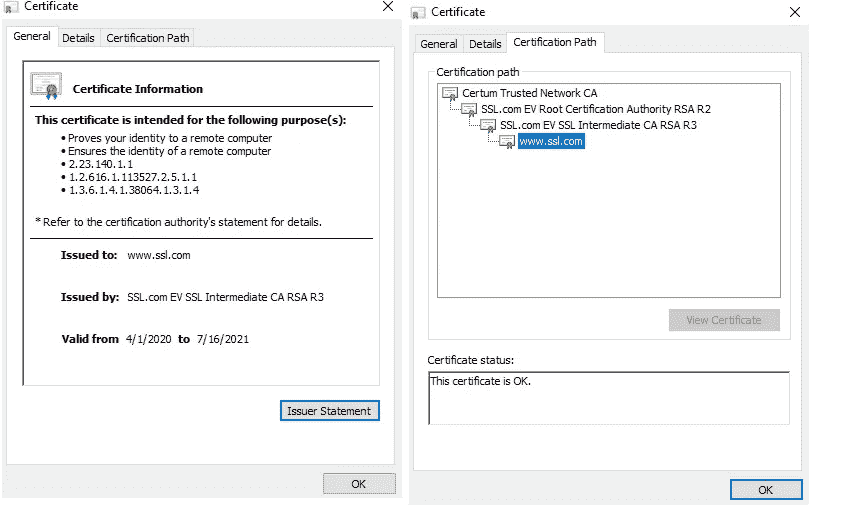

# 关于中间人攻击您必须知道的事情——ARP 欺骗、DNS 欺骗和 SSL 证书

> 原文：<https://medium.com/nerd-for-tech/things-you-must-know-about-the-man-in-the-middle-attack-arp-spoofing-dns-spoofing-and-ssl-613b8fb74050?source=collection_archive---------7----------------------->

关于中间人攻击您必须知道的事情——ARP 欺骗、DNS 欺骗和 SSL 证书

**ARP 欺骗**

ARP 中毒或 ARP 欺骗是一种中间人(MitM)攻击，攻击者进入两台通信设备之间并监听它们的通信。通常，这发生在同一个网络中。下面逐步定义在局域网(LAN)中发生这种情况的方式。

图一。ARP 欺骗。

如图 1 所示；

当用户 Y 试图访问 google 时，它会向局域网内的所有设备询问路由器的 MAC 地址。通常，路由器会用其 MAC 地址来响应消息。但是，在收到来自路由器的响应后的 MiM 攻击中，同一网络中的另一个设备(假设用户 X 是攻击者)也将使用其自己的 MAC 地址来响应同一消息。然后在 Y 的机器中更新 ARP 缓存，它会将攻击者的 MAC 地址视为路由器的 MAC 地址。正因为如此，通过路由器发送给谷歌的请求将首先到达 X。

下图 2 说明了设备的 ARP 缓存。

图二。ARP 缓存表。

如果高速缓存表包含两个不同 IP 地址的相同 MAC 地址，这表明您的计算机上正在发生 ARP 攻击。

**DNS 欺骗**

在详细讨论 DNS 欺骗之前，让我们先澄清一下术语 DNS。

*域名系统*

通常，网络浏览器使用目的 IP 地址而不是相应的在线域名来访问网页。因此，应该有一种特定的方法将在线主机名转换成相应的 IP 地址。这是由 DNS 执行的。

通常，当用户在浏览器上输入她或他想要访问的地址(主机名)时，浏览器将在他或她的计算机的缓存文件上搜索相应的 IP 地址。但是，如果找不到浏览器，浏览器会将主机名发送到最近的 DNS。如果也找不到，最近的 DNS 也会将主机名发送给它的直接父 DNS。假设直系父代拥有该域名，那么这将通过最近的 DNS 向浏览器提供相应的 IP 地址。参考图 3。

图 3。DNS 查找(来源:[https://retechnic . com/Website/single _ service/8)。](https://retechnic.com/Website/single_service/8).)

DNS 欺骗是攻击者使用的一种方法，通过 DNS 记录使受害者重定向到被设计为目标网站的欺诈网站。这也是中间人攻击的一种类型。这是因为攻击者注入了欺诈网站的恶意 IP 地址条目，而不是 DNS 缓存上的确切地址。这将导致受害者被路由到另一个目的地(托管欺诈网站的服务器)，而不是预期的目的地(托管确切网站的服务器)。参考图 4。

图 4。DNS 欺骗。

一旦用户访问了假冒网站，他或她就允许黑客窃取他或她的访问凭证和其他敏感信息。此外，黑客可能会利用这个机会在受害者的计算机上安装恶意软件。

**SSL**

安全套接字层(SSL)是一种用于在客户端和服务器之间建立安全通信的技术。在这里，使用名为 [X.509 证书](https://www.ssl.com/faqs/what-is-an-x-509-certificate/)的数字文档将网站和公司的身份绑定到加密密钥对(私有和公共)。通常，私钥保存在数据库中，公钥与证书(SSL 证书)共享，以在客户端和服务器之间建立安全连接。有两种实现 SSL 的方法。下面详细描述每一个。

*单向 SSL*

这里，客户端负责确保客户端是否从目标服务器接收到数据。下面逐步描述单向 SSL 认证。

图 5。单向 SSL。

如图 5 所示；

1.  首先，客户端通过 HTTPS 协议向服务器发送请求，在它们之间建立安全连接。
2.  服务器将其公共证书发送给客户端。
3.  客户端通过搜索 CA 中的证书列表来验证这一点。
4.  如果客户端找到了相应的证书，那么客户端将能够通过建立的安全连接(加密隧道)访问资源。

*双向 SSL*

这里，客户机和服务器都负责确保它们之间的安全连接。下面逐步描述双向 SSL 认证。

图 6。双向 SSL。

如图 6 所示；

1.  首先，客户端通过 HTTPS 协议向服务器发送请求，在它们之间建立安全连接。
2.  服务器将其公共证书发送给客户端。
3.  客户端通过搜索 CA 中的证书列表来验证这一点。
4.  如果客户端找到了相应的证书，则客户端与服务器共享其公共证书。
5.  服务器通过搜索 CA 中的证书列表来验证这一点。
6.  如果服务器找到了相应的证书，那么客户端将能够通过建立的安全连接(加密隧道)访问资源。

**相关术语**

*认证机构*

它负责发布数字证书(SSL 证书等)。)并通过证书的名称主题来证明公钥的所有权。CAs 的一些例子有，SSL.com、哥达迪、RapidSSLonline、Comodo 等。图 7 显示了由 SSL.com 颁发的证书。

图 7。由 SSL.com 签发的证书。

*SSL 证书* ( [一种 X.509 证书](https://www.venafi.com/blog/what-ssltls-x509-certificate))

这是由可信的 CA 签名的，并被操作系统、web 浏览器等信任。SSL 证书遵循 X.509 标准，这意味着证书包含公钥、主机名身份、组织等。SSL 证书在客户端和服务器之间共享，以在它们之间建立安全的连接。

*HTTP vs HTTPS*

这是 HTTP 的安全版本。这里，在客户端和服务器之间传输的所有数据包都用公钥或私钥加密。因此，大多数网站都将 HTTPS 作为默认协议。大多数使用 HTTPS 协议的网站都包含由公共可信 CA 签署的 SSL/TLS (TLS:传输安全层，SSL 的继任者)证书。图 8 显示了受信任的 SSL/TLS 证书保护的网站和不受保护的网站之间的差异。

图 8。使用 SSL 证书保护与不保护。

**结论**

*   RPA 欺骗和 DNS 欺骗属于中间人(MitM)攻击。
*   DNS 用于获取在线域名对应的 IP 地址。
*   SSL 证书在客户端和服务器之间共享，以在它们之间建立安全的连接。
*   证书颁发机构负责颁发 SSL 证书。

**参考文献**

*   [https://www . imper va . com/learn/application-security/ARP-spoofing/](https://www.imperva.com/learn/application-security/arp-spoofing/)
*   [https://www . imper va . com/learn/application-security/DNS-spoofing/](https://www.imperva.com/learn/application-security/dns-spoofing/)
*   [https://dzone.com/articles/ssl-in-java](https://dzone.com/articles/ssl-in-java)
*   [https://www.ssl.com/faqs/faq-what-is-ssl/](https://www.ssl.com/faqs/faq-what-is-ssl/)