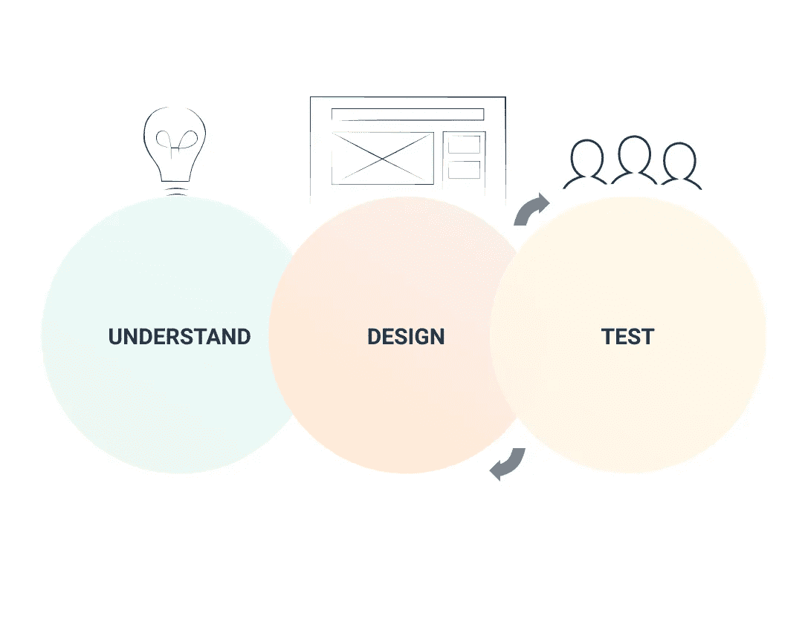
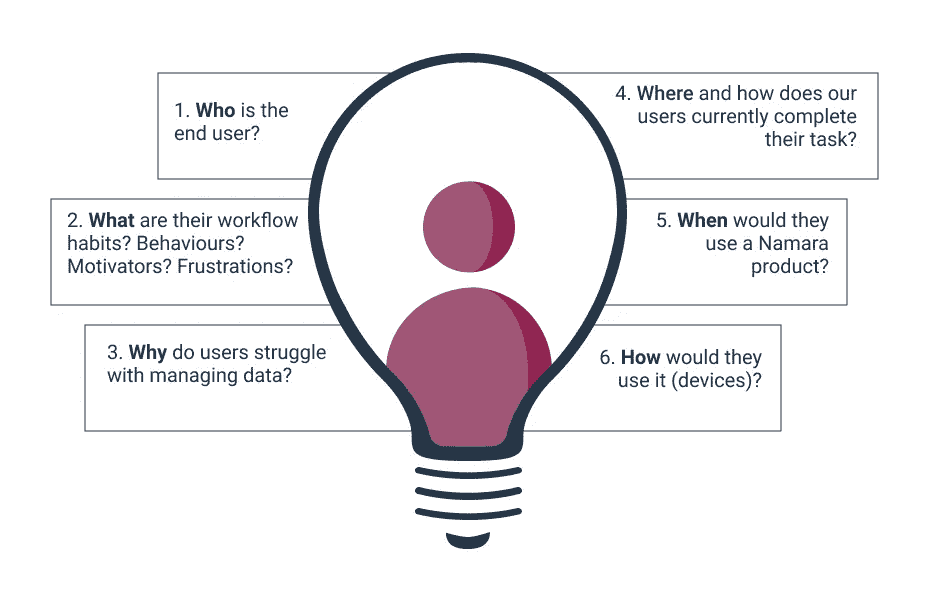
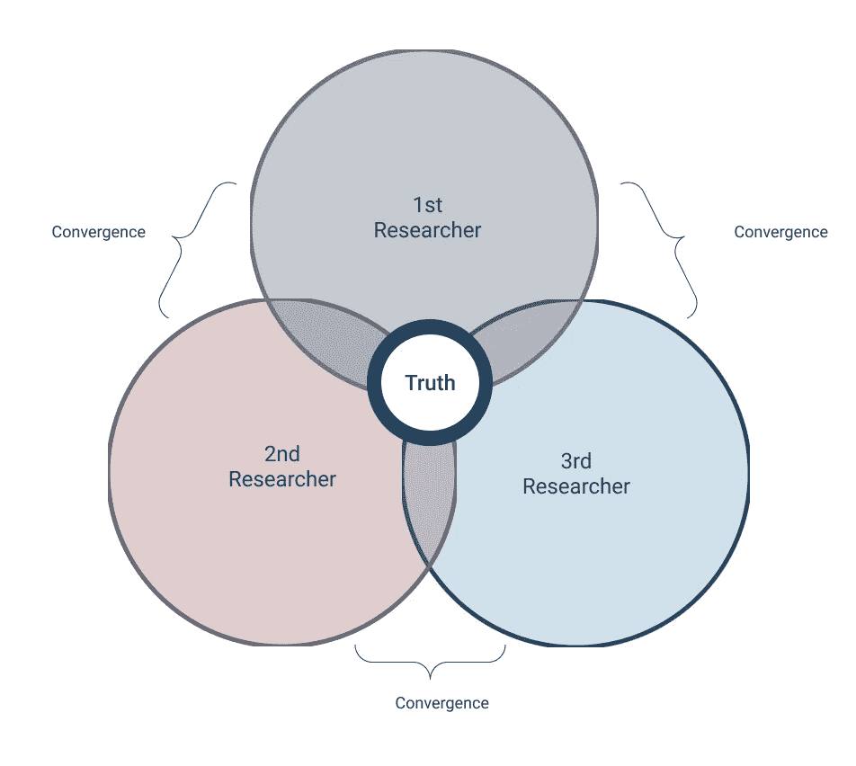

# (认为)数据的作用是把用户放在第一位

> 原文：<https://medium.com/nerd-for-tech/think-data-works-to-put-users-first-af83a200906d?source=collection_archive---------22----------------------->

作为数据技术的领导者，我们所做的每一方面都是由数据驱动的-工程、营销、销售和设计决策都需要数字和证据的支持。

用户研究数据是塑造我们整个公司以及我们设计平台的方式的重要见解。通过利用用户数据，我们可以更好地了解受众的需求、行为和背景，以产生定制的解决方案来补充用户工作流。

我们为数据专业人员构建和设计了终极数据工作台。我们的端到端数据管理解决方案 Namara**可将来自全球任何来源(公共、私有或合作伙伴)的数据进行流式传输，帮助组织将新数据分层到现有实践中，以推动更好的业务洞察。**

作为一个团队，我们正在研究人们如何使用我们的平台的数据，以使可用性和数据科学工作流成为我们的优先事项。在高层次上，我们的(不那么线性的)设计过程看起来像这样:

## 基本问题

为了改进我们的产品，我们首先要求 5w(和 one H)同情和理解我们的最终用户:

在收集了可行的见解后，我们开始思考，并根据业务和数据社区的需求制定设计范例。一旦我们有了这些想法，我们就用一系列的设计来检查画板，这样我们就可以跨专业团队进行调整。通过一系列测试和概念验证，我们在设计周期的不同阶段不断迭代，以完善我们的设计解决方案。

## 通过三角测量确认

在过去的几年里，我们从用户那里收到了有价值的反馈和请求，因此我们能够隔离他们工作流程中的关键需求。随着远程可用性测试在社交距离上的巨大帮助，我们从远近的用户身上学到了很多。为了演示我们如何调整用户反馈和观察研究，我们使用三角测量方法来指导功能改进。

三角测量是结合几个观察笔记来排列不同观点的过程；我们事实上的 UX 侦探来自我们的数据，前端，客户成功，销售和营销团队。

通过从我们的客户和最终用户那里收集平台可用性的不同范围，它有助于揭示我们平台的用户体验的特定领域，以便可以改进这些领域。整理反馈可以让我们看到每个结果的共同点，从而更好地了解平台可用性背后的真相。这有助于我们优先考虑用户需要什么功能，以及我们如何着手设计实现。

## 数据让数据更好

很久以前，在一个遥远的星系里，尤达曾经说过，“永远在运动就是未来，”这句话在当今瞬息万变的数字世界里再贴切不过了。据估计，每天会产生 [**2.5 万亿字节**](https://www.socialmediatoday.com/news/how-much-data-is-generated-every-minute-infographic-1/525692/) 的数据，我们了解数据背后的价值，为未来的机会和各行业的优化提供信息。我们致力于通过减少工作流程开销，为使用 Namara 平台的企业树立信心，使数据更容易处理。

## 帮助我们帮助你

当莱娅公主的飞船被达斯·维德接管时，她说:“救救我，欧比万·克诺比。你是我唯一的希望。”虽然我们的平台没有被任何黑暗势力接管，但我们需要你的帮助来设计一个继续把我们的用户放在第一位的平台。

如果您目前是 Namara 用户，并且有 2-3 分钟的空闲时间，我们希望收到您的来信。我们附上了一个调查链接供您分享您的反馈: [**Namara 用户调查**](https://docs.google.com/forms/d/e/1FAIpQLSdnukW-iBNON5yStzXFP6fvJK_NfphnPNuYwNxUTVq2iLvYUA/viewform) 。非常感谢您的想法，我们希望每个平台用户都能为改进平台做出贡献。

如果您是一名数据科学家，但不是 Namara 用户，我们仍然希望通过这份 [**一般数据专业调查**](https://docs.google.com/forms/d/e/1FAIpQLSdT1BBm18gmBvKSnCbnLU90NxndYIJtD85y8tU9eQmkMXWdpQ/viewform) 收集关于您的工作流程和需求的见解。

最后，如果您愿意自愿参加未来的可用性测试或对调查有任何疑问，请 [**联系我们**](mailto:info@thinkdataworks.com) 。

想了解有关协调业务和数据战略的更多信息吗？

[**请求咨询我们的数据专家之一**](https://meetings.hubspot.com/eugene) 或 [**浏览**](https://marketplace.namara.io/) 解决方案就绪数据的最大目录，以确定 [**ThinkData 的技术**](https://www.thinkdataworks.com/products/namara) 如何推进您的项目。

*最初发表于***。**