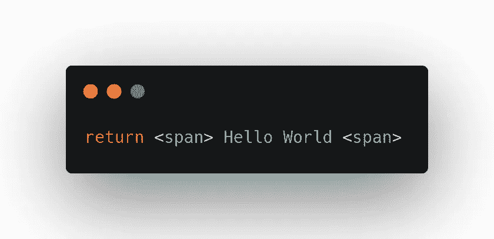
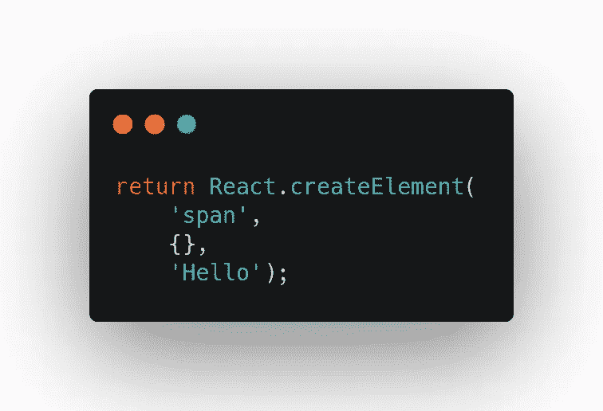
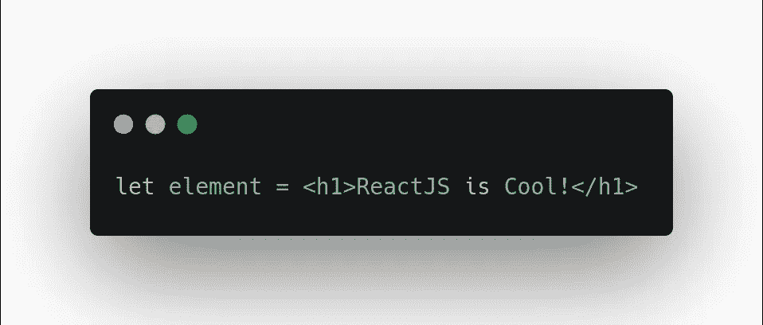
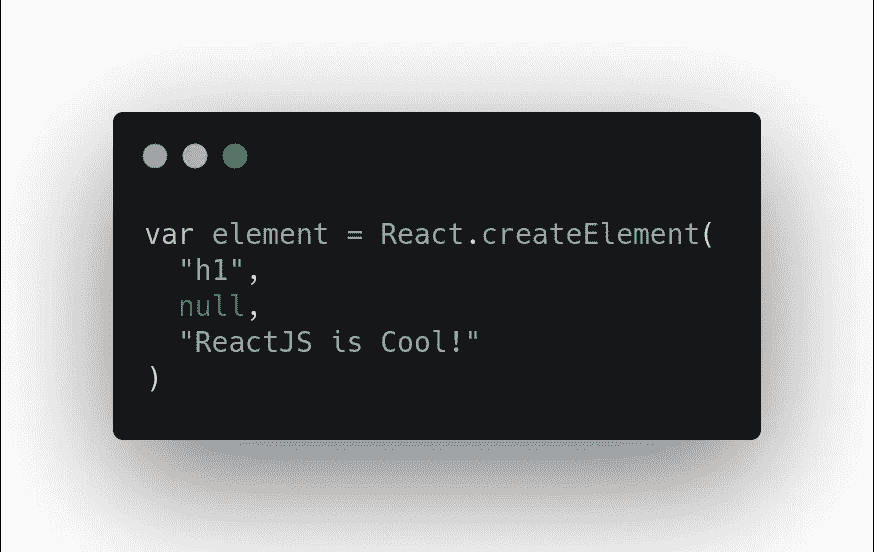
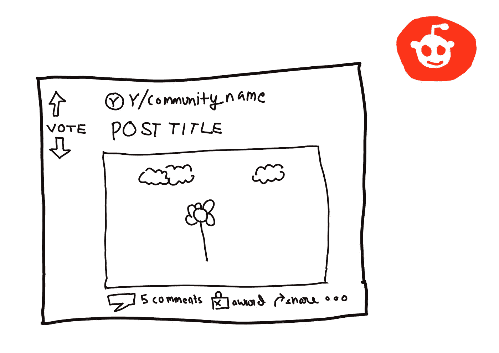
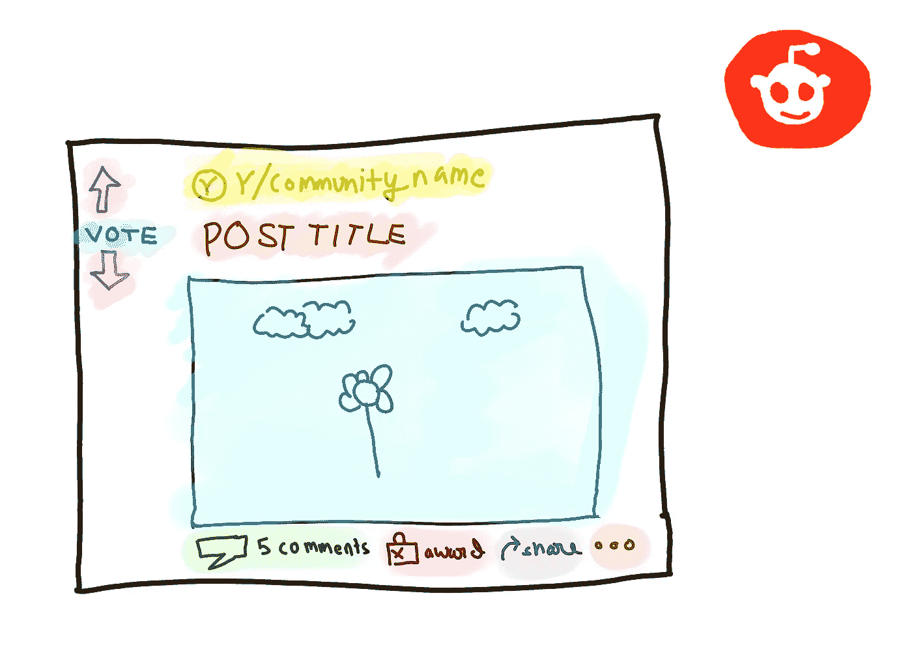
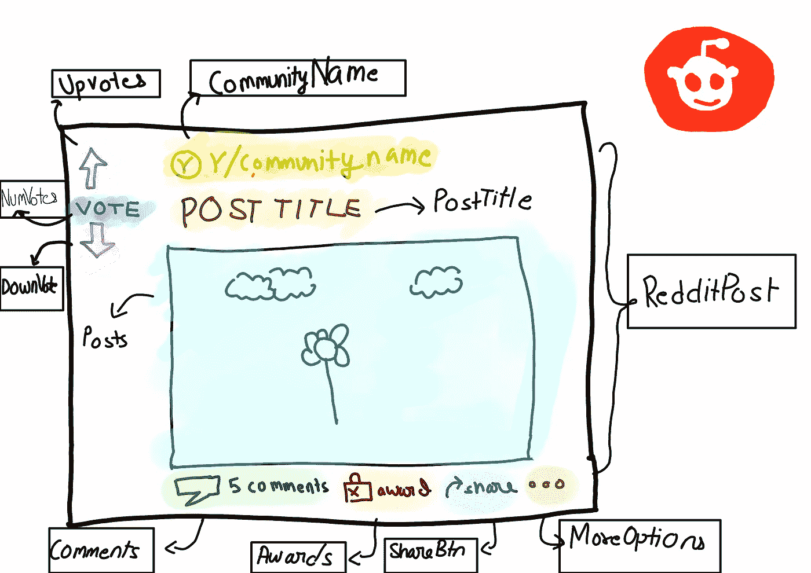

# 像反应一样思考

> 原文：<https://medium.com/nerd-for-tech/thinking-like-reactjs-ffcd4a674717?source=collection_archive---------30----------------------->

这是我的 react 学习系列的第三部分，在这里，我每周发布一篇关于我的 react 学习进度的文章，并分享有用的资源和材料，这些资源和材料帮助我更好地理解概念并提高我的 javascript 技能。

本周的讨论与我所遵循的路线略有不同，但这是最有成效的一周，我在完全不同的层面上理解了 react，不，不，我没有学习路由器或 Redux 或任何其他 reactjs 框架，相反，我学习了如何在不编写 JSX 的情况下运行 reactJS，是的，你没听错。

这篇文章受到了我最近在 LinkedIn 上写的一篇文章的影响，在那里我谈到了 React 生态系统有多么巨大，并且有大量固执己见的框架，路由器，redux，gatsby，nextjs，webpack，babel，还有很多！

React 是 web 应用程序世界中的一个新规范，并将持续一段时间，对于每个人来说，首先理解什么是 pure react 以及这个库在没有任何框架的情况下实际上是如何工作的是至关重要的。了解如何反应。CreateElement()如何工作，React 如何在 DOM 中呈现 [HTML](https://www.linkedin.com/feed/hashtag/?keywords=html&highlightedUpdateUrns=urn%3Ali%3Aactivity%3A6807030601267384320) 元素，最重要的是 JSX 如何转换成 [javascript](https://www.linkedin.com/feed/hashtag/?keywords=javascript&highlightedUpdateUrns=urn%3Ali%3Aactivity%3A6807030601267384320) 。

人们直接进入框架，这可能会完成工作，但你不会对幕后工作的东西有一个全面的理解。

因此，本周我深入了解了所有这些隐藏在幕后的概念，但它们是框架的真正力量，我今天要讨论的两个主题是， **React.createElement、ReactDOM.render 和 react component 的思维方式。**

## React.createElement()

为了理解`React.createElement()`做什么，我们首先需要弄清楚 JSX 到底是什么？

JSX 是脸书团队创造的语法糖，它允许你用熟悉的语法创建元素，而不是手写函数调用。在编译过程中，JSX 向下编译成浏览器能够理解的真正的 JavaScript。名为 Babel 的工具负责这种转换，它是一个 transpiler，将代码转换为有效的 ES5 JavaScript。让我们看一些例子来更好地理解。

**一个简单的 JSX 片段**

下面是编译器生成的 JavaScript

`React.createElement`返回的 React 元素对象只是普通的旧 JavaScript 对象，它描述了您希望`ReactDOM.render()`创建的 DOM 节点。

`React.createElement()`函数接受三个参数并返回一个对象。这三个参数看起来像这样，`React.createElement(types, props, childrem)`

1.  类型:HTML 元素。

2.道具:归因于 HTML 元素。

3.Children:这包含元素的内容。

## **现在，让我们利用这些特征来理解 JSX 的三个最重要的规则。**

1.  `**<tags>**` **是元素，`**<tags>**` **映射为** `**React.createElement()**` **。****

上面的语句将变成，

我希望现在您明白 JavaScript 中那个看起来很奇怪的 HTML 是什么意思了。

**2。JSX 的子孙映射到第三个参数** `**React.createElement()**` **即他们成为元素的** `**props.children**`

**3。JSX 属性成为道具，**无论是字符串、表达式、文字还是变量，我们传递的 JSX 属性都成为道具。

从这里我们可以很容易地过渡到 **ReactDOM.render()** 中，并理解它到底是如何工作的。`ReactDOM.render()`是实际创建和更新 DOM 节点元素的函数。

`React.createElement()`返回的 React element 对象只是描述 DOM 节点的普通旧 javascript 对象，我们希望`ReactDOM.render`创建这些对象。

## 像反应元件一样思考

在这里，我想谈谈，你如何像 react 组件一样思考，并把复杂的用户界面分解成一个简单的组件式结构。

为此，让我们举一个 Reddit 帖子的例子，让我们采用组件方法，将这个东西分成小块。

1.  **素描(请原谅我的丑素描)**

**3。突出显示组件**

这是你理解的部分，页面上的哪个部分是组件，在某种意义上一切都是组件，这就是 react 教给我们的，将 UI 分成简单的可重用组件。

**3。命名您的组件**

每一个都将成为一个组件，其中`RedditPost`是父组件，所有的组件都将在这里呈现。

*   RedditPost
*   后置标题
*   社区名称
*   向上投票
*   NumVotes
*   反对票
*   邮件
*   评论
*   奖金；奖品
*   ShareBtn
*   更多选项

**4。最后一步是构建你的组件，并在 DOM** 上渲染它们。

我希望这篇文章能帮助你了解关于 react 生态系统的一些基本的重要事实，这些事实通常会在学习框架和基于它的其他框架的热潮中迷失，主要的收获是，要成为一名 10 倍 react 开发人员，我们首先需要了解库本身实际上是如何工作的，以及幕后到底发生了什么，这样你不仅会深入了解如何使用 react，而且学习其他固执己见的框架也会变得更容易。

[1][https://front arm . com/courses/react-fundamentals/basics/one-file-react-app/](https://frontarm.com/courses/react-fundamentals/basics/one-file-react-app/)

[2][https://www.purereact.com/](https://www.purereact.com/)