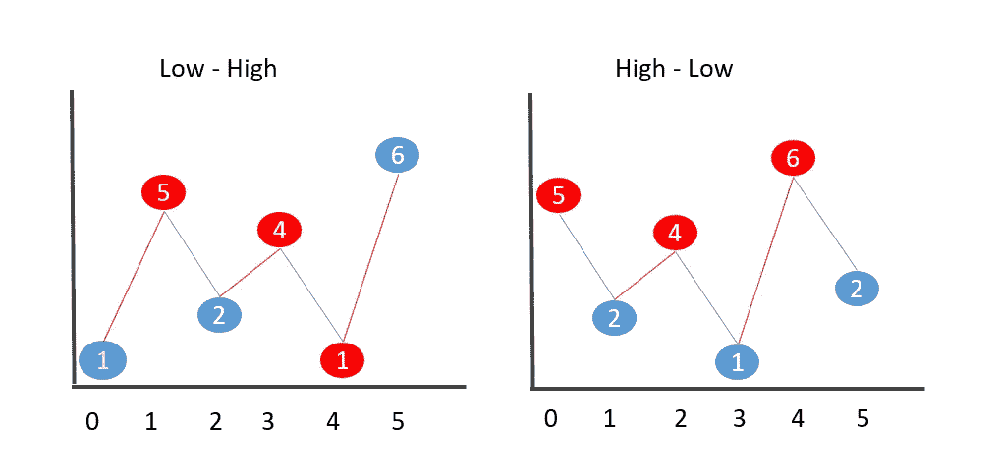

# Python 中的递归思维#2

> 原文：<https://medium.com/nerd-for-tech/thinking-recursively-2-in-python-8d742bf2d79a?source=collection_archive---------6----------------------->

这是我第二篇关于如何用 python 递归思考的文章。在我的[上一篇文章](/nerd-for-tech/thinking-recursively-1-with-python-ac48ae78201a)中，我已经解决了一些基本的递归问题。在这篇文章中，我们将解决两个复杂的递归问题，这将改善你的递归思维方式。让我们直入主题吧。


照片由 [Grooveland Designs](https://unsplash.com/@groovelanddesigns?utm_source=unsplash&utm_medium=referral&utm_content=creditCopyText) 在 [Unsplash](https://unsplash.com/s/photos/spiral?utm_source=unsplash&utm_medium=referral&utm_content=creditCopyText) 上拍摄

## 之字形阵列

给定一个数组，判断元素是否呈锯齿形。锯齿形意味着奇数位置的元素应该比它们相邻的元素小(或大)。



如果你仔细观察这个问题，我们的逻辑看起来是这样的

```
arr[0]**<**arr[1]**>**arr[2]**<**arr[3]**>**arr[4]….. (for low-high zig-zag array)
DOWN -- UP -- DOWN -- UP -- DOWN -- ...
```

```
def isZigZag(arr): 
    return isUpDown(arr) or isDownUp(arr)
```

我选择`**logical or**` 的原因是，如果它是一个 ***高低*** 之字形数组或一个 ***低高*** 之字形数组，那么它就是一个之字形数组。

输入:[1，5，2，4，1，6]

```
isZigZag([1,5,2,4,1,6])
= isUpDown([1,5,2,4,1,6]) or isDownUp([1,5,2,4,1,6])
= **False** or isDownUp([1,5,2,4,1,6])
= isDownUp([1,5,2,4,1,6])=**((1<5) and isUpDown([5,2,4,1,6]))** 
=(True and **(5>2 and isDownUp([2,4,1,6]))**
=(True and (True and **( 2<4  and isUpDown([4,1,6]))** )=(True and (True and (True and **(4>1 and isDownUp([1,6]))**))
=(True and (True and (True and (True and **(1<6 and isUpDown([6]))))** =(True and (True and (True and (True and (True and **True**))))#basecase
= **True**
```

我们可以把上面两个函数结合起来，递归地写成，

## 列表的置换

我将告诉你，我们如何能够达到一个纯粹的递归方式找到一个列表的排列(没有回溯)。这个方法并不乐观，但它确实让你理解了递归。

给定一个名单{arr₀，arr₁,….arrₙ}.我们可以找到列表的排列

1.  如果我们有从{arr₁,….开始的列表排列 arrₙ}
2.  然后，我们在步骤 1 中得到的每个置换子数组的所有位置插入`arr₀`。为了更好地理解，

考虑列表[1，2，3]

```
Step 1: Find the permutation of [2,3]. It is **[ [2,3], [3,2] ]** Step 2: Insert 1 at all the positions of each of the permutation sub-arrays. Permutation[0] = [2,3]   //**first sub-array** of permutation([2,3])
Insert 1 at index 0 =  [1,2,3]
Insert 1 at index 1 =  [2,1,3]
Insert 1 at index 2 =  [2,3,1]#############################################Permutation[1] = [3,2]   //**second sub-array** 
Insert 1 at index 0 =  [1,3,2]
Insert 1 at index 1 =  [3,1,2]
Insert 1 at index 2 =  [3,2,1]
```

这就是我们如何递归地推导出一个列表的排列。

首先，让我们编写一个函数 interleave()，它只执行**步骤 2。**

考虑输入:`arr = **[2,3,4]**, elementTobeInserted = 1`

下面是调用栈的样子，(你一定会理解下面的解释😊)

> 下面的缩进表示**新的调用堆栈**

```
 >>interleave(1,[2,3,4])
1\.  res = [1,2,3,4]  #line 12, the possibility that we know for sure
    head = 2
    tail = [3,4]
    #line 14 => **interleave(elementToBeInserted,tail)** 
                **interleave(1, [3,4] )** will be called
                res = [1,3,4]
                head = 3
                tail = [4]
                #line 14 => **interleave(1,[4])**
                            res = [1,4] 
                            head = 4
                            tail =[]
                            #line 14 => interleave(1,[])
                                        **returns [[1]] #base-case**otherPossiblitiesArr = [[1]]
                            add 4(head) to the front => [[**4**,1]] **returns** [**[1,4],**[4,1]]                otherPossiblitiesArr= [[1,4],[4,1]]
                Add 3(head) to the front => [[**3**,1,4],[**3**,4,1]]
                returns [**[1,3,4]**,[3,1,4],[3,4,1]]
                 otherPossiblitiesArr = [**[1,3,4]**,[3,1,4],[3,4,1]]
   add 2(head) to the front => [[**2**,1,3,4],[**2**,3,1,4],[**2**,3,4,1]]
   returns [**[1,2,3,4]**,[2,1,3,4],[2,3,1,4],[2,3,4,1]]
```

我希望看到调用栈能清楚地告诉你函数是如何工作的。让我们编写置换函数，它将使用上面的`interleave()`函数来推导给定列表的所有置换。

```
>>>permutation([1,2,3,4])
#call stack
>> head = 1
   tail = [2,3,4]
   tailPerm = permutation([2,3,4])
            >>head = [2]
              tail = [3,4]
              tailPerm = permutation([3,4])
                       >>head = 3
                         tail = [4]
                         tailPerm = permutation([4])
                                    returns **[[4]]** #base-case

                         *loop 1:* interleave(3,[4]) = [[3,4],[4,3]]
                         returns **[[3,4],[4,3]]**

              *loop 1:* interleave(2,[3,4])= [[2,3,4],[3,2,4],[3,4,2]]
              *loop 2:* interleave(2,[4,3])= [[2,4,3],[4,2,3],[4,3,2]]
              returns **[[2,3,4],[3,2,4],[3,4,2],
                       [2,4,3],[4,2,3],[4,3,2]]**

   *loop 1:*interleave(1,[2,3,4]) = [[1,2,3,4],[2,1,3,4],[2,3,1,4],[2,3,4,1]]
   .....
   *loop 6:* interleave(1,[4,3,2]) = [[1,4,3,2],[4,1,3,2],[4,3,1,2],[4,3,2,1]] returns **[[1,2,3,4],[2,1,3,4],[2,3,1,4],[2,3,4,1],.....,[4,3,2,1]]**
```

你可以看到它有多优雅🦄解决方案是，这都是关于理解子问题。一旦你不把每个问题看成一个整体，而是看成一堆子问题，递归思考就很容易了。

我希望你喜欢这篇文章并理解递归函数的工作原理。如果你真的喜欢这类递归函数，我强烈建议你学习一门函数式编程语言( [Haskell](https://www.youtube.com/watch?v=EfmyKgYjNP8&list=PL3pGy4HtqwD2-bYXI3_4LWQyafXp4-olc) 可能是个不错的起点)。

谢谢🙏为了阅读。拍手声👏如果你喜欢这篇文章。我将在接下来的文章中写更多关于递归函数的内容。