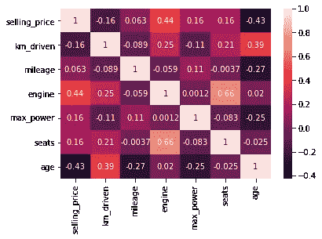
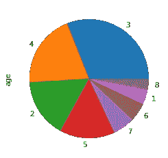
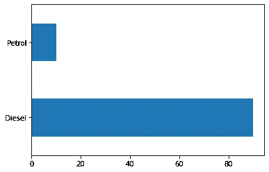
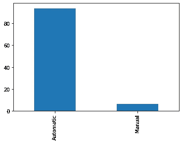

# 这一分析将使你更好地了解下一次购车。

> 原文：<https://medium.com/nerd-for-tech/this-analysis-will-make-you-better-informed-for-your-next-car-purchase-3bdc147c7eec?source=collection_archive---------10----------------------->


照片由[迪瓦克里希纳](https://unsplash.com/@dhivakrishna?utm_source=unsplash&utm_medium=referral&utm_content=creditCopyText)在 [Unsplash](https://unsplash.com/s/photos/cars?utm_source=unsplash&utm_medium=referral&utm_content=creditCopyText) 上拍摄

除了买房之外，汽车可能是大多数人一生中第二重要的购买品，这使得你有必要用足够的信息武装自己，以便做出明智的购买。

当谈到汽车和选择买哪辆车时，特别是当它涉及到成本时，我们都有自己的看法。你听到人们说“某某品牌更贵”或“这辆车会更贵，因为行驶的公里数少”。但是数据说明了什么呢？因此，我使用 Kaggle 二手车车辆数据集的数据来回答以下问题:

1.  汽车的哪个特性对汽车的价格影响最大？
2.  汽车销售前行驶的距离会影响汽车的价格吗？
3.  柴油车和汽油车哪个最贵？
4.  哪些汽车品牌最贵？
5.  自动和手动哪种齿轮传动最贵？
6.  首次购买的车龄会影响售价吗？

这个项目的数据是从卡德霍的 Kaggle 二手车辆数据集获得的。Kaggle 上的数据可以在[这里](https://www.kaggle.com/nehalbirla/vehicle-dataset-from-cardekho?select=car+data.csv)找到，这个项目的完整代码可以在我的 [github 库](https://github.com/uforodavid/Cars_Prices_Prediction_Project)找到。

## 哪个特征对汽车的价格影响最大？



相关热图

六个定量特征，包括行驶公里数、里程数、发动机容量、功率、座位数和首次购买后的车龄，以及与汽车售价相关性最高的特征的售价进行了分析。发动机容量与汽车销售价格的正相关性最高。这意味着高发动机容量的车辆将是高成本的车辆。其他对售价有很大影响的特征包括“品牌”、“档位类型”和汽车使用的燃料类型。另一方面，令人惊讶的是，从第一次购买起的车龄与车价没有正相关关系。

## **汽车首次购买后行驶的距离会影响售价吗？**

数据显示，里程或公里数与汽车销售价格没有正相关关系。事实上，“里程”和“行驶公里数”的相关性仅次于“年龄”。这证明了在二手车交易时，所涉及的距离不应该出现在对话中。然而，车龄在 4 年以下的车更多地出现在 100 辆最贵的车中。



3 年车在前 100 名中的份额更大。

## 柴油车和汽油车哪个最贵？



柴油与汽油

我的分析显示，柴油车比汽油车更贵，因为前 100 辆最贵的车中有 90 辆是柴油车。这个特别的发现让我很惊讶，因为我个人并不这么认为。

## 哪些汽车品牌最贵？

我的分析显示，德国品牌宝马拥有 24 辆车，在 100 辆最贵的汽车中数量最多，其次是奔驰和奥迪。有趣的是，这 3 个最贵的品牌都是德系车。以下是 100 辆最贵汽车的分类:

```
BMW              24
Mercedes-Benz    19
Audi             16
Toyota           14
Volvo             7
Jaguar            7
Ford              4
Skoda             3
Jeep              2
Isuzu             1
Land              1
Lexus             1
Honda             1
```

## 自动和手动哪种齿轮传动最贵？

正如你已经猜到的，数据显示，自动挡比手动挡贵。排名前 100 的汽车中有 94 辆使用了自动挡。



## 首次购买的车龄会影响售价吗？

数据显示，车龄为 3 年的汽车是最贵的，这可能意味着较新的汽车售价最高。但数据也显示，一些车龄不到 3 年的车辆售价较低，这与观察到的趋势不符。然而，我认为，较新的车辆，售价较低，可能是受传输类型，燃料类型，品牌的汽车或发动机容量。

## 随机森林回归和线性回归预测模型。

在使用随机森林和线性回归构建我的回归模型时，我为分类变量创建了虚拟变量，将一些数字列转换为对数，并删除了包含异常值和缺失值的行。

RFR 和 LR 模型的 r 平方值分别为 0.98 和 0.82，这是一个没有过度拟合的好模型。

我希望你从这个分析中有所收获。非常感谢，请好好分享。

要了解更多关于这个分析的信息，请点击这里查看我的 git hub 知识库[。](https://github.com/uforodavid/Cars_Prices_Prediction_Project)