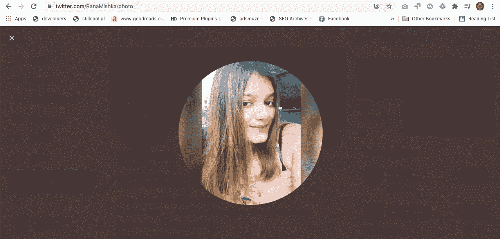

# Rana 的品牌调查推文

> 原文：<https://medium.com/nerd-for-tech/this-brand-survey-tweet-of-rana-8be571096b6a?source=collection_archive---------16----------------------->

## 见解深刻的推文示例

[米什卡拉纳](https://twitter.com/RanaMishka)

米什卡·拉纳(Mishka Rana)这样的人只需发一条推文，就能完成过去只有拥有巨额预算的品牌营销人员才能完成的工作。通过下面的这条推文，Rana 知道了哪些品牌对她的观众至关重要，因为有 607 人回答了 Rana 的问题。

我没有对这条推文进行深入分析，但听起来苹果、耐克、可口可乐、Zomato 和 Amul 在我们的[品牌世界](https://mkrdiop.medium.com/open-branded-world-557012321da1)中脱颖而出。

[Rana](https://www.linkedin.com/in/mishkarana) 执行了一项过去花费数百万美元的品牌调查，这凸显了技术让意见收集变得多么简单快捷。借助一个简单的数据处理工具，Rana 可以进行统计分析，对影响这一人群样本的品牌进行排名，并将所有社会数据纳入每个受访者的个人资料，Rana 就能知道为什么每个品牌对每一类人都很重要。

当然，并不是每个人都可以发布一条推文，并通过评论获得超过 600 人的参与。什么表明 Rana 非常擅长社交媒体营销，因为她成功地培养了一批积极参与的观众。

这篇文章讲述了 Rana 的技能，并展示了在我们这个互联时代，生产和信息收集工具就在每个拥有智能手机或个人电脑的人的指纹上。但是这需要有耐心和动力去学习和测试。

Rana 是一名内容撰稿人|文案|社交媒体营销人员|她发布的这条颇有见地的推文可以证明，在内容和社交媒体营销方面，她是一个值得合作的人。如果你正在寻找一个专业的社交媒体营销人员，这里有拉纳的 Linkedin 简介

 [## 米什卡·拉纳-内容作家/文案作家-自由职业者| LinkedIn

### 一个专业的内容作者和社会媒体营销人员帮助品牌脱颖而出和发展。工作经验丰富…

www.linkedin.com](https://www.linkedin.com/in/mishkarana/) 

像这些女人一样，一个能干的女人在科技领域做着重要的工作。

**PS:** 下面这段视频你可以听听米什卡·拉纳讲解她的过程和旅程