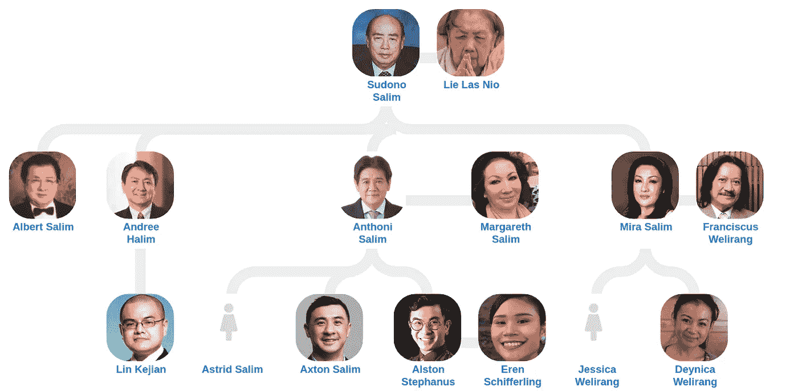
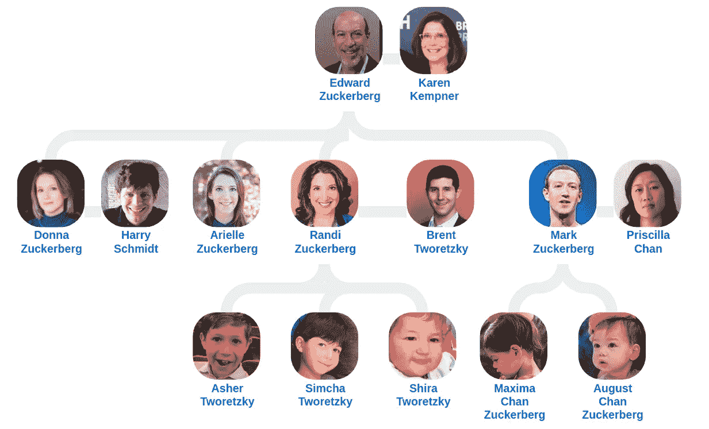
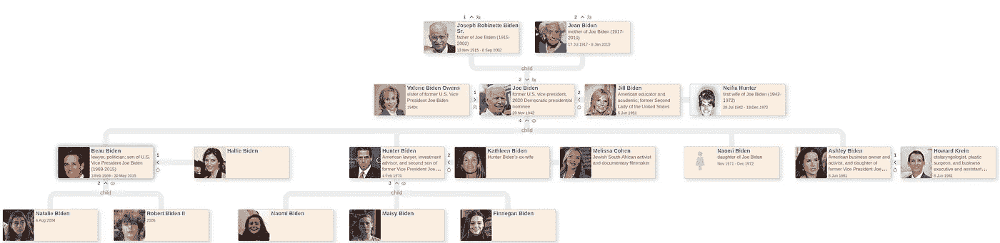

# 这种交互式可视化工具将大大增强您的数据叙述

> 原文：<https://medium.com/nerd-for-tech/this-interactive-visualization-tool-will-supercharge-your-data-narrative-30a52569acae?source=collection_archive---------17----------------------->

照片由 [Unsplash](https://unsplash.com?utm_source=medium&utm_medium=referral) 上的[延斯·勒列](https://unsplash.com/@madebyjens?utm_source=medium&utm_medium=referral)拍摄

EntiTree 是始于 2020 年中期的一项努力，是其他关于树木的[维基数据可视化工具](https://www.wikidata.org/wiki/Wikidata:Tools/Visualize_data)的合并，增加了一些额外的功能，使其更加可用和可导航。

EntiTree 的使命是支持以下人群:

*   任何水平的研究人员都希望以可视化的方式探索维基数据的联系，🧪
*   热衷于使用交互式分类树的科学家🔬
*   调查王室的历史学家👑
*   任何学科的学生，都想丰富自己的知识🎓
*   由于多语言功能，来自世界各地的好奇的随机和不讲英语的人🌎🌍🌏
*   维基数据编辑和贡献者，特别是如果他们有兴趣发现缺失或重复的链接🤓

# 用法示例

有了 EntiTree，你可以交互式地可视化硅谷巨头[、](https://medium.com/family-trees/tagged/silicon-valley)、印尼企业集团、[美国政客](https://medium.com/family-trees/tagged/us-politics)等等的家谱。下面是一些例子。

哈利·塔诺索迪布霍的家谱。用 EntiTree 构建:[https://www.entitree.com/en/family_tree/Q102422470](https://www.entitree.com/en/family_tree/Q102422470)

从上面的树上，我们可以看到 Harry Tanoesoedibjo 的家庭:这位印度尼西亚亿万富翁，MNC 集团的创始人，有四个女儿和一个儿子。

苏多诺·萨利姆的家谱。用 EntiTree 构建:[https://www.entitree.com/en/family_tree/Sudono_Salim](https://www.entitree.com/en/family_tree/Sudono_Salim)

Harry Tanoesoedibjo 是第二代印尼出生的华人，而 Sudono Salim 是第一代印尼华人，他于 1916 年出生在中国福州省，1936 年移居印度尼西亚。

马克·扎克伯格的家谱。用实体建造[https://www.entitree.com/en/family_tree/Q20900225](https://www.entitree.com/en/family_tree/Q20900225)

穿越海洋来到美国，EntiTree 现在向你展示这位脸书亿万富翁的美丽家谱。马克和普莉希拉有两个小孩:马克西玛·陈·扎克伯格和奥古斯特·陈·扎克伯格。

乔·拜登的家谱。用 EntiTree 构建:[https://www.entitree.com/en/family_tree/Joe_Biden](https://www.entitree.com/en/family_tree/Joe_Biden)

另一方面，美国总统乔·拜登拥有更丰富的公开家庭数据。可以进一步交互探索树，挖掘现任美国总统多事之家家谱:[https://medium . com/family-trees/Joe-Bidens-family-tree-8f 135 b 63038d](/family-trees/joe-bidens-family-tree-8f135b63038d)

请随时联系 EntiTree 团队的任何成员，关于用户界面的技术疑问或帮助 [Orlando](https://github.com/ogroppo) 是合适的人选，关于(维基)数据的任何事情 [Martin](https://medium.com/u/ebdd7d0df2e1?source=post_page-----30a52569acae--------------------------------) 将非常乐意帮助你。你也可以在 Twitter 上关注 EntiTree。