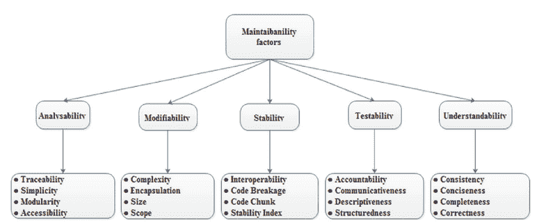
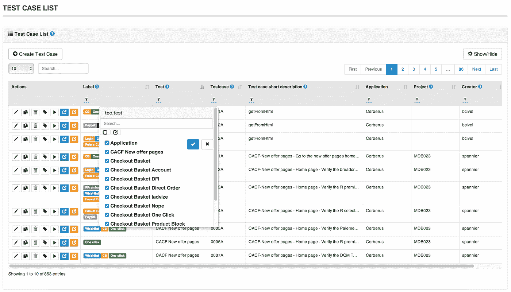
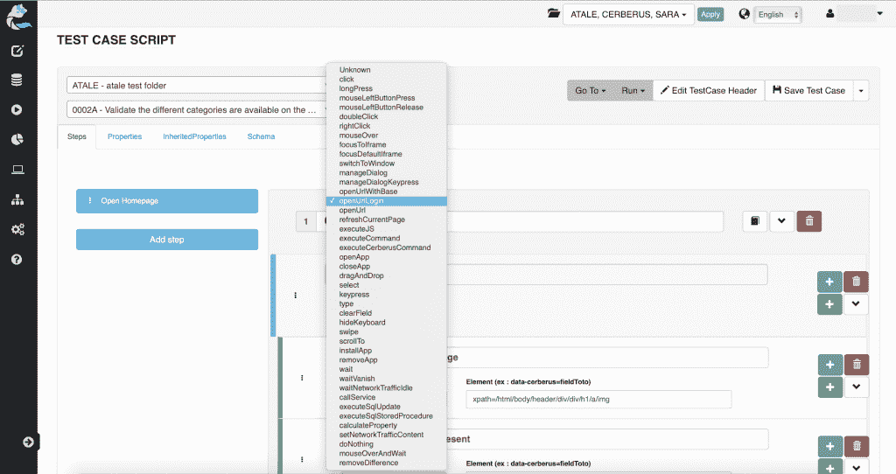
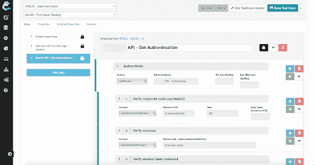

# 这就是如何实现可维护的自动化测试

> 原文：<https://medium.com/nerd-for-tech/this-is-how-to-implement-maintainable-automated-tests-740c1daa3cf?source=collection_archive---------9----------------------->

一个重要的特点就是晚。开发团队最终提交最后的变更。我们运行活动，但它充满了橙色和红色的指标。我们没有时间更新测试，所以活动被绕过“稍后”更新。事实上，就在那一天，它开始被遗忘。

测试自动化的旅程充满了瓶颈。一旦被测试自动化所说服，我们最终可以前进。但是随着测试套件的增长，另一个挑战也随之而来，那就是维护。忘记将测试可维护性作为一个需求会导致上面描述的情况。

测试自动化的采用受到一种驱动力的支持，这种驱动力可以稳定地加速软件变更的频率。自然的趋势是增加我们的测试自动化覆盖率，直到我们足够自信。事实是，软件应用程序正在进化，通过数字交互来迭代价值主张。因此，我们必须被动地和主动地处理测试维护。

让我们首先定义自动化测试的可维护性。

[**跟随 Cerberus 测试**](https://cerberus-testing.com/follow) 进行更多的开源测试自动化。

# 可维护的自动化测试意味着什么？

可维护性本身就是一项需求，属于非功能性需求类别。可维护的自动化测试的一个关键要素在于处理变更的容易程度。就像在软件中一样，Pareto 原则适用于自动化测试，80%的精力都放在维护上。

良好的可维护性支持从根本上解决缺陷，限制对整个系统的影响。这种良好的结构化导致在执行变更时防止了意想不到的副作用。

图 1:可维护性因素[https://www . semantic scholar . org/paper/maintainment-assessment-for-software-by-use-a-Kundu-t yagi/ef 8 ebddd c 1865 ecac ff 32 c 66d 006920 B1 f 293 bde](https://www.semanticscholar.org/paper/Maintainability-assessment-for-software-by-using-a-Kundu-Tyagi/ef8ebdddc1865ecacff32c66d006920b1f293bde)

因此，我们可以最大化自动化测试的使用寿命(还记得测试活动旁路&忘记吗？)、效率、可靠性和安全性。最重要的是，我们保持满足新需求的能力，这是持续测试方法的必备条件。

我们先来看具体的技术，从远离技术细节开始。

# 与业务领域一致的结构

产品管理团队管理他们的测试参考，因为他们有*特性*。这样，技术团队就可以更容易地使用特定的信息来实现相关的测试。我们可以做得更好；为什么首先要有一个筒仓？

团队需要横向协作，以便对他们的实验进行快速反馈。一个共享的测试存储库将支持一个活跃的协作、一个公共的词汇表和一个相似的结构。这些元素对于测试维护很有价值。

图 Cerberus 测试共享库[https://Cerberus Testing . github . io/documentation _ en . html # _ test case](https://cerberustesting.github.io/documentation_en.html#_testcase)

我们就以电商平台为例。传统产品区将会出现，如目录、产品、客户、结账和支持。这些领域中的每一个都可以细分为由页面和上下文组成的客户旅程。这是我们需要在测试中重用的业务结构，以最大化一致性和理解。

我们必须填补更多的空白，清晰地描述测试用例。

# 清晰明了的测试用例

想象一下，你刚作为一名 QA 来接替一名即将离职的成员。不幸的是，没有可能移交。您只剩下文档的剩余部分。你的第一反应将是搜索自动化测试，寻找“现实”。

结构良好、可读和可理解的测试用例是知识管理的基础。在我们的例子中，价值是确保团队中知识的连续性。此外，清晰也有助于日常协作。

图 Cerberus 测试中可用的动作和控制库【https://cerberus-testing.com/features/ 

高效的解决方案并不意味着复杂。在测试自动化中，用简单的语言表达简单的动作和控制的清晰的测试用例是必需的基础。关键字驱动测试( [KDT](https://www.guru99.com/keyword-driven-testing.html) )框架依赖于这种方法。

特定的技术也可以改进我们的方法，比如行为驱动开发(BDD)和单一责任原则(SRP)。一个更实际的测试也是可能的:问一个不熟悉你的测试的商务人士，他看了一遍后明白了什么。

好的结构可以重复使用。

# 我们可以轻松更新的可重用组件

因式分解是早期工程课程中训练的一个练习。模块、功能和组件被确定为良好实践。测试自动化也从这些实践中受益，在这些实践中可以应用类似的思想。

自动化测试由一组动作和控制组成，然后组合成一个逻辑结构。在 Cerberus 测试中，自动化动作库可用于动作和控制，简化了它们的使用和维护。

图 Cerberus 测试中的可重用步骤[https://cerberus-testing.com/features/](https://cerberus-testing.com/features/)

然后，一个步骤允许在一个测试用例中对动作和控制进行分组。类似地，我们可以将我们的步骤保存在步骤库中，以便在各种测试中重用它。价值是简化进化中的变化；我们只需要换一个地方。

Cerberus 测试还支持应用程序对象存储库的页面对象模型模式。这个特性使得能够使用一个集中的存储库来管理跨不同测试用例重用的对象的引用。这样，一个对象中的一个单独的变化就被应用到所有使用组件的测试用例中。

我们有一个有趣的工具箱可以明智地使用。

# 测试维护需要平衡

主要的风险是陷入过度优化的陷阱，目标不是简化维护，而是最大化重用。这种实践导致危险的异构模块在我们害怕改变的任何地方重复使用，这与我们最初的目标相反。

我们的答案在各种元素的平衡中。我们必须平衡业务和技术约束，以实现对两个世界的理解和可用性。耦合和解耦需要对它们的权衡进行客观的评估。

我们必须保持我们最初的测试维护目标作为指导原则:减轻现有和未来需求的变化。测试可维护性是我们在不断变化的世界中必须掌握的平衡艺术。

现在开始免费使用[地狱犬测试](https://cerberus-testing.com/start/)。

[**跟随 Cerberus 测试**](https://cerberus-testing.com/follow) 进行更多的开源测试自动化。

您可以支持开源测试自动化

*   **拍拍**这篇文章**👏**
*   **Star**GitHub[上的项目](https://github.com/cerberustesting/cerberus-source/)
*   **提供**一份[咖啡](https://www.buymeacoffee.com/CerberusTesting) ☕

*作者:* [*安托万·克拉斯克*](https://twitter.com/acraske_)

# 参考

维基百科，*维修性*[https://en.wikipedia.org/wiki/Maintainability](https://en.wikipedia.org/wiki/Maintainability)

*原载于 2021 年 7 月 24 日*[*【https://cerberus-testing.com】*](https://cerberus-testing.com/blog/this-is-how-to-implement-maintainable-automated-tests/)*。*