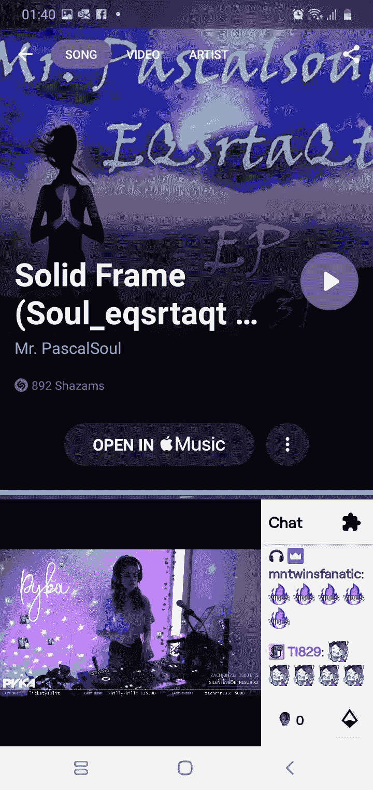
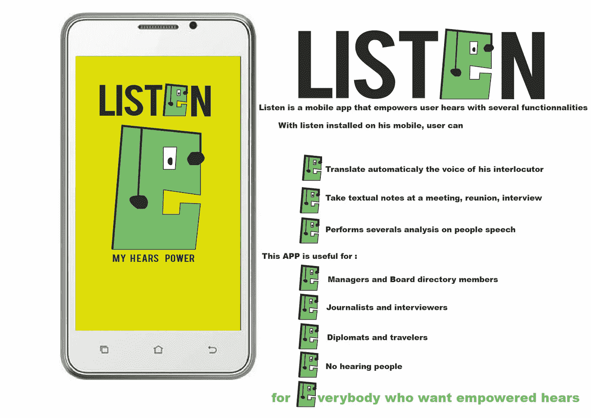
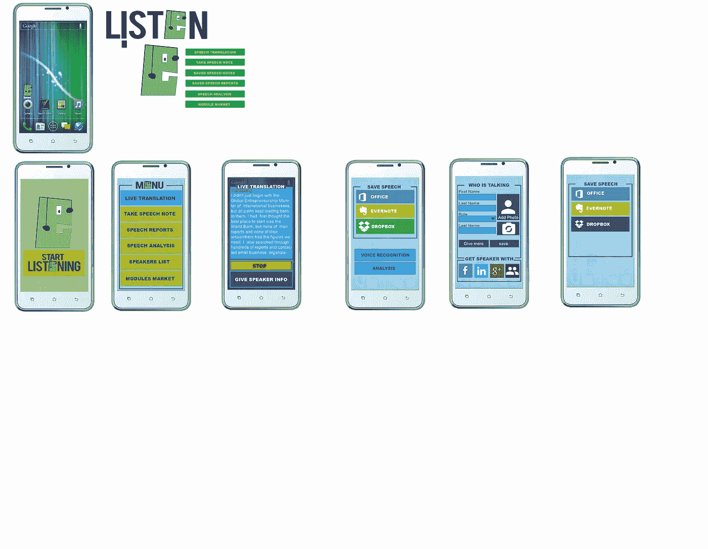

# 这就是这个玩家的目的

> 原文：<https://medium.com/nerd-for-tech/this-is-what-thisplayer-is-about-496ab000b152?source=collection_archive---------6----------------------->

## 所有这些参与者的技术支持想法的例子

我现在正在听这个声音，这个声音是在这个直播摄像头上播放的，我并不是在 P…n 鼓吹商业，但是也有数百万的直播摄像头在这样的平台上播放音乐。难道一个技术化的系统不可能监听所有这些流式声音，并获得声音的艺术家和标题吗？这难道不是一个收集热门音乐信息的好工具吗？对音乐产业来说，这难道不是一件有趣的事情吗？

这就是这个技术驱动的想法的意义所在，而且对于一个技术企业家来说，建立和运作这个想法仍然是有意义的。

我刚刚用智能手机测试了这个技术化的想法，这个想法可以通过算法实现自动化和规模化。

测试这个想法真的很容易，你只需要一部智能手机和一个像 Shazam 这样的应用程序，我不记得如何像那样分割屏幕，但是你认为没有你的帮助，计算机或智能手机不可能自己完成这个吗？

如果你的答案是肯定的，那么你已经向自己证明了我所写的这个技术化的东西是可以由一个像你这样的软件工程师或者你将要雇佣的人来构建的。如果你需要我，请不要犹豫，但我会让你付出很多，比如得到这个 [100X 软件工程师](https://mkrdiop.medium.com/how-to-be-this-100x-software-engineer-for-the-financial-industry-fbd1886bf8de)的费用。那么你最好在这些自由市场中的一个寻找另一个软件工程师，出价最低的人获胜，并问我你是否需要另一个技术支持的想法，因为我对[技术支持的想法业务](/running-a-publishing-startup/into-the-tech-enabled-product-ideation-business-fdadeab86e28)感兴趣，我很开放，能够为你提供更适合你的想法。

谷歌访问并处理了数十亿个网页，那么你就可以成为这个监听引擎，它将监听并处理数十亿个直播摄像头，不仅存储播放的音乐，还存储播放的内容。你可以像谷歌一样让每个人都可以访问它，或者只是让它成为音乐行业或任何其他行业的专业人士的 B2B 技术平台。我分享这一点是因为我认为这可能是一个技术支持的想法，您可能会感兴趣，我寻找了关于这一技术支持的想法的幻灯片，但没有发现什么可以说的是，有时关于技术支持的想法的文档可能会因为缺乏存储资源而丢失或被删除另一个事实也突出了资源稀缺正在影响我。但是我保证，一旦我找到了，我会和你分享它，很可能我会的，因为我想我已经把这个技术支持的想法的幻灯片通过电子邮件发给了某人，那么它应该在我的邮箱里。

如果你把这种科技化的想法当成自己的想法并倾听，你就可以成为像谷歌一样大的倾听引擎。

这个项目的幻灯片是[这里的](https://drive.google.com/file/d/1_NqVk8YUdJu4SDbHa396ZRZzR3ftyq2k/view?usp=sharing)

**PS:** 下面这个科技化的想法是关于一个应用程序实时翻译和你说话的人的语言。这种应用程序成为现实需要很长时间。

