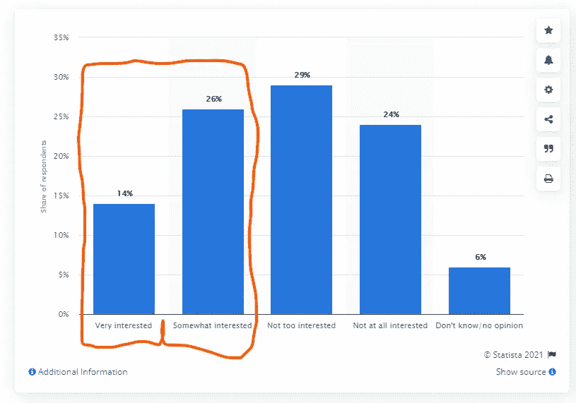

# 这是一个新闻技术支持和数据驱动的平台

> 原文：<https://medium.com/nerd-for-tech/this-journalistic-tech-enabled-and-data-driven-platform-e43998f66690?source=collection_archive---------9----------------------->

## 从声音到文本，再到视频，所有关于新闻报道的数据

从语音到文本再到视频，这个技术化的平台试图追踪并找到重要的话语和关心的人。在对新闻领域感兴趣之前，我已经花了很多年时间，我在 Coursera 上的这门课程提醒我，新闻对这个世界，尤其是对科技行业是多么重要。我一直在写科技新闻，展示它的报道如何影响科技企业的成功，并通过下面这些短文做了更广泛的分析

 [## 科技新闻领域

### 新闻报道如何影响创业成功

mkrdiop.medium.com](https://mkrdiop.medium.com/the-tech-journalistic-field-b6a9d8c3ad71)  [## Medium VS Techcrunch

### 尽管它们是出版公司，TechCrunch 和 Medium 当然是不同的。Techcrunch 是一家出版公司…

medium.com](/nerd-for-tech/medium-vs-techcrunch-1af2d7bf759c)  [## 关于香蕉的认知流程

### 香蕉到香蕉的链接可以产生伟大的事物和想法，为什么不是伟大的人类领袖。

mkrdiop.medium.com](https://mkrdiop.medium.com/cognitive-flow-about-bananas-dc91f8f233ce)  [## TechCrunch 和搜索引擎

### 下面是关键词 Jumbotail 在 2021 年 1 月 4 日到 2021 年 1 月 11 日之间的走势。这些数据是全球性的

mkrdiop.medium.com](https://mkrdiop.medium.com/techcrunch-and-search-engines-ad111fd3d180)  [## 听听亚历克斯和纳塔莎的话

### 距离被互联网打破了，这就是像 EquityPod 这样的好想法和解决方案向我们展示的。今天你…

mkrdiop.medium.com](https://mkrdiop.medium.com/listen-to-alex-and-natacha-fe11f5c863af) 

一篇发表在 Medium ( [here](/predict/medium-metrics-for-writers-and-publications-e692173361d8) )上的简单文章帮助我对这个新闻科技平台的受众做了一些假设。从这 65000 人中，我们猜测只有 5%的人会对这个科技平台感兴趣，这代表了 3367 个潜在用户的市场规模。如果这个 SaaS 新闻技术平台的订阅价格是 99 美元，那么在给定注册率的情况下，每年的收入是多少

这个新闻技术平台的收入估计

2015 年，美国约有**32900 名全职记者，到 2021 年，这个数字肯定会增加。**但是，随着我们现在生活在一个互联的世界，新闻业已经发生了深刻的变化，有许多像我一样的人，也许还有你，可以在网上提供内容，成为合格的业余记者。我在上一段中提到的这 65000 人就是这样的人，他们每天都在写他们的观点、想法和知识。那么这个新闻技术平台首先针对的是这一群人，然后试图接触到为华盛顿邮报或 TechCrunch 和其他专业媒体公司工作的专业记者。

有一个事实是，随着对假新闻和内容的担忧的增加，在线内容的指数级增长使得人们越来越有兴趣了解新闻业，不仅是为了对该领域做出贡献，也是为了了解信息是如何处理的，以便他们从假新闻中过滤出真相。如 2017 年图表所示，成年人(40%)对新闻领域越来越感兴趣

截至 2017 年 3 月，美国成年人对了解更多新闻行业的兴趣程度

300，000 美元的年收入是这个新闻技术平台可以实现的，这就是为什么我们开始建立这个简单的最低可行的平台，它将帮助您对这个平台感兴趣的人参与进来并从中获得价值，同时帮助我根据您的反馈和功能请求改进它。

现在差不多一年过去了，我独自经营一家出版创业公司，并写了一些数据驱动书籍的草稿，听起来这将是这家出版创业公司生产的第一个平台，但仍然没有资金来购买这个领域和云托管空间。资源对我来说一直是稀缺的，但我希望这永远不会阻止我像写这篇文章一样与你分享。