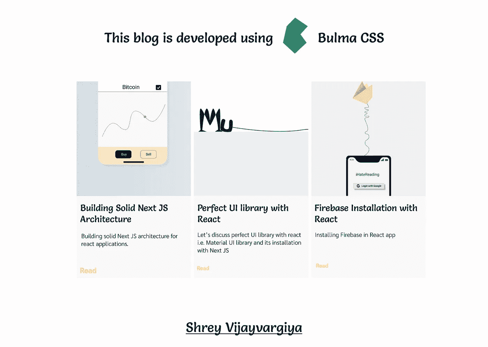

# 这个库使得 CSS 样式化变得轻而易举

> 原文：<https://medium.com/nerd-for-tech/this-library-makes-css-a-cakewalk-471521a27d5a?source=collection_archive---------12----------------------->

替代 bootstrap 和 tailwind CSS，使用 React 应用程序开始使用 Bulms CSS

[为文章设计创意](http://ihatereading.in)

# 在后台

我只是在寻找顺风 CSS 的替代品，看，我并不反对顺风，但我确实发现使用顺风 CSS 扩展我的样式有些困难，所以我开始寻找它的替代品。