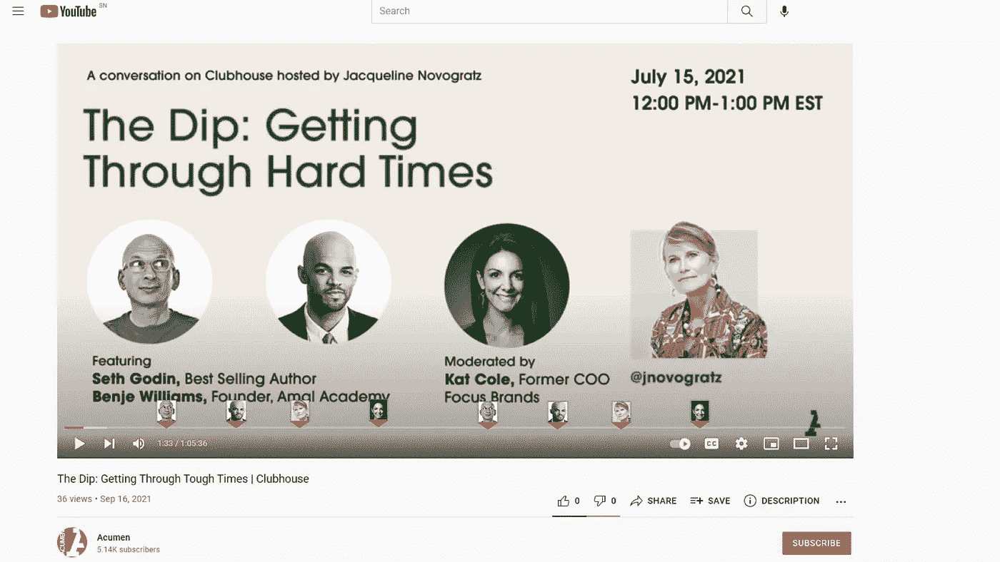
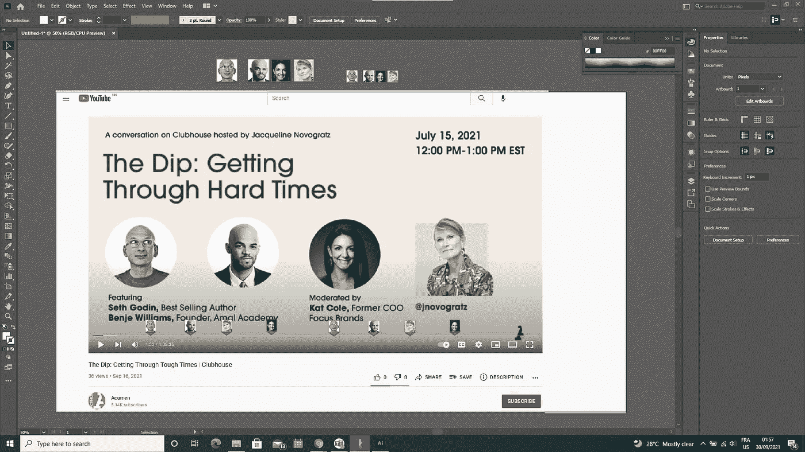

# 另一个类似 Youtube 的功能想法

> 原文：<https://medium.com/nerd-for-tech/this-other-youtube-like-feature-idea-25cda30cf066?source=collection_archive---------11----------------------->

## 谢谢杰奎琳·诺沃格拉茨，你向我强调了这一特点

有人拿着带有 Youtube 标志的智能手机

我使用 Youtube 作为一个例子，但这个功能是关于每一个嵌入到网站中的视频播放器，用于播放来自俱乐部会所记录的对话的视频或我在这篇题为《视频制作的人工智能》([此处为](/codex/ai-in-video-publishing-platform-177a1b8d8003))的文章中所写的视频。这类视频主要是关于人们讨论一个给定的话题。有时是两个人的讨论，但通常不止两个人参与对话，但通常情况下，我们观看这种视频是因为有人，就我而言，是昨天因为 Seth Godin 和某种程度上 acumen 的 Jacqueline Novogratz，即使我最终发现 Benje 和 kat 也是值得听的伟大人物。我消耗了整个对话，但时间紧迫，我觉得我只需要听赛斯的意见，而不是其他人的意见，但我没有可能跳过视频的某些部分，直接进入我感兴趣的部分，如我如何能够在这个网站上做到这一点，我很惭愧在这里透露。我说的这段对话就在这里

Acumen fund 的 youtube 频道视频

但我所写的视频播放器的功能是自动将标记点添加到时间轴上，并从这些标记点开始显示正在说话的人的图像。然后有了这个可能性，我就能够争取时间，只听赛斯·戈丁的意见。我应该同意，对于那些将被跳过的人来说很难，因为很难接受别人不关心你的想法。我希望这不会发生在你和其他人身上，因为这是一个难以忍受的情况，但互联网上的时间真的很少，就像在现实生活中更少一样，这就是为什么我们技术建设者应该总是给互联网用户更多的过滤能力，这就是为什么我写的这个功能对于像 youtube 这样的平台和网站来说很重要，因为它有益于所有互联网用户。

你将被建造的一个特征

如果你能造出这种视频播放器，请去造吧，因为世界需要它。就我而言，我将尝试构建它，但我问自己我将如何处理这个关于 C++编译器的项目，我在今天的早间页面和几个月前我在 youtube 上发布的这个视频以及这个[的另一个 Youtube 功能](https://mkrdiop.medium.com/this-youtube-feature-370243a5554)中写道。我希望你已经看到，通过在我的待办事项中添加这个功能，我惩罚了另一件也计划要做的事情，因为我们不能像扩展技术支持的项目那样扩展时间。

PS:我真诚地认为，我不应该花超过 24 小时不写和发表在这里，给你机会阅读，并希望你可能会有一些有趣的东西，这将缓解你的旅程，并帮助你实现你的目标。我希望你也为我祝福。

至于向你展示我已经亲自完成了这项工作，请考虑我的画板或桌面的截图。

我的桌面屏幕截图构建此 youtube 或视频播放器功能的图片