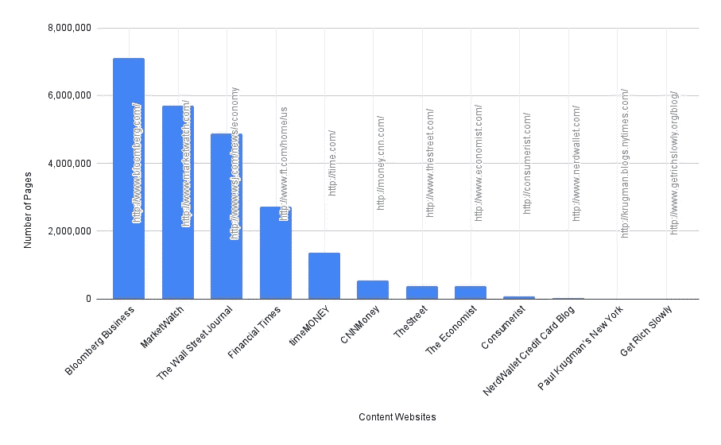
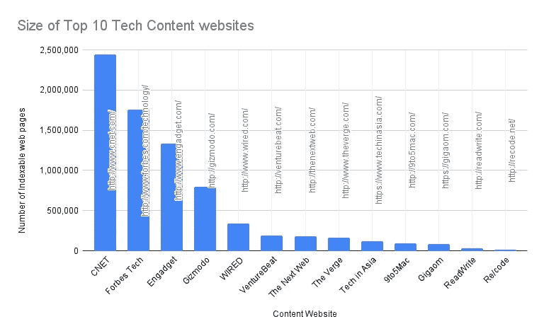
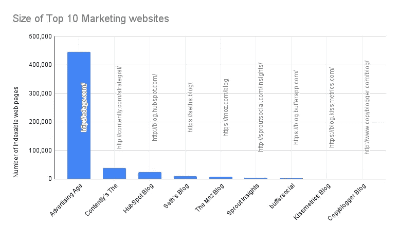
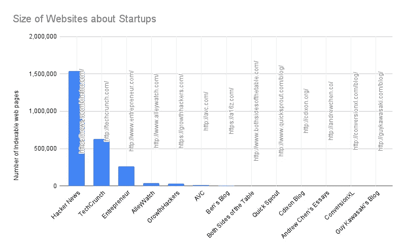

# 这个顶级 1K 搜索引擎

> 原文：<https://medium.com/nerd-for-tech/this-top1k-search-engine-41dc46f89b04?source=collection_archive---------5----------------------->

## 一个技术支持的想法，服务于最少的可行受众

谷歌正在参考和索引数十亿个任何类型和流派的网站，并根据我们在搜索框中输入的关键词提供数百万个结果。如果搜索引擎只索引和引用前 1000 个内容网站，如 youtube、medium、TechCrunch、blogger、Wallstreet Journal 和其他网站，会怎么样？也许你的网站是这些 1000 强内容网站的一部分，也将是我向你描述的这个搜索引擎的一部分。

明确它是关于什么的，可以帮助用户和客户过滤掉他们不需要的东西，然后如果你正在搜索的东西深入到黑暗的网络中，你肯定不会在这个 TK 搜索引擎中找到它，因为它很可能是我们许多人都知道的前 1000 个网站中的一个网站，顺便说一下，是在网络的表面。

为什么不只是这 51 个网站在这里列出

这是他们的页数图表，可以被这个搜索引擎索引，为你提供关于金钱的最佳答案。

关于金钱的 12 大网站的可索引网页数量

但是，如果你正在寻找科技领域的东西，那么 TechCrunch 及其替代品可以满足你的要求。这个搜索引擎只能索引 10 个技术部分内容的网站，我列出的一个是在这里与他们可以被索引的网页数量的图表

十大科技网站的可索引网页数量

或者像我一样，营销是你关心的事情，因为你相信我们每天做的一切都涉及营销，那么这个搜索引擎可以索引这十大营销网站，这是它们的页面数量

十大营销网站的可索引网页数量

如果你已经读到这里，那么很有可能创业公司跟你谈得很好，你想让我了解他们更多。这就是为什么将关于创业公司新闻和知识的网站纳入搜索引擎索引的原因，下面的图表显示了一些创业公司网站的规模

十大营销网站的可索引网页数量

如果这个搜索引擎只关注我上面列出的关于金融、商业、营销和创业的网站的内容，它实际上会索引超过 3300 万个网页，确切地说是 33，732，888 个网页。为什么不是这种搜索引擎？肯定有像我一样需要它的人，也许是你。

你不是吗？

PS: 这个科技化的想法实现了[赛斯·戈丁](https://seths.blog/about/)的最小可行观众框架的课程，或者如果你喜欢[凯文·凯利](https://kk.org/about-me)的真正 1000 名粉丝。我写的这篇文章在[中描述了这个塑造商业模式的框架。](https://mkrdiop.medium.com/traction-driven-business-modeling-fe6ac959591c)

如果你打算建立这个搜索引擎，请注意下面这个技术支持的想法

 [## 404 页对我们不利

### 为什么搜索引擎和所有这些创业公司和公司不联系网站所有者或拥有一个煽动…

mkrdiop.medium.com](https://mkrdiop.medium.com/404-pages-are-bad-for-us-4f79b39128f7)  [## 404 页和气候变化

### 多少互联网用户的请求导致 404 页。很多往往是我的答案，我经历了很多 404 页…

mkrdiop.medium.com](https://mkrdiop.medium.com/404-pages-and-climate-change-24a714dfcb77)