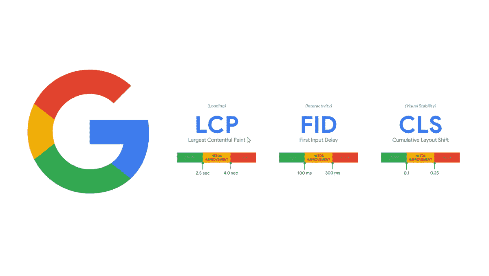

# 这次更新仍然是一个机会

> 原文：<https://medium.com/nerd-for-tech/this-update-is-still-an-opportunity-6a89baeec41f?source=collection_archive---------4----------------------->

谷歌核心网站动态更新

我在听播客 Pivot t，听到 Scott Galloway 教授以投资者和 About.com 董事会成员的身份讲述了这个故事，以及当谷歌对他们的搜索算法进行更新，使 about.com 失去了他们从这个搜索引擎获得的很大一部分有机流量时他们的经历。几个小时后，我看了马尔科姆·格拉德威尔的《大师课》,听到他讲述他如何看待谷歌有多糟糕，因为它擅长确认我们已经知道的和每个人都同意的东西，并了解更多关于所有搜索引擎和推荐引擎共有的确认偏见的问题。你可以读这些书，但马尔科姆提醒我的是，即将到来的谷歌更新将对许多基于搜索引擎有机流量的业务产生非常大的破坏性。

一年前，我致力于这一更新，试图为那些将要面对它的人建立一个解决方案，当我将它搁置以进入 book dojo 的图书出版时，这项工作已经处于高级阶段。希望对我来说，更新已经被推迟或推出了小增量，让我仍然有时间来工作，并完成我心目中的解决方案。JS 第三方服务是那些想在这次更新浪潮中悄悄冲浪的人要解决的主要问题。几天前，我听说这个谷歌更新即将到来，我与这个年轻的黑客运动员的谈话，他建议我出售我的廉价和糟糕的文章，就像是告诉我是时候工作和发布这个解决方案了，这将帮助基于有机流量的在线企业安全地面对这个谷歌更新。真诚地说，一年前我收到了一个谷歌团队成员的邀请，他们负责收集工具，这些工具是为帮助网站所有者面对这一新的更新而构建的，我从这位谷歌团队成员那里获得的列表中注册了大约十个解决方案，我的可能是其中的一部分。

然后，让我们在这个即将到来的更新上工作，看看它是否会是一个成功的赌注，有了这个项目，我甚至不需要响应或移动开发，因为它肯定要建立的解决方案的目标受众是桌面驱动的，而且很长一段时间以来，我认为最好以桌面为主要媒介推出在线业务。

当你有一个来自你的最高层级实体的检查时，所有可能让这个检查员对你评分很差的事情，直到它完成检查，让他们回来，谁知道这也可以用于这次谷歌更新，因为像 StackExchange 这样的初创公司已经向谷歌搜索引擎显示了使他们排名的内容，同时隐藏了这些待售的信息，但最好的解决方案是持久和一致的解决方案，直接针对问题，而不是欺骗。这就是我试图实现的解决方案，即使我清楚地知道如何让一个搜索算法判断你的网页符合 CVW 标准，而事实并非如此。

**PS:** 你可以用谷歌播客[这里](https://podcasts.google.com/feed/aHR0cHM6Ly9mZWVkcy5tZWdhcGhvbmUuZm0vcGl2b3Q=)听引用的播客 Pivot 或者看马尔科姆·格拉德威尔大师班[这里](https://www.masterclass.com/classes/malcolm-gladwell-teaches-writing)