# JAVA 中的线程

> 原文：<https://medium.com/nerd-for-tech/threads-in-java-b3b575d1030d?source=collection_archive---------7----------------------->


●线程是执行的流程。

●一个线程同时执行多条指令。

●线程用于在后台执行复杂的任务，而不会中断主程序。

# **多线程**

多线程可以被称为同时处理的多个执行流。这也被称为“多任务处理”。

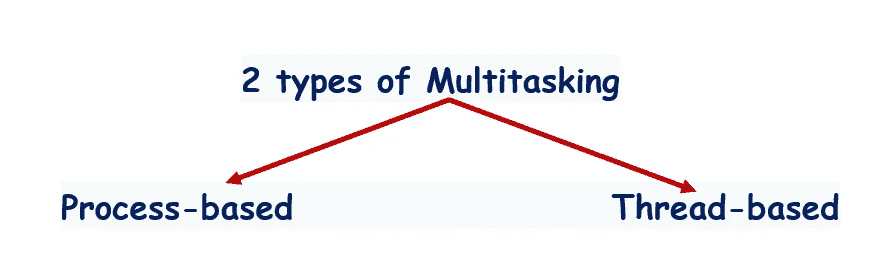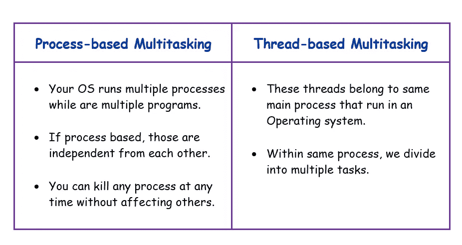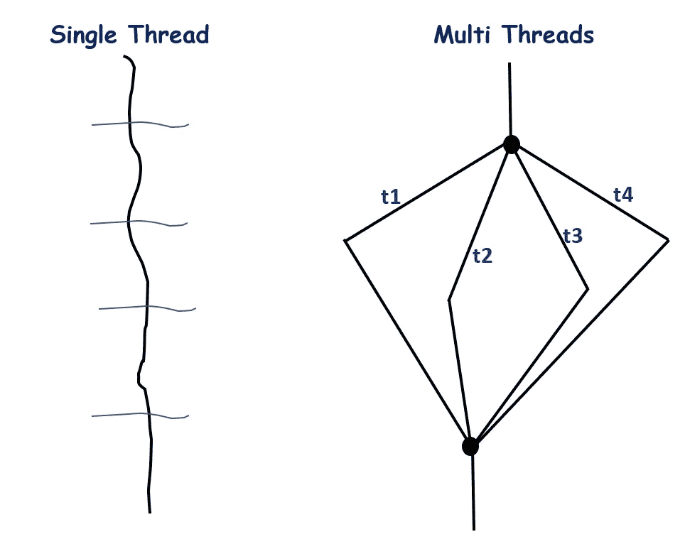

✦有一种可能性，在某一点上，所有的线程可以加入，并作为一个线程从这一点开始。

**要记住的事实:**

🟠:仅仅通过增加线程的数量是不可能显著减少时间的。

🟠在基于线程的多任务处理中，那些线程属于一个进程本身。

# **线程生命周期**

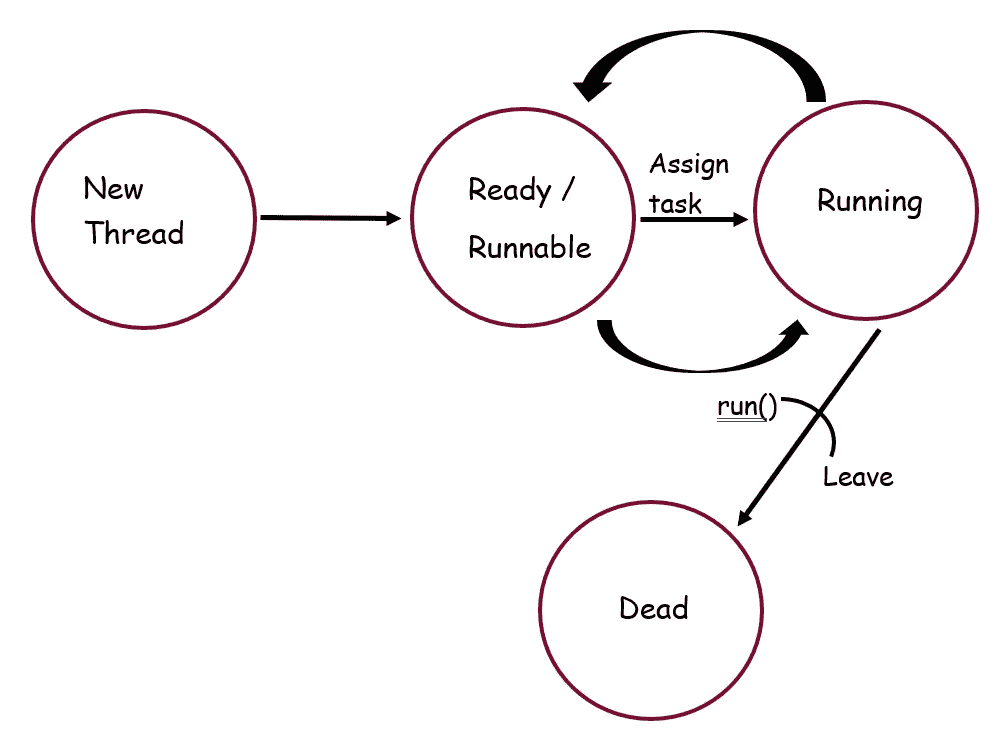

1.  **新增**

当你创建一个线程类的实例时，线程进入新的状态。当线程处于新状态时，它还没有开始执行。

**2。就绪/可运行**

一旦线程进入可运行状态，它就可以执行了。

**3。正在运行**

如果线程调度器选择并分配了一个任务，它就处于运行状态。在某些情况下，线程可以移回就绪状态。

**4。死了**

当线程的 run()方法退出时，它处于 dead 状态。一旦线程死了，它就不能回到任何先前的阶段。

🔴在这些步骤之间，还有其他多个步骤。

例如:线程可以进入阻塞状态(临时保持状态)

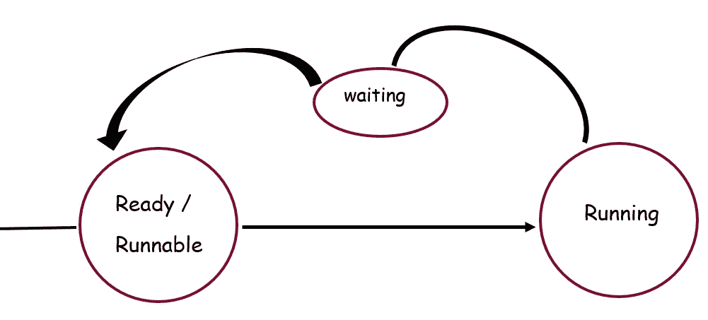

⚫️ **规则:**如果任何线程进入等待状态，没有办法直接进入运行状态。

以便从等待状态进入就绪状态；

1.  当线程 2 完成其任务时
2.  当超时时
3.  当被打断时

让我们举一个例子。

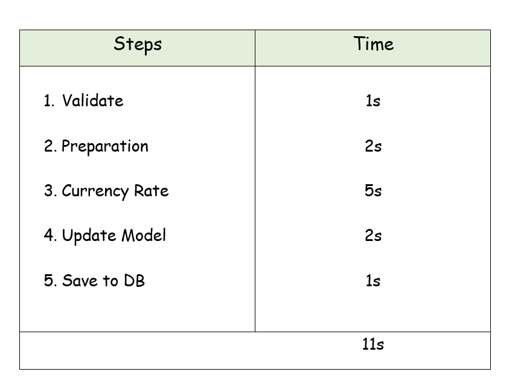

**问题:**

为什么我们不能使用 5 个线程，把时间缩短到 11/5 秒的❓

💠因为它们是依赖任务。

💠可以并行做任务。为此，您可以使用两个不同的线程，将时间缩短到不到 11 秒。但是没有办法增加线程的数量，将进程减少到 1 秒或 2 秒。

**如何在 Java ❓中创建线程**

有两种方法。

1.  扩展线程类
2.  实现可运行接口

🟣无论你如何创建一个线程，线程的行为和它做什么都不会改变。

# **扩展螺纹类**

让我们观察下图。

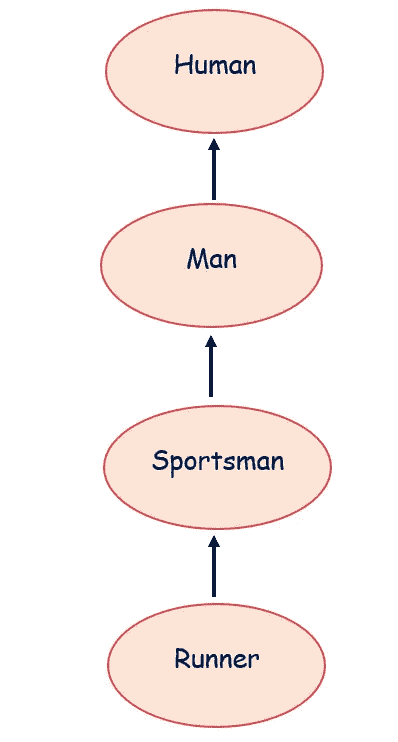

如果你把 Runner 转换成一个线程(即扩展 thread 类)，就打破了这种关系。当扩展螺纹等级时，跑步者与运动员的关系将会破裂。这是因为 Java 不支持多重继承。

🔴没有什么叫做“扩展线程类比实现 Runnable 接口更好”。

**与线程相关的场景**

```
**Scenario 1: Is it valid to override run() method when you extend thread class?**
```

当您调用 run()方法时，它会检查 Printer 类中是否有 run()方法。

当您在 Application.java 中使用 printer.start()方法时，它会在 printer.start 中检查 printer 类中是否有 start()方法。因为什么都没有，所以它转到父类(线程类)

在线程类中；

🔹有一个 start()方法。

🔹在 start()方法中，调用 run()。

**输出:**

它将被执行，但什么也不会发生。

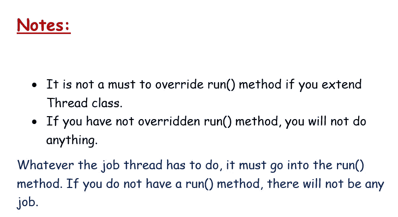

*如果你实现一个 Runnable 接口，它会强制覆盖 run()方法，因为这是一个实例的行为。如果实现任何接口，必须重写接口中的所有方法。*

```
**Scenario 2: Can we stay without overriding run() method when you implement multiple threads?**
```

可以，但是有一个条件。

它必须来自“扩展线程”类(不是实现)

如果不覆盖 run()方法，该线程将没有任何作业。所以，什么都不会发生。

```
**Scenario 3: Why do we have different orders in each executions when executing the below program many times?**
```

*在执行时，我们无法预测哪个线程(无论是主线程还是子线程)将首先执行，因为没有执行顺序的规则。当一个线程开始执行时，它会将你的线程添加到完全依赖于你的 JRE (JVM)的线程调度器中。线程调度器决定哪个线程去。并且这个顺序从 JVM 到 JVM 是变化的。*

```
**Scenario 4: What happens when you invoke run() method instead of start() method?**
```

**输出:**

它总是在执行 main 之前执行子类。

我们只有一根线。(不是两个线程)

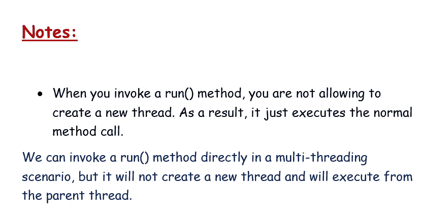

问:为什么强制调用 start()方法？

🟠让你的生活变得简单。

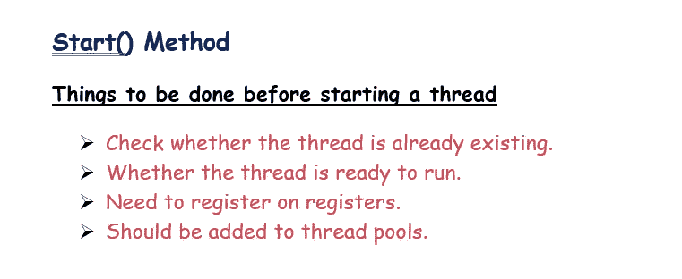

🟠当你调用 start()方法时，JVM 会完成上面提到的所有任务，并调用 run()方法。

```
**Scenario 5: What happens when you override a start() method on your Thread class?**
```

*printer.start()方法给出了即时类的机会。当我们调用 main 类中的 start 方法时，Printer 类中的 start()方法被执行。*

*当重写 start 方法时，您已经阻止了创建新线程的机会，因为您阻止了线程类调用 start()方法。因此，它不会创建一个新线程，不会添加注册，不会做任何事情，所以它不会工作。*

```
**Scenario 6: Can you overload main method?**
```

*是的，但是 JVM 总是考虑公共静态 void main (String[] args)签名。*

```
**Scenario 7: Can you override start() method and allow creating a thread?**
```

*然后它创建了一个新线程。当您调用 super.start()时，它会转到 Thread 类的 start()方法的父类，它会创建一个线程并添加到池中。这一次，该线程立即开始执行。*

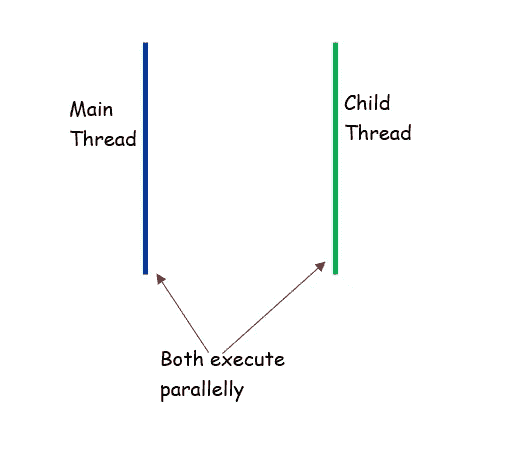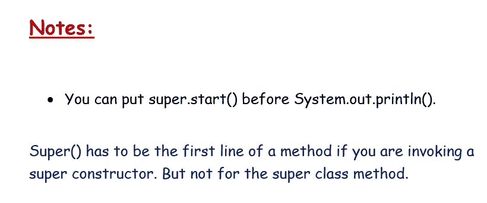

```
**Scenario 8: What happens if you overload run() method?**
```

*什么也不会发生，它会创建一个线程。但是线程类将总是不带参数地调用 run()方法。*

```
**Scenario 9: What happens if your main thread does more job than your child thread?**
```

*如果主线程离开 main 方法，不会终止 java 程序。即使主线程完成了它的工作，子线程也可以继续它的工作。*

如果要在主线程终止时终止子线程，必须将子线程设置为守护线程。

***(。setDaemon(true))***

只有当最后一个非守护线程终止时，程序才会终止。

# **实现可运行接口**

● Runnable 是一个不包含任何实现方法的接口。

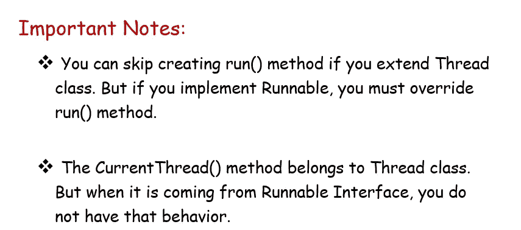

*扩展一个线程类的时候，你的类扩展了线程类，线程实现了 Runnable。我们有一个中间类叫做 Thread。它从 Runnable 接口实现了所有有用的方法。*

当您从 Thread 类创建一个对象时，您可以为它传递 Runnable 实例。

在下面的代码片段中，我们创建了一个线程类实例，并从 Runnable 接口传递我们的实例。那意味着，我们通过打印机实例。

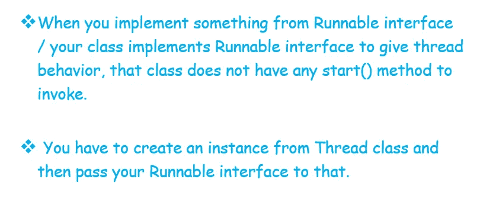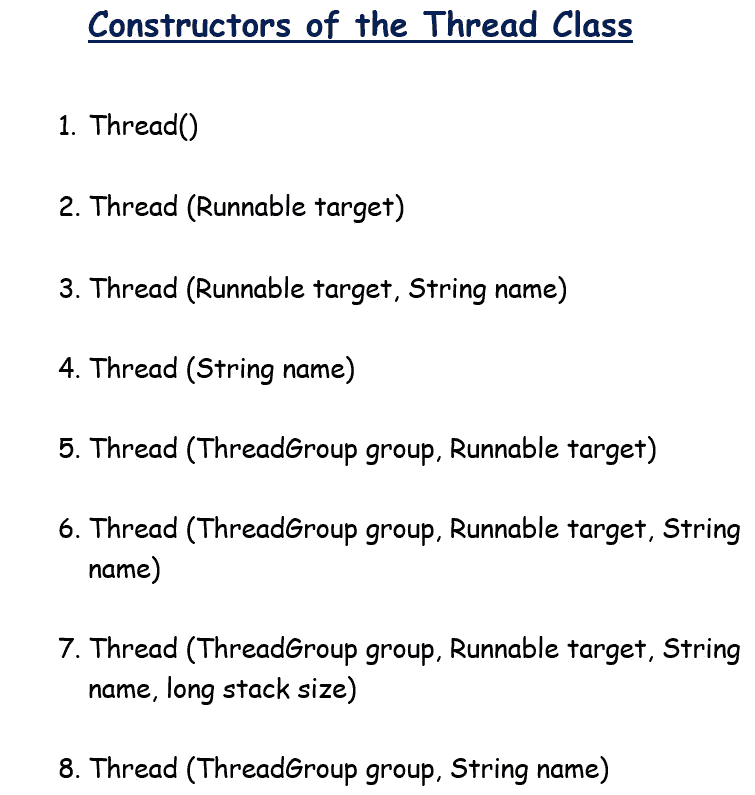

# **线程优先级**

🔸线程优先级不是一个索引，而是一个值。

🔸线程优先级范围从 1 到 10。

最高优先级➞ 10

最低优先级➞ 1

🔸在任何应用程序中，主线程的默认优先级是 5。此后，您创建的任何线程都将继承父线程的值。

🔸没有这样的规则，线程优先级总是为 5。

示例:

如果主线程创建 t1，t1 继承主线程的优先级。然后你可以改变 t1 的优先级。

考虑主线程的线程优先级是 5。然后你创建了 t1，所以现在 t1 的优先级变成了 5。然后将 t1 的优先级设置为 7。如果你用 t1 线程创建 t2，t2 将继承 t1 线程的优先级。

```
**What happens if you set a priority beyond 1-10?**
```

*它会抛出一个非法参数异常，因为你设置的东西超出了线程优先级的限制。*

```
**What happens if two threads carry the same priority?**
```

不会发生什么重大的事情。*线程调度器将选择一个线程运行，您无法预测。*

# T hread 连接方法

它允许当前正在运行的线程停止执行，直到另一个线程完成它的任务。

有 3 种不同的重载连接函数。

1.  加入()
2.  加入(长距离)
3.  join(长毫秒，整数纳米)

✵如果时间没有提及，它永远等待。如果另一个线程在给定时间之前完成了它的工作，那么它可以继续。

# 螺纹屈服法

● Yield()方法可以用来调试或者改变/给某个特定线程更多的机会。

●使用 yield()时，您无法使用多线程。

●如果有 2 个不同的线程，任何线程都可以调用 yield()。调用 yield()的那一刻，线程给线程调度器一个信号，把机会让给其他人。

● Yield()是原生方法。(未在 Java 中实现)

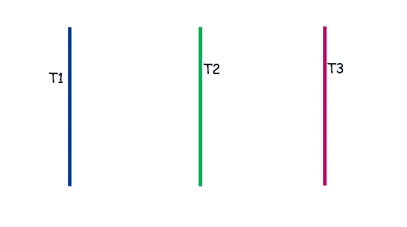

✽ T1 调用 yield()方法。

✽无论是 T2 还是 T3 都会得到机会。

✽:如果 t3 得到了机会，不能保证当 T3 在特定时间段完成工作时，T1 还会得到机会。很可能是 T2。(这是因为 T1 又是线程调度器上的一个普通等待线程)

# 线程睡眠方法

●它可以等待某个给定的时间。

●有两种不同的方法签名(重载)

1.  公共静态 void sleep(长毫秒)抛出 InterruptedException ➞本机方法

2.公共静态 void sleep(long ms，int nanos)抛出 InterruptedException ➞不是本机方法

●在这个 sleep()方法中，线程将进入等待状态一段时间，如果:

🟢等待时间已过

如果发生任何中断，🟢

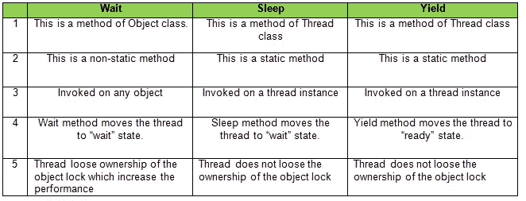

# 线程中断方法

●线程类的 **interrupt()** 方法用于中断线程。

●在你执行 interrupt()方法的那一刻，无论什么处于等待状态的线程都会回来。

# 参考

[](https://www.geeksforgeeks.org/java-concurrency-yield-sleep-and-join-methods/) [## Java 并发性——yield()、sleep()和 join()方法——GeeksforGeeks

### Java Concurrency - yield()、sleep()和 join()方法我们可以通过使用一个…

www.geeksforgeeks.org](https://www.geeksforgeeks.org/java-concurrency-yield-sleep-and-join-methods/) [](https://www.javatpoint.com/multithreading-in-java) [## Java 中的多线程-Java point

### Java 中的多线程是同时执行多个线程的过程。线程是一种轻量级的…

www.javatpoint.com](https://www.javatpoint.com/multithreading-in-java) [](https://images.app.goo.gl/Y9JY758A8D5e9cD38) [## https://bimales.files.wordpress.com/2014/07/af869-wait.png 的谷歌图片搜索结果

### 编辑描述

images.app.goo.gl](https://images.app.goo.gl/Y9JY758A8D5e9cD38)