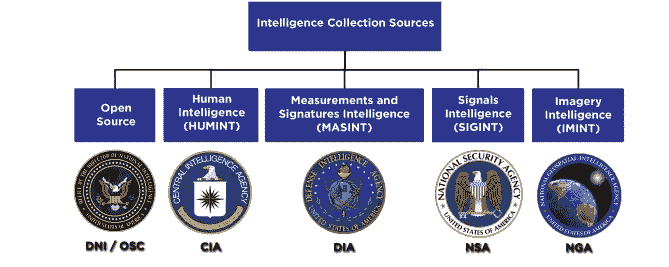
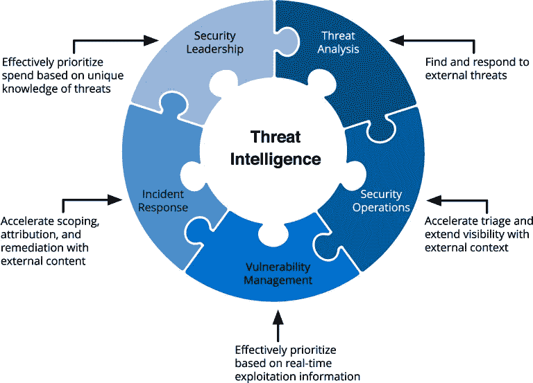
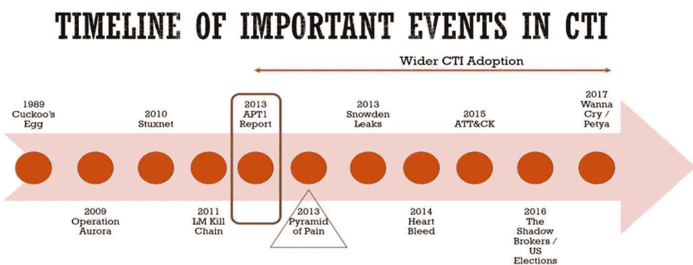
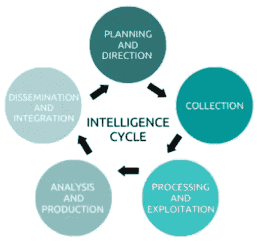

# 威胁情报

> 原文：<https://medium.com/nerd-for-tech/threat-intelligence-eaf648712f47?source=collection_archive---------3----------------------->

对抗网络攻击的新武器

情报是收集和处理关于竞争实体及其代理人的数据和信息，这是组织或团体出于其安全目的所需要的。

让我们从头开始……
根据需要，组织可以使用许多智能领域。

> **什么是威胁情报？**

*   威胁情报被定义为，
    收集、检测、评估&分析对组织有害的威胁&恶意事件的过程。
*   威胁情报已经成为成熟安全组织的重要职能之一

*   您已经多次听到团队威胁情报威胁情报可以减少您在调查安全事件上花费的时间。也许你读了一篇关于国家支持的攻击的报道，想知道如何保护你的企业。
*   CTI 不仅仅是创建和制作报告、PDF 或 IR 团队的一些实际研究，但在现实世界中，CTI 可以在许多方面帮助保护网络空间。就像，IOC(危害指标)可以帮助安全团队识别恶意活动，SOC(安全运营中心)也有助于检测、分析和响应网络安全事件等等…

> **CTI 提供有关恶意行为者、其工具、基础设施和方法的信息；**

识别攻击类型
定义、指导和优先化操作要求
了解威胁参与者的能力、战术、技术和程序
部署检测系统
制定防御策略

> **我们可以将主要威胁分类如下:**

恶意软件
DoS/DDoS
僵尸网络
网络钓鱼/垃圾邮件
勒索软件
内部威胁
漏洞利用
数据泄露
身份盗窃
信息泄露
高级持续威胁(APTs)

> **CTI 中一些有用的方法**

**智力生命周期**

*1)规划&方向*方向
确定将要执行智能的范围&区域的集合。

*2)收集*
从多个来源收集数据，包括 HUMINT、OSINT、imagery、电子来源、截取的信号或公开来源。

*3)处理&利用*
数据收集后，必须处理成可理解的形式。这可能包括从外语翻译、解密或整理数据。

*4)分析&生产*
评估和分析英特尔流程的最终生产可用数据。这一阶段的产品是为决策者总结数据的评估和报告

*5)传播&整合*
这些报告和评估交付给客户、执法机构或顾客

**网络杀戮链**

*   洛克希德·马丁公司开发的网络杀伤链，它意味着确定威胁行动者为实现其目标应遵循的步骤。
*   有七个不同的步骤:

1.侦察 **:** 利用非侵入性技术了解受害者。

2.武器化:产生将要投放的恶意有效载荷。

3.交付:交付武器化神器。

4.利用漏洞:通过利用漏洞在受害者系统上执行代码。

5.安装:安装最后一个恶意软件。

6.命令和控制(C2):建立一个通道与受害者系统上的恶意软件进行通信。

7.针对目标的操作:通过完全的访问和通信，攻击者实现了他们的目标。

**米特 ATT & CK 框架**

*   一个有用的框架，用于表达和记录 MITRE 支持的策略和技术，并通过社区中的许多人做出了贡献。侧重于在现实世界中观察到的战术和技术
*   [**米特 ATT&CK**](https://attack.mitre.org)**框架是一种描述性模型，用于标记和研究威胁参与者能够执行的活动，以便在企业环境、云环境、智能手机甚至工业控制系统中获得立足点并进行操作。**
*   **ATT&CK 框架背后的神奇之处在于，它为网络安全社区提供了一个通用的分类法来描述对手的行为。它作为一种共同的语言，进攻和防守研究人员都可以使用它来更好地相互理解，并与非该领域专业人员更好地交流。**
*   **最重要的是，你不仅可以在你认为合适的时候使用它，而且你还可以在它的基础上，创造你自己的一套**战术、技术和程序** ( **TTPs** )。**
*   **12 战术被用来包含不同的技术。每个战术代表一个战术目标；也就是威胁者表现出特定行为的原因。这些策略中的每一个都由一组描述特定威胁参与者行为的技术和子技术组成。**
*   ****程序**是威胁行动者实施特定技术或子技术的特定方式。一个过程可以扩展成多个技术和子技术。**

> **网络威胁情报分析师的职责是什么？**

**日常运营和职责取决于每个组织的目标。威胁情报可以在信息安全计划的许多领域提供帮助；因此，该角色的职责可能略有不同。然而，我可以根据我的经验和我所认为的通过实施威胁情报来解决问题的最常见方法来说话。**

**威胁情报可以分为三个主要主题。**

*   **战术的**
*   **战略的**
*   **操作的**

## **战术的**

**战术侧重于日常的技术操作。一个很好的例子就是指导安全分析师如何应对他们每天遇到的威胁。为此，威胁情报分析师应该提供背景和相关指标。这将使安全分析师能够专注于重要的威胁，并更快、更高效地解决问题。如上所述，智能无非是:**

1.  **信息**

*   **例如关于威胁。**

**2.语境**

*   **例如，组织的环境及其面临的威胁风险。**

## **战略的**

**战略威胁情报侧重于将情报提供给负责决策的高级官员。因此，传达风险的能力变得至关重要。**

*   **例如，作为一名威胁情报分析师，您需要将任何技术信息以情报成品的形式翻译给组织的领导。这方面的例子包括视频演示、书面报告或一对一会议。交付和产品应该专业和简洁。主题可能包括威胁分析、趋势或业务的持续风险。**

**需要强调的是，战略威胁情报工作是最关键的部分。在这种情况下，威胁情报团队的所有成员都应该在进行任何交流之前，对最终产品进行贡献、交叉检查和分析。**

## **操作的**

**作战威胁情报侧重于通过研究战术、技术和程序(TTP)来了解对手。为我们提供所需信息的主要信息来源来自内部事件。这里的主要重点是了解攻击背后对手的意图、能力和动机，并对可能影响您试图保护的组织的威胁进行优先级排序。**

*   **例如，威胁情报分析师将分析内部入侵企图，以了解组织正在面临的威胁。这里的目标是为多个团队提供相关信息，包括事件响应、威胁搜寻和漏洞管理。**

**作战威胁情报必须能够理解技术语言和日常战术层面的行动，并且能够向决策者传达风险。它可以被看作是一个威胁情报计划的功能，在战术行动和更高层次的战略任务之间架起一座桥梁。**

****要点:能够解释网络威胁情报的规模，以及你可能向谁提供情报，这是展示你了解情报在商业环境中的作用的一个很好的方式。****

> *****如何才能保护组织？*****

**实施事件响应工具包
实施 VAPT
制定网络违规响应计划
第三方供应商必须遵守
限制访问您最有价值的数据
内部审计
安全意识**

****感谢阅读……*😊😊*****