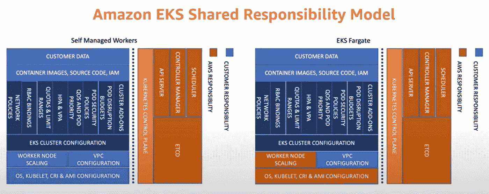
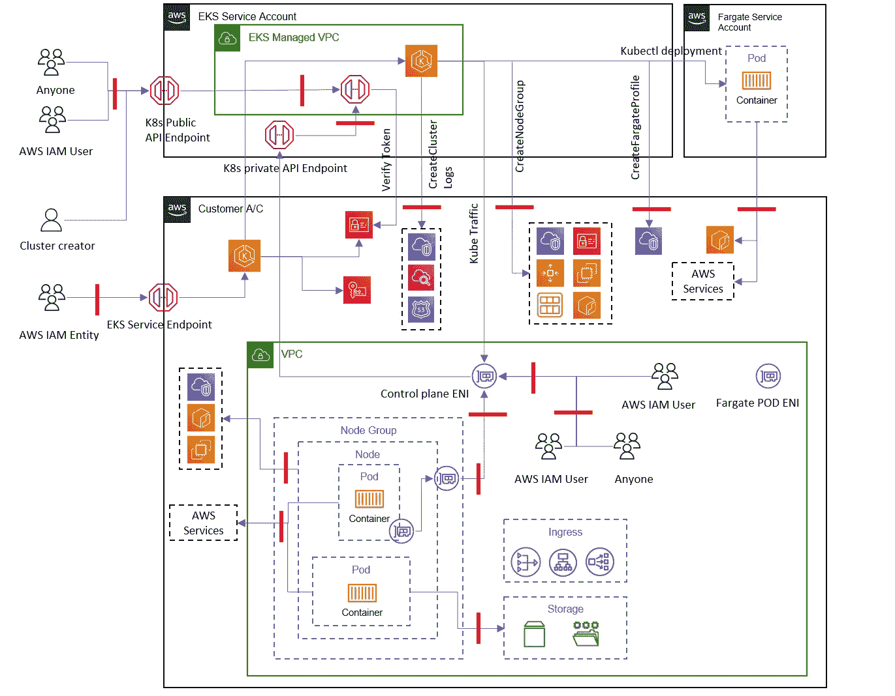

# 威胁建模— EKS

> 原文：<https://medium.com/nerd-for-tech/threat-modeling-eks-c1e06f6814f?source=collection_archive---------0----------------------->

照片由[飞:D](https://unsplash.com/@flyd2069?utm_source=unsplash&utm_medium=referral&utm_content=creditCopyText) 在 [Unsplash](https://unsplash.com/s/photos/threat?utm_source=unsplash&utm_medium=referral&utm_content=creditCopyText)

将安全性嵌入服务产品

威胁建模是识别系统和数据潜在威胁的过程。通过使用这个过程，我们可以制定一个计划来保护我们的系统免受这些威胁。

在我目前的组织中，我们使用 AWS 服务目录来提供由公司其他团队消费的产品——一种可消费模式。因为我们有单一的服务创建来源，所以我们在产品本身中构建了安全性。为此，我们对相关服务进行了威胁建模练习。在这篇博客中，我将分享我们遵循的瘦身方法。

## 识别服务/应用

在这一步中，我们定义威胁建模的范围。

*对于这个博客，我将使用 AWS EKS 集群。*

## 创建责任和所有权矩阵

在这一步中，我们定义谁负责有问题的组件。AWS 与客户。在 EKS，控制平面、Fargate 和受管节点由 AWS 管理，数据平面由我们管理。定制节点组和定制控制器，以及 webhook 变异都是我们的责任。

图像源 AWS 文档。

## 识别管理 API

*   CreateNodegroup
*   删除节点组
*   UpdateNodegroupConfig
*   UpdateNodegroupVersion
*   CreateFargateProfile
*   DeleteFargateProfile
*   创建集群
*   删除集群
*   UpdateClusterConfig
*   UpdateClusterVersion
*   AssociateIdentityProviderConfig
*   取消关联 IdentityProviderConfig

## **识别访问/入口点**

在这一步中，我们找到了正在讨论的服务的所有入口点。

*   API 端点
*   SSH 到主机
*   kubelet 进入集装箱
*   通过启动 rouge 容器访问集群

## 确定渗漏点

在这一步中，我们找到了可以将数据移出的所有方法。

*   将工件上传到外部/非预期系统的访问权限(S3)
*   将图像从 ECR 下载和上传到其他 ECR 或工厂

## 确定可以放置控件的位置

基于以上两个步骤，我们知道所有需要放置控制机制的地方。

EKS 的数据流图(安全视图)

有了数据流图，我们可以总结最后三个步骤。在上图中，我用红线标出了所有可以放置控件的地方。在这种情况下，这些控制可以是一个 **SCP、安全组、aws-auth、角色、端点访问点、OS 挂载。**

## **确定演员**

在这一步中，我们试图找出在服务中谁会引起安全问题。

*   外部攻击者
*   恶意容器(被篡改的图像)
*   易受攻击的第三方软件包
*   恶意用户/被盗凭据
*   滥用合法特权

## **识别威胁(什么会出错？)**

在这一步中，我们找到了与参与者相关的威胁。这基本上是一个演员在服务中能做到的。

*   无权访问群集的人可以通过网络访问运行在群集上的应用程序和/或管理端口
*   攻击者可以访问单个容器，并希望扩展其访问权限以接管整个集群
*   攻击者拥有针对 Kubernetes API 执行命令的有效凭证，以及对端口的网络访问权限
*   如果用户有权访问管理 API，他们可以修改集群配置

然后，这些威胁被映射到一个漏洞框架。如 **S** poofing、 **T** ampering、**R**epudation、**I**information Disclosure、 **D** enial of Service、**E**remove of Privilege(**STRIDE**)。

## **识别威胁的影响**

在这一步中，我们评估不同参与者执行的操作的影响。

*   数据销毁(删除配置、存储)
*   资源劫持(运行数字货币挖掘)
*   拒绝服务(使服务不可用)
*   服务中断

## **确定违约的持续性**

在这一步中，我们试图找出所述动作可以在系统中存在多长时间。

*   后门集装箱
*   可写主机路径(在主机上创建 cron 作业)
*   Kubernetes Cronjob(集群中的计划单元)
*   恶意准入控制器

## **识别横向运动**

在这一步中，我们评估恶意参与者可以触及的所有接触点。这包括被评估服务范围之外的系统和服务。

*   访问云服务
*   容器中的应用程序凭据
*   库伯内特的秘密
*   核心 DNS 中毒
*   可写卷装载在主机节点中

## **识别预防措施**

在这一步中，我们找到了减轻已识别威胁的预防性控制措施。

*   确保管理服务(API 服务器、kubelet)不会暴露给没有适当认证控制的不可信网络
    - API 服务器认证
    - API 服务器授权
    - Kubelet 认证
*   确保服务帐户没有装载在容器中，或者具有受限的权限(即不是集群管理员)
*   RBAC，IRSA，Pod 安全策略
*   控制面板和工作人员的独立安全组
*   Calico 网络策略
*   私有注册表认证
*   确保管理 API 仅提供给管理员角色，并且仅限于由公司网络中的某些实体承担。

**实施通用预防措施**

*   输入验证、身份验证、会话处理和上下文绑定处理

## **创建一个控制矩阵**

一旦我们有了控制措施，我们就创建了一个控制矩阵，它映射了威胁和针对该威胁的所有控制措施。我们将它们分成不同的类别，如下所示。这需要由安全 SME 审查和批准。

*   **指令** -**-**把配置放在产品中对抗威胁。
    - Calico 网络策略
*   **预防性** - 当您需要远程访问主机时，请使用 SSM 会话管理器，而不是启用 SSH 访问。
*   **Detective** -**基于事件的错误配置检测(AWS 配置&自定义安全工具)- 定期运行 Kube-bench 以验证是否符合 CIS 亚马逊 EKS 基准测试
    -定期使用 Amazon Inspector 评估主机的暴露情况、漏洞以及与最佳实践的偏差
    -定期扫描您的容器图像**
*   ****补救**
    -事故应对计划**
*   ****矫正**
    -迭代硬化**

****

**威胁控制矩阵**

## ****制定事故响应计划****

**万一发现威胁，如何应对。这是针对每种威胁的操作手册或 SOP。**

*   **识别违规的 Pod 和工作节点(通过工作节点、通过部署、通过标签、使用服务帐户名称**
*   **隔离单元/节点(网络策略)**
*   **撤销分配给 pod/节点的临时安全凭据**
*   **封锁工人节点**
*   **在受影响的工作节点上启用终止保护**
*   **捕获 worker 节点上的易变工件(os 系统内存、netstat 树转储)**

**如果该措施没有实施或由于其他防止滥用的机制而需要豁免，获得 SME 的批准并在单独的豁免清单中提及。**

**这种带有详细文档的实践有助于创建和分发安全的消耗品。**

**快乐阅读！！**

***注:所有观点均为个人观点。没有现任或前任组织的认可。***