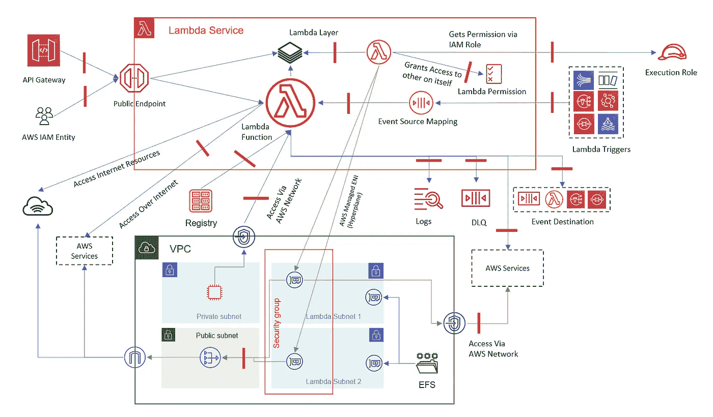

# 威胁建模— Lambda

> 原文：<https://medium.com/nerd-for-tech/threat-modelling-lambda-dac9c6f7ac06?source=collection_archive---------1----------------------->

将安全性嵌入 lambda 服务产品中

在上一篇博客[威胁建模— EKS](/nerd-for-tech/threat-modeling-eks-c1e06f6814f) 中，我们看到了如何评估 EKS 的安全态势，在这篇博客中，我们将为 AWS Lambda 做一个类似的练习。

## 分担责任模式

**客户**

> 功能代码、库、扩展、层
> 云中数据
> 在途数据
> 资源配置
> IAM
> 其他服务配置

**AWS** :

> 计算
> 联网
> 执行环境
> 运行时语言
> 服务器软件硬件 AZ，地区

下图描述了 lambda 服务的各种参与者、入口和出口点。



lambda(安全视图)的数据流

## 资源

*   λ函数
*   Lambda 函数 URL
*   λ层
*   Lambda EventSourceMapping 对象
*   拉姆达 DLQ &活动目的地
*   Lambda 版本和别名
*   λ资源策略
*   拉姆达·EFS 坐骑
*   Lambda 服务端点
*   Docker 图像的 ECR

## 威胁

*   不适当的访问控制
*   权限提升
*   不安全的资源配置
*   功能监控和记录不足
*   异常处理不当&详细错误
*   敏感数据暴露
*   不安全的第三方依赖
*   事件有效负载操作
*   不安全的秘密存储
*   资源枯竭
*   执行流操作

在查看威胁向量后，我们有以下几点来确保安全的 lambda 使用:

设置访问控制标准和**限制对 Lambda API**和部署流程的访问——我们应该避免从控制台创建 Lambda 函数。应该使用 IaC 将其映射到 CI/CD 流程。这将允许我们将 lambda 的管理 API 控制到几个角色。我们还需要限制可以传递给 lambda 函数的角色。有问题的 API 如下:

`lambda:AddPermission``lambda:CreateAlias``lambda:CreateEventSourceMapping``lambda:CreateFunction``lambda:CreateFunctionUrlConfig``lambda:DeleteEventSourceMapping``lambda:DeleteFunction``lambda:DeleteFunctionEventInvokeConfig``lambda:DeleteLayerVersion``lambda:InvokeFunction``lambda:InvokeFunctionUrl``lambda:PublishLayerVersion``lambda:PublishVersion``lambda:PutFunctionEventInvokeConfig``lambda:RemovePermisison``lambda:UpdateAlias``lambda:EventSourceMapping``lambda:UpdateFunctionCode``lambda:UpdateFunctionConfiguration``lambda:UpdateFunctionEventInvokeConfig``lambda:UpdateFunctionUrlConfig`

避免 monolambdas —通过保持函数的粒度，我们可以限制它们的特权，从而减少攻击面。一个 lambda 函数应该服务于一个目的，并且应该映射到一个 Lambda 专有的角色。

**授予最小特权** —我们只需要授予功能角色所需的访问权限。例如，如果函数只需要对 S3 存储桶路径进行读写访问，我们应该只授予这个权限。我们应该具体到 API 动作和资源。

**保留并发** —对于关键功能，确保保留并发。这有助于我们将该函数与其他函数隔离开来。此外，这还设置了上限，以便在 DoS 攻击的情况下，函数不会超出帐户并发调用的限制。它还改善了冷启动。提供的并发数为 5 将使 5 个执行环境在函数调用之前做好准备。

**实现断路器** —对于事件源映射对象，我们应该总是实现断路器模式。基于定制的 CloudWatch 指标，我们应该启用或禁用事件源映射。此模式防止 DDoS 使用源泛洪。

**带有 lambda 的 RDS 代理** —使用 RDS 代理连接数据库允许我们共享连接，并且我们不需要传递数据库凭证。`**rds-dc:connect**`

**事件数据验证** —我们应该利用 lambda 代码中的事件验证框架来确保 lambda 得到预期的事件。我们可以利用 python 的`pydantic`来进行事件验证。

```
pip install aws-lambda-powertools[pydantic]
```

**从日志中删除 PII**—由于 log/print 语句会将数据放入 CloudWatch，我们应该避免为了数据而这样做。应该只记录执行流信息/错误。

**在构建过程中实现依赖扫描**——我们不希望在产品中出现不安全的代码。所以我们希望依赖扫描成为我们构建过程的一部分，例如 lambda 层和 Lambda 代码。Lambda 层需要特别注意，因为它也用于扩展。像`**trivy & safety**`这样的包可以用来做扫描。

```
pip install safety
safety check -r requirements.txt --full-report # manual
safety check -r requirements --bare # get vulnerable package & fail
```

**图像扫描** —类似于依赖扫描，我们应该对 lambda 函数中使用的 ECR 图像进行连续扫描。`**twistlock**`可在映像构建过程中作为扫描工具添加。

**限制对 ECR 的访问** —由于 lambda 使用相同的角色来提供和执行功能，我们应该将对 ECR(docker 功能)的访问仅限于特定的映像报告。

限制访问 EFS 坐骑

**Lambda 函数代码或配置中没有凭证** —我们应该始终从系统管理器或秘密管理器获取凭证(第三方 API 凭证)。函数代码或 env 中没有硬编码。

**删除不用的函数** —清理不用的 lambda 函数总是好的。这减少了攻击媒介，因为旧的 lambdas 可能有过时和未打补丁的运行时。

**版本化&别名** —我们应该避免使用$LATEST。这是默认的，很容易猜到。更好的选择是使用版本控制并为其添加一个别名。授予别名的执行权限。这有助于减少点击&试用漏洞。

```
{
  "Sid": "Invoke",
  "Effect": "Allow",
  "Action": [
    "lambda:InvokeFunction"
  ],
  "Resource": "arn:aws:lambda:us-east-1:123456789012:function:our-function:**cool-alias**"
}
```

**安全死信队列** —由于 DLQ 用于传递失败事件，我们需要保护 dlq，因为它们可能包含敏感事件。

**删除弃用的运行时** —因为 AWS 不对弃用的运行时(如 python 2)应用安全补丁。* python 3.4|5|6，我们不应该使用那些运行时。

**加密环境变量** —如果我们使用 env 对 lambda 进行参数化，我们应该使用 KMS 对这些变量进行加密，这样在控制台中以及 lambda 函数被未授权的角色描述时，这些变量就不可见了。此外，将敏感信息存储在 SSM/秘密管理器中，按需索取，不要在功能代码中记录或打印这些信息。

**API Gateway(Implement Auth)后面的 Lambda**—应该避免直接调用 Lambda 函数。我们应该把它们放在 API 网关后面，在 API 网关实现 auth。对于 ALB 后面的 lambda，我们应该在 lambda 代码中有认证和授权逻辑。同样对于 ALB，我们应该实现 IP &协议边界。对于具有函数 URL 的 lambda，请确保启用了 AUTH。此外，我们应该将`**lambda:InvokeFunctionUrl**` API 限制为尽可能少的角色。

**将 VPC 端点**策略锁定为仅允许的操作或资源—为 AWS 服务添加尽可能严格的端点策略是一个好主意。另外，为 VPC 的 lambdas 添加一个使用 vpce 进行调用的条件

```
{
  "Action": ["lambda:InvokeFunction"],
  "Resource": [
    "arn:aws:lambda:us-east-1:123456789012:function:our-function:cool-alias"
  ],
  "Effect": "Allow"
  **"Condition":
    StringEquals:
     'aws:sourceVpce': "vpce-xxxxx"**
}
```

**短函数超时** —函数超时越短，恶意代码运行时间越长的风险就越小。但是要确保您的超时考虑到了某些延迟的执行。P95 持续时间+ 10%。

**Clean /tmp** —在连续的调用之间/tmp 文件夹被重用，因此在函数执行期间必须清理写入/tmp 的文件。因为它可能包含敏感信息。使用带有上下文处理程序的运行时临时文件，比如`**tempfile**`。

**日志&监控** —我们应该确保启用了 lambda 日志，对于生产工作负载，我们已经增强了监控。我们应该创建关于 Lambda 故障、超时、&节流的警报。

**主动跟踪** —对于与其他 lambda 或无服务器组件一起使用的 lambda，我们应启用 X 射线跟踪。这使我们能够看到服务地图，并跟踪端到端的执行流程。

## 侦探规则

我们可以尽快创建配置规则来主动应对安全问题。可以使用以下配置规则:

> *检查具有通配符 IAM 权限的 Lambda 函数
> 检查没有死信队列的 Lambda 函数
> 检查没有授权的函数 URL
> 检查没有触发器的 Lambda 函数
> 检查具有多个触发器的 Lambda 函数
> 检查未知的跨帐户访问
> 检查具有不推荐使用的运行时的 Lambda 函数
> 检查单个 IAM 角色是否被多个 Lambda 函数使用
> 检查使用控制台(CloudTrail 规则)创建的 Lambda 函数*

## 最佳实践

> *Graviton 运行时节省成本
> 将公共代码部署到 lambda 层
> 较小的 Docker 映像
> 将 lambda 处理程序与服务逻辑分开
> 为 lambda 启用 DLQ
> 为 Lambda 日志谨慎设置保留期
> 利用 Lambda Powertools*

安全快乐！！

资源:

[](https://awslabs.github.io/aws-lambda-powertools-python/latest/) [## 主页

### AWS Lambda 函数的一套实用程序，用于简化采用最佳实践，如跟踪、结构化日志记录…

awslabs.github.io](https://awslabs.github.io/aws-lambda-powertools-python/latest/)  [## pydantic

### 版本文档:1.9.0 使用 python 类型注释的数据验证和设置管理。pydantic…

pydantic-docs.helpmanual.io](https://pydantic-docs.helpmanual.io/)