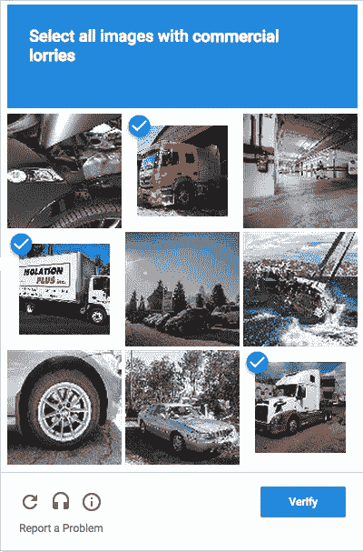
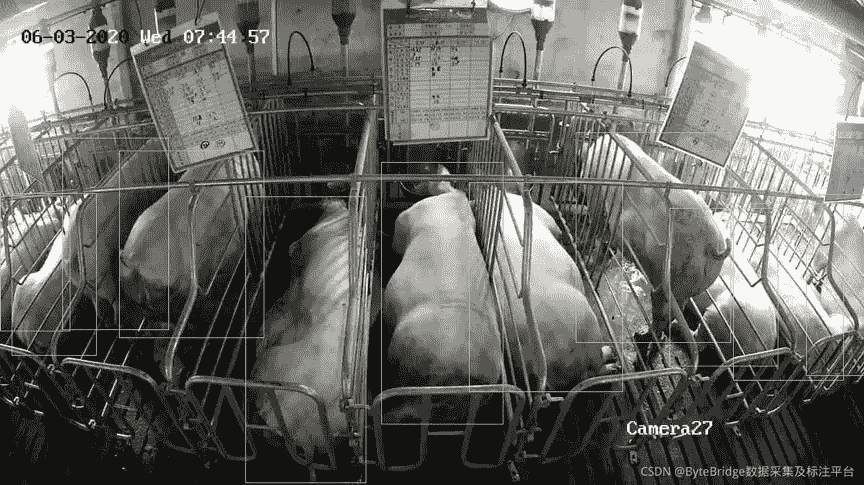

# 三种常见的图像注释类型

> 原文：<https://medium.com/nerd-for-tech/three-common-types-of-image-annotation-e37884b0f04?source=collection_archive---------8----------------------->

## **C** 常见类型

## **分类**

分类是一种快速而直接的图像注释方法，通常对一幅图像应用一个标签。这是一种快速的图像注释方法，但也是一种比较晦涩的方法，因为它没有指出对象在图像中的位置。

## **目标探测**

目标检测允许注释器注释图像中指定的特定对象。

## **语义分割**

语义分割通过确保每个图像成分属于一个类别来解决对象检测的重叠问题。一般来说，语义分割就是对区域内的像素进行分类。因此，贴标机需要为每个像素分配一个类别(例如，行人、汽车或交通标志)。它有助于训练 AI 模型识别和分类特定的对象，即使它们被遮挡。

**更多阅读:** [**什么是语义切分、实例切分、全景切分？**](https://tinyurl.com/48w576p7)

## **标注项目外包的两点建议**

*   定义范围:对项目进行明确严格的定义，尤其是对标注数据的要求，包括形状、特例、输出格式要求等。
*   制定迭代计划:为数据集制定初始标准，然后开始试运行。建议客户自己标注一小部分数据。在迭代过程中，会发现边缘情况。这个迭代计划将鼓励客户团队与数据标签供应商合作。此外，贴标供应商可以提供的多种贴标工具和专业知识涵盖了各种贴标使用案例，并且可以根据客户需求进行修改。

## 定制数据集

随着 AI 商业化进程的加快，以及辅助驾驶、客服聊天机器人等 AI 技术在各行各业的应用，人们对特殊场景下的数据质量的期望越来越高。**高质量的标签数据将是人工智能公司的核心竞争力之一。**

如果说之前的算法模型使用的一般数据集是粗粮，那么算法模型目前需要的是定制的营养餐。如果公司想要进一步提高某些模型的商业化，他们必须逐步从通用数据集向前发展，以创建独特的数据集。

# 结束

将你的数据标注任务外包给[字节桥](https://tinyurl.com/4k2za482)，你可以更便宜更快的获得高质量的 ML 训练数据集！

*   无需信用卡的免费试用:您可以快速获得样品结果，检查输出，并直接向我们的项目经理反馈。
*   100%人工验证
*   透明和标准定价:[有明确的定价](https://www.bytebridge.io/#/?module=price)(包括人工成本)

**为什么不试一试？**