# TiFS，一种基于 TiKV 的分区容忍、严格一致的文件系统

> 原文：<https://medium.com/nerd-for-tech/tifs-a-tikv-based-partition-tolerant-strictly-consistent-file-system-82c18baffdae?source=collection_archive---------7----------------------->


作者:[河西李](https://github.com/Hexilee)(软件工程师平盖实习生)

Transcreator: [黄然](https://github.com/ran-huang)；编辑:汤姆·万德

TiKV 是一个分布式键值存储引擎，具有很强的一致性和分区容忍度。它既可以充当 TiDB 的存储引擎，也可以充当独立的事务性键值数据库。你知道它还能做什么吗？

在 [TiDB Hackathon 2020](https://pingcap.com/community/events/hackathon2020/) 、**上，我们的团队构建了一个基于 TiKV 的分布式 POSIX 文件系统**、 [TiFS](https://github.com/Hexilee/tifs) ，它继承了 TiKV 的强大功能，也挖掘了 TiKV 在数据存储之外的可能性。

在这篇文章中，我将带你了解 TiFS 的每个细节:**我们是如何想出这个主意的，我们是如何实现这个文件系统的，以及它的基准测试结果。**让黑客攻击开始吧！

# 为什么要构建基于 TiKV 的文件系统？

“分布式”系统有多个跨机器协作的进程；TiKV 也有。作为一个分布式数据库，意味着它很容易向外扩展，并且本质上是容错的。

我的一个朋友曾经想尝试 TiDB 但是只有一个服务器。我告诉他，他可以在每个磁盘上运行一个 TiKV 实例，实现数据容灾，不再需要 RAID 了！

但是，TiKV 只存储数据，不存储文件，所以您仍然需要 RAID 来从灾难中恢复文件。但这在我心中引发了一个想法:**如果 TiKV 可以存储文件系统数据，那么就可以实现文件系统的容灾。因此，我们花了几天时间构建 TIF。这是一个 POSIX 文件系统，在第一个版本中漏洞百出，容易出现死锁——但是，嘿，这个想法是可行的。**

为什么我们要这么努力？三个原因:

*   与分布式文件系统的通用存储后端不同， **TiKV 支持符合 ACID 的分布式事务。**因此，我们可以**保证文件系统的严格一致性。**
*   POSIX 文件系统不仅涵盖了本地文件系统的需求，而且**支持跨机器的文件协作，并为其他分布式应用程序存储文件。**
*   更酷的是，**如果我们在 TiFS 上运行一个支持多实例协作的独立应用程序，它就变成了一个分布式应用程序。**

因此，我们开始这个项目来构建 TiFS，一个像钛一样坚固的文件系统。

# 我们如何实施 TiFS

TiKV 只提供了一个简单的键值存储，其中键和值是长度不固定的字节数组。因此，在实现文件系统之前，我们需要为键划分逻辑区域，为值构建数据结构。

## 价值观念

**TiFS 在 TiKV 中存储七种类型的值:系统元数据、文件元数据、文件块、文件处理程序、符号链接、目录和文件索引。**文件块是用户写的透明数据。符号链接只存储目标路径。其他五个值是结构化数据。

**系统元数据**

整个文件系统只有一个**系统元数据** ( `Meta`)，只在`mknod`和`mkdir`操作时更新。系统元数据仅包含一个用于生成文件信息节点编号的整数:

```
struct Meta {
    inode_next: u64,
}
```

**文件元数据**

每个文件都有一个对应的**文件元数据** ( `Inode`)。在这个数据结构中:

*   `file_attr`存储 POSIX 文件系统所需的元数据，比如文件索引节点号、文件大小和块数。详见[铁锈文件属性](https://docs.rs/fuser/0.7.0/fuser/struct.FileAttr.html)。
*   `lock_state`跟踪当前锁状态和锁持有者，用于执行`flock`。
*   `inline_data`存储少量文件内容，以提高微小文件的读写性能。
*   `next_fn`是一个自动递增的整数，用于生成文件处理程序。
*   `opened_fn`记录打开的文件处理程序的数量。

```
struct Inode {
    file_attr: FileAttr,
    lock_state: LockState,
    inline_data: Option<Vec<u8>>,
    next_fh: u64,
    opened_fh: u64,
}
```

**文件处理器**

每次用户调用`open`，文件系统都会生成一个对应的文件处理程序(`FileHandler`)来存储该处理程序的读写限制:

```
struct FileHandler {
    flags: i32,
}
```

**目录**

每个**目录**存储一个子文件列表，这样它就可以实现`readdir`。在列表中，每个`DirItem`项存储文件的索引节点号、名称和类型:

```
type Directory = Vec<DirItem>;struct DirItem {
    ino: u64,
    name: String,
    typ: FileType,
}
```

**文件索引**

当我们查询一个文件时，文件系统可以遍历整个文件目录；但是为了更有效地查询文件，我们为每个文件创建了一个**索引** ( `Index`)。文件索引仅包含目标文件的信息节点号:

```
struct Index {
    ino: u64,
}
```

## 钥匙

TiFS 有五种类型的键:系统元数据、文件元数据、文件块、文件处理程序和文件索引。其中，文件块键存储文件块数据、符号链接和目录，其他四个键存储它们对应的值。

**块的第一个字节，也称为作用域，标识键的类型。**键的字节数组通常遵循以下模式:

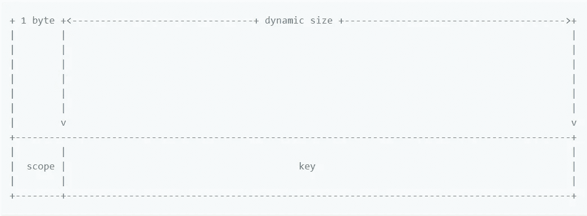

**系统元数据范围**只有一个键值对:

```
+ 1 byte +
|        |
|        |
|        |
|        |
|        |
|        |
|        v
+--------+
|        |
|    0   |
|        |
+--------+
```

**文件元数据**键仅包含以大端顺序排列的索引节点号，因此所有文件元数据都按顺序存储在 TiKV 中。因此，对于`[statfs](https://man7.org/linux/man-pages/man2/statfs.2.html)`操作，我们可以使用 TiKV 的`scan`接口获得所有文件元数据。

文件元数据键如下:

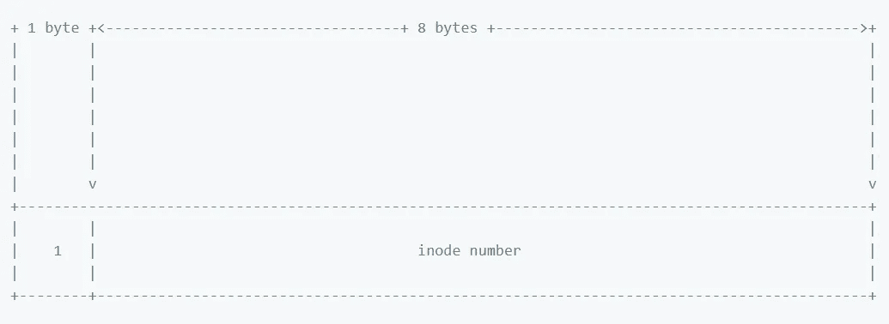

**文件块**键由文件索引节点号和块索引按大端顺序组成。单个文件的所有文件块按顺序存储在 TiKV 中。当我们需要读取大块的数据时，我们可以通过一个`scan`得到想要的文件块。

键的数组如下所示:

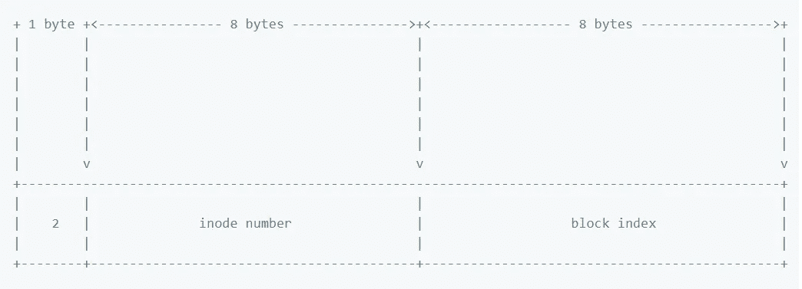

**文件处理程序**键由文件索引节点号和文件处理程序号组成，以大端顺序排列:

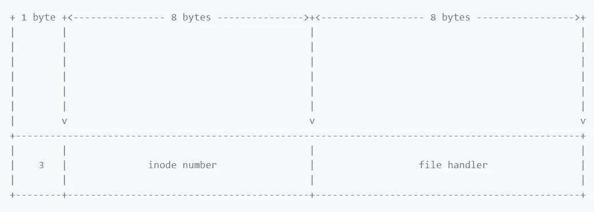

**文件索引**键包括其父目录的索引节点号(大端排序)和文件名(UTF-8 编码):

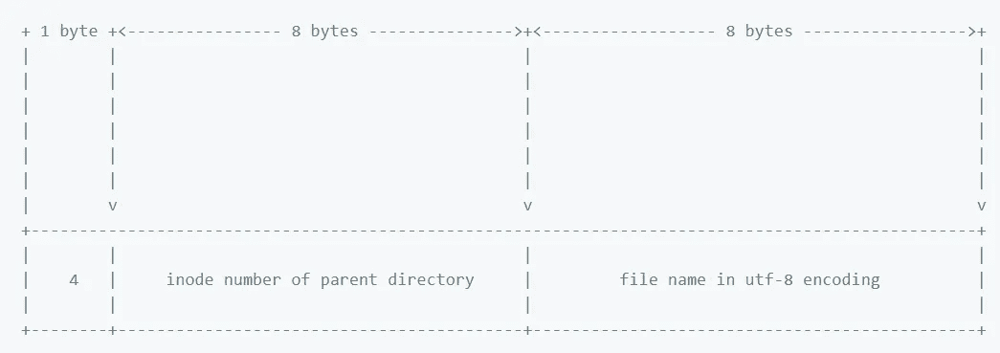

## 一致性

TiKV 支持乐观和悲观的交易。然而，由于 Rust 客户端仅在实验上支持悲观事务，并且悲观事务可能会在事务不冲突时降低性能，因此我们仅通过乐观事务来实现 TIF。

# 各种场景

对于读写小文件或其他复杂的文件系统操作，TiFS 是最有效的。虽然 TiFS 可以处理大文件，但与其他大文件存储解决方案相比，它的功能和效率都不如前者。

以下是一些你可能会感兴趣的 TIF 用法:

*   Git 远程存储库可以直接使用 TiFS 来存储项目并运行 Git 任务，例如`rebase`或`cherry-pick`，而无需将文件传输到本地文件系统。
*   当应用程序的多个节点读取或写入 TiFS 中的同一个文件时，您可以使用`flock`来解决任何冲突。
*   空间管理没有复杂的 SDK 或 API。您只需调用文件系统 API 或运行一个 shell 脚本。
*   TiFS 允许您将支持多实例协作的独立应用程序转换成分布式应用程序。例如，SQLite + TiFS =又一个分布式关系数据库。诚然，要这样使用 TIF，应用程序不能依赖页面缓存或其他缓存机制来避免写入不可见。

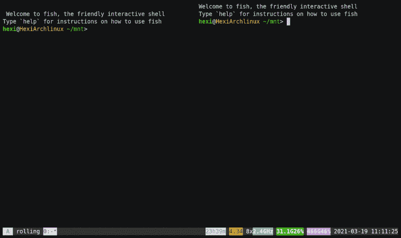

*TiFS 让 SQLite 成为另一个分布式关系数据库*

# 测试和基准

在黑客马拉松期间，我们使用 [pjdfstest](https://github.com/pjd/pjdfstest) 来测试 TiFS 的正确性。但是因为 pjdfstest 没有涵盖读/写正确性或并发正确性，我们将需要添加其他测试。

理论上，有三个主要因素影响 TiFS 的读/写性能:文件系统块的大小、网络延迟和加载块的大小。这里我们将展示读/写 IOPS 和速度的[基准测试结果](https://github.com/Hexilee/tifs.benchmark)。

## IOPS

> *注意:TiKV 是一个复杂的系统，其中有逻辑持续时间、磁盘 I/O 持续时间和网络持续时间。在本文中，出于演示目的，我们将 TiKV 简化为单个副本。*

让我们先来看看 IOPS。因为顺序读取和写入线性地执行 I/O 操作，所以每个 I/O 操作都是 TiKV 中的一个事务。如果我们忽略每个操作之间的微小差异，一个 I/O 操作的持续时间 *T* ，是 *IOPS* 的倒数。另外，如果不算流处理，我们可以把 *T* 看成是以下四个变量的线性相加:

*   *Tf* :保险丝[的 I/O 持续时间](https://en.wikipedia.org/wiki/Filesystem_in_Userspace)。
*   *Tc*:TiFS 的逻辑持续时间。
*   *Tn* :网络传输时间。
*   *Ts*:TiKV 的逻辑持续时间。

相应地，我们有这个等式:

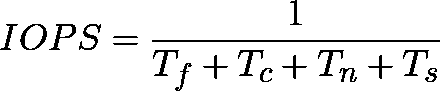

**阅读 IOPS**

对于读取操作， *Tf* 与加载块的大小正相关。每个 I/O 操作中 TIF 读取或写入的数据大小必须是文件系统块大小的整数倍。因此， *Tn* 和 *Ts* 与加载块和文件系统块之间的较大值正相关；但是，对于较大的流量，网络和磁盘 I/O 可能需要更长时间。 *Tc* 未知。

**下图显示了顺序读取 IOPS 如何随着加载块的大小而变化。**这四行代表不同的文件系统块大小和数据副本。

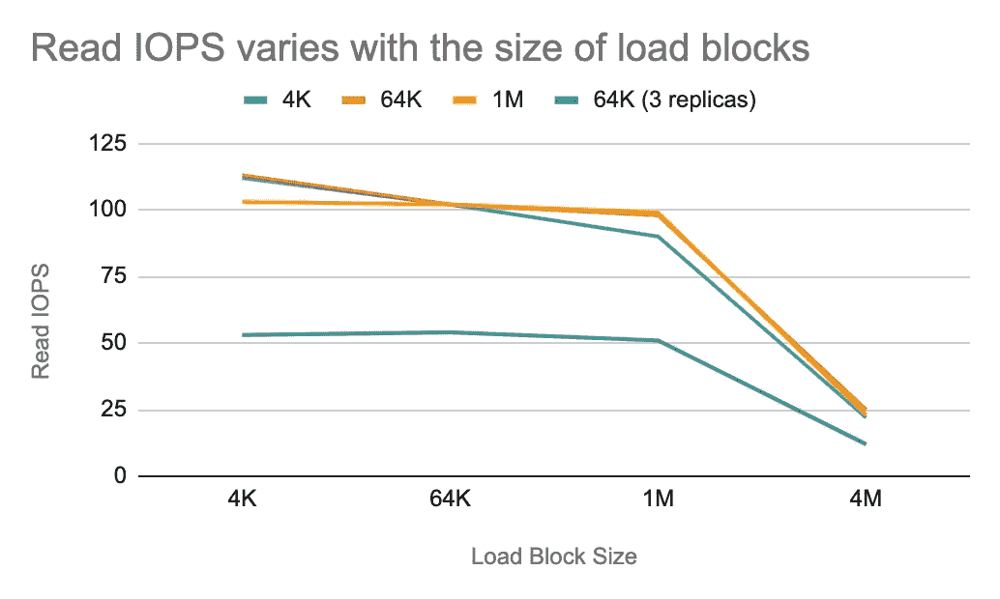

*阅读 IOPS 基准测试结果*

在基准测试之前，我们有以下预测:

*   当文件块和负载块都是 4 KB 时，如果负载块增加， *Tf* 、 *Tn* 、 *Ts* 增加；因此，*减少。*
*   *当文件块为 64 KB 或 1 MB 时:
    如果负载块小于文件块， *Tn* 和 *Ts* 几乎不变，而 *Tf* 增加；因此， *IOPS* 减小。
    如果负载块大于文件块， *Tf* 、 *Tn* 、 *Ts* 都增加；因此， *IOPS* 减小。*

*正如你在图表中看到的，变化几乎与我们的预测相同。*

***写 IOPS***

*当 TiFS 顺序写入数据时，如果加载块小于文件块，TiFS 需要读取一个脏块，导致额外的 *Tc* 和 *Tn* 。当文件块很大时，额外的开销会很明显。*

***下面的折线图显示了顺序写入 IOPS 如何随加载块的大小而变化。**当文件块为 1 MB(见黄线)时， *IOPS* 最大，文件块和加载块相当。*

*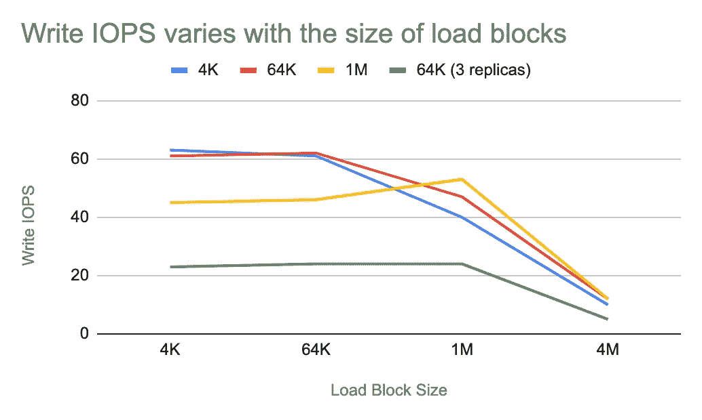*

**写出 IOPS 标杆的结果**

*而且，我们可以看到，在前两个数据点上，红线几乎与蓝线重叠。这意味着当加载块和文件块是 4 KB 或 64 KB 时，它们的 ***IOPS*** 值几乎相同。在这样的情况下，每秒流量最小 4 KB *110 = 440 KB，最大 64 KB* 100 = 6.25 MB，对网络和磁盘的压力都不大。当流量足够小时，可以有把握地说 *IOPS* 达到上限，那么 *Tn* 的主要因素就变成了网络延迟。(在本地测试中， *Tn* 被认为是 0 毫秒。)*

*在上图中，当文件块和加载块在 4 KB 和 64 KB 之间变化时， *IOPS* 几乎不受影响。在这样的配置下， *T* 由 *Tc* 和 *Ts* 决定，所以我们称之为 TiFS 的固定系统操作延迟。**固定系统操作延迟**由 TiFS 和 TiKV 的逻辑持续时间引起。如果延迟足够长，会导致小文件的读/写性能很差。我们仍在进行这种优化。*

## *速度*

*因为读写速度是 *IOPS* 乘以负载块的乘积，而 *IOPS* 在负载块从 4 KB 增加到 1 MB 时变化很小，所以读写速度在负载块为 1 MB 时达到最大值。*

*以下两个条形图比较了负载块为 1 MB 时不同集群配置中的读写速度。蓝条代表普通 TiKV，红条代表启用 Titan 的 TiKV。*

> *[*Titan*](https://github.com/tikv/titan) *是一个 RocksDB 插件，用于键值分离，受* [*WiscKey*](https://www.usenix.org/system/files/conference/fast16/fast16-papers-lu.pdf) *启发，减少写放大。**

*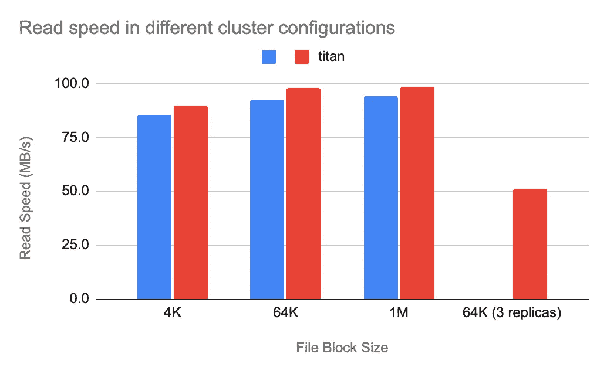*

**读取速度基准测试结果**

*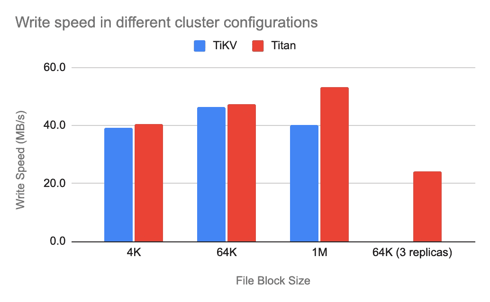*

**写速度基准测试结果**

*从图表中，我们可以看到写入速度主要受文件块大小和是否启用 Titan 的影响，读取速度只是略有波动。这是因为文件块越小，TiKV 写入的键值对就越多，这需要更多的时间。但是 RocksDB 处理大文件块的性能很差，所以启用 Titan 可以减少不必要的值复制，从而提高性能。*

# *我们的下一步*

*在 TiFS 中，存储文件块的成本非常高，因为 TiKV 通过使用多个副本(默认为三个)来实现冗余。冗余率(占用空间除以写入数据量)通常为三或更多。*

*然而，在其他支持通过擦除编码(EC)实现冗余的分布式文件系统中，如 HDFS、CephFS 和 JuiceFS，冗余率低至 1.2~1.5。EC 冗余需要在数据写入和重建期间进行编码和解码，这会消耗额外的计算资源。**但是，EC 冗余策略牺牲了部分读取性能，换取了更低的网络开销和存储成本。***

*目前，TiKV 支持 EC 有些困难，但我们**计划支持文件块的 EC 冗余对象存储，以降低存储成本。***

*除此之外，**我们将重点验证正确性和调优性能:***

*   *为了确保正确性，我们将研究如何测试其他文件系统，并使用这些知识来构建我们自己的测试。*
*   *对于性能，我们将涵盖 TIF 和 TiKV，以减少固有的延迟。*

*如果你对 TiFS 感兴趣，请随时[尝试一下](https://github.com/Hexilee/tifs)或[加入我们的讨论](https://github.com/Hexilee/tifs/issues)！*

**原载于 2021 年 5 月 24 日*[*www.pingcap.com*](https://pingcap.com/blog/tifs-a-tikv-based-partition-tolerant-strictly-consistent-file-system#why-build-a-file-system-based-on-tikv)*