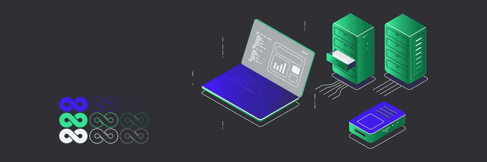
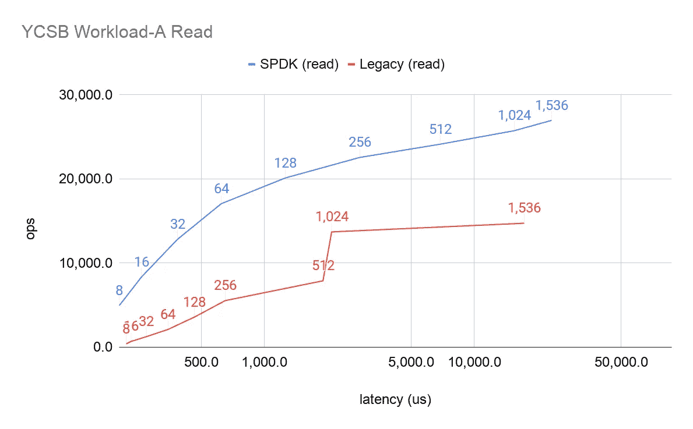
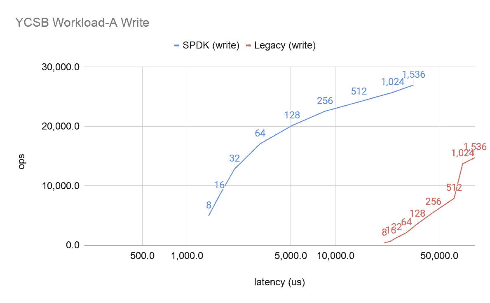

# TiKV + SPDK:挑战存储性能的极限

> 原文：<https://medium.com/nerd-for-tech/tikv-spdk-pushing-the-limits-of-storage-performance-908ff559798b?source=collection_archive---------9----------------------->

作者:[杨克傲](https://github.com/YangKeao)(ping cap 软件工程师)

Transcreator: [黄然](https://github.com/ran-huang)；编辑:汤姆·万德

现代软件的核心是分层抽象。在抽象中，每一层都隐藏了与其他层不相关的细节，并提供了一个简单、有效的接口。

然而，因为抽象带来了系统调用的额外开销，它的简单性是以牺牲性能为代价的。因此，对于性能敏感的软件，如数据库，抽象可能会带来不必要的后果。我们如何提升这些应用的性能？

在本文中，我将讨论现代存储结构中抽象的陷阱，以及我们如何在 [TiDB Hackathon 2020](https://pingcap.com/community/events/hackathon2020/) 上通过在 TiKV 中引入存储性能开发套件(SPDK)来解决这个问题。

# 抽象的陷阱

在抽象的魔法世界里，一切都井井有条。应用程序没有制定其执行计划；它让数据库来决定。数据库不将数据写入磁盘；它让操作系统来决定。当然，操作系统从不直接在存储单元上操作；相反，它要求磁盘的控制芯片去做。更多的时候是把具体的任务交给有更多知识的一方，让大家都开心满意。

当数据库读写数据时，它利用文件系统中的抽象。通过文件系统，数据库创建、写入和读取文件，而无需直接在硬盘上操作。当数据库启动系统调用时，需要几个步骤才能将数据最终保存到磁盘:

1.  操作系统接收系统调用。
2.  操作系统在虚拟文件系统(VFS)和页面缓存机制上运行。
3.  文件系统实现特定的行为。
4.  数据从块设备中读取和写入，I/O 调度程序和设备映射器在块设备中生效。
5.  系统通过硬件驱动程序向存储设备发送指令。
6.  磁盘控制器处理指令并在存储介质上操作。

这个过程可能有四个潜在的问题:

*   系统调用有很高的开销。对于 I/O 操作之类的复杂系统调用，系统从用户模式切换到内核模式，保存进程状态，然后恢复进程状态。如今，随着存储设备的性能大大提高，这种开销占据了更大比例的资源消耗。
*   **文件系统实施对高级应用程序有着失控的影响。**不同的文件系统使用不同的数据结构来管理文件，因此适用于不同的场景。例如， [XFS](https://en.wikipedia.org/wiki/XFS) 就不擅长处理大量的小文件。高级应用程序可能无法很好地响应文件系统的变化。
*   **Linux 优先考虑其通用性**作为一个通用操作系统，这意味着它的页面缓存算法和硬件支持被设计为适用于所有应用程序和所有硬件。这意味着它没有完全优化特定软件应用程序(如数据库)和硬件(如 [NVMe](https://en.wikipedia.org/wiki/NVM_Express) 驱动器)的机制。
*   **重复记录也是一个问题。每一层抽象都试图通过日志来维护其稳定性。NVMe 控制器、文件系统和 RocksDB 都有日志。在当前的机制中，这些重复的日志对于系统的健壮性是必不可少的。但是如果我们能从全局的角度重新设计这个系统，我们也许能移除一些日志记录。**

所有这些问题的解决方案是将应用程序推向更低的层次，以减少抽象。应用程序自己做的杂务越多，性能提升就越大。

# 我们如何在 TiKV 中减少抽象

[TiKV](https://tikv.org/) 是一个分布式事务键值数据库。在 TiDB Hackathon 2020 上，我们试图通过将 TiKV 推到上面提到的步骤 5 来减少 TiKV 中的抽象，即直接向 NVMe 磁盘发送指令。这样，我们消除了几个抽象的开销。

## SPDK 和 BlobFS

应该减少多少抽象层次是一个权衡的问题。由于 NVMe 的流行及其新特性(4 KB 原子写入、低延迟和高并发队列)，我们认为为 NVMe 磁盘重新设计 TiKV 是值得的。

幸运的是，开源社区也这么认为。英特尔提供了 [SPDK](https://spdk.io/) 、**一套用于编写高性能存储应用的开源工具包和库**，其中包括针对 NVMe 的用户模式驱动程序和软件包。通过虚拟功能 I/O (VFIO)等方法，用户模式驱动程序将硬件 I/O 映射到用户模式可访问的内存，以便应用程序可以访问硬件，而无需绕道操作系统。VFIO 广泛应用于虚拟机中，允许虚拟机直接访问显卡或网卡。

除此之外， **SPDK 实现了一个名为 BlobFS 的文件系统，它提供了类似于** [**POSIX**](https://en.wikipedia.org/wiki/POSIX#:~:text=The%20Portable%20Operating%20System%20Interface,maintaining%20compatibility%20between%20operating%20systems.) **文件系统**的函数接口。使用 BlobFS，应用程序分三步执行 I/O 操作:

1.  应用程序调用`blobfs_create`和`blobfs_read`等函数。
2.  文件系统操作被映射到存储设备操作。
3.  BlobFS 将指令发送到 NVMe 磁盘。(严格来说，指令是写入 NVMe 设备中相应的内存空间的。)

与 Linux I/O 进程相比，SPDK I/O 进程更简单、更高效:

*   函数调用的开销比系统调用低。
*   BlobFS 使用 NVMe 的原子写特性，因此简化了文件系统元数据的管理。
*   其优化的页面缓存策略适用于连续读写。对于 RocksDB，优化对于 LSM 压缩非常重要，但不幸的是，它也消除了点查询的额外缓存。

这个解决方案解决了我们前面提到的四个问题:**它消除了 syscall 开销，使用了更适合数据库和 NVMe 磁盘的数据结构和缓存算法，简化了文件系统日志记录。**如果我们将 SPDK BlobFS 集成到 TiKV 中，我们可以期待看到巨大的性能提升。

## 测量 TiKV 改进

为了对我们的实验进行基准测试，我们使用 [YCSB 工作负载 A](https://github.com/brianfrankcooper/YCSB/wiki/Core-Workloads) (更新重工作负载)来测试最终的 I/O。如下图所示，结果超出了我们的预期。数据点上的标签指的是客户端线程的数量。显然，在相同的延迟下，总部位于 SPDK 的 TiKV 每秒处理的操作数(OPS)更高:

*YCSB 工作负载 A 读取性能*

*YCSB 工作负载 A 写性能*

# 前进

这个黑客马拉松项目能走多远？答案看情况。随着 NVMe 磁盘越来越受欢迎，TiKV 不断追求更高的性能，我们的项目一定会取得具体的成果。

此外，随着完全托管的 TiDB 服务 [TiDB Cloud](https://pingcap.com/products/tidbcloud/) 公开化，TiDB 用户只需点击几下鼠标就可以启动一个集群。他们可以享受 SPDK 的好处，而无需忍受自行配置的痛苦。

在业内，人们多年来一直在探索相关的话题:

*   一些研究人员将软件进一步推向第 6 步——让软件完成 NVMe 控制器的任务，如开放通道 SSD 技术。有一篇[论文](https://dl.acm.org/doi/10.1145/3126545)关于 LSM 树中 SST 文件只读模式和 SSD 中块只读模式(先擦除后重写)的共性。这可以减少由意外擦除引起的性能降级。
*   还有一些项目研究如何在 Linux 块设备上读写。例如，Ceph 的 [BlueFS](https://github.com/ceph/ceph/blob/master/src/os/bluestore/BlueFS.cc) 具有比直接文件系统读写更高的性能，并显示出比 SPDK 更好的硬件兼容性和更低的风险。

这些方法各有各的前途。有一天，我们可能会看到它们中的一个或多个集成到 TiKV 中，创建一个具有更高存储性能的数据库。