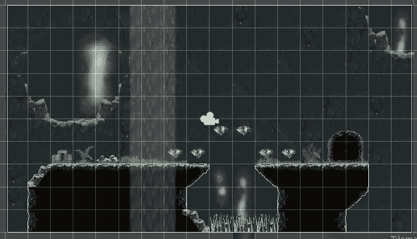
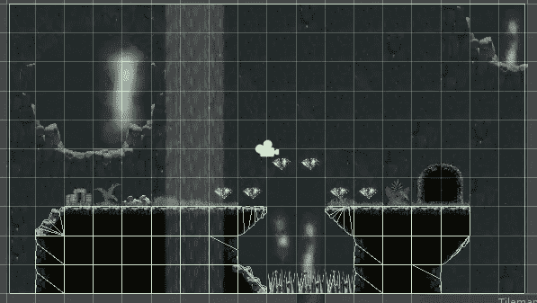
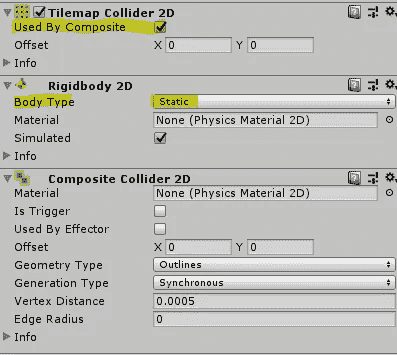

# Tilemap 碰撞器

> 原文：<https://medium.com/nerd-for-tech/tilemap-colliders-cb278d92aac2?source=collection_archive---------15----------------------->

**目的:**给地面地图添加碰撞器。

我们将开始添加一个 *Tilemap 碰撞器 2D* 组件到我们的地面 Tilemap。这将在 tilemap 中的每一个瓷砖周围放置一个碰撞器。

接下来我们将添加一个*复合碰撞器 2D* 组件，这也将添加一个*刚体 2D* 组件到我们的 tilemap。我们将*刚体 2D* 的*身体类型*属性设置为*静态*，并选中 *Tilemap 碰撞器 2D* 上的*由复合*使用复选框。瞧啊。内部瓷砖不再有自己的对撞机！

