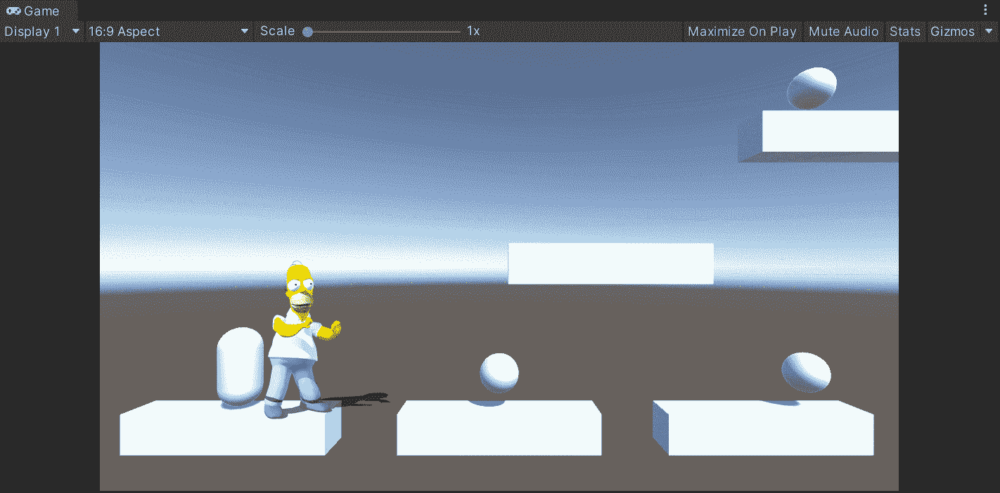
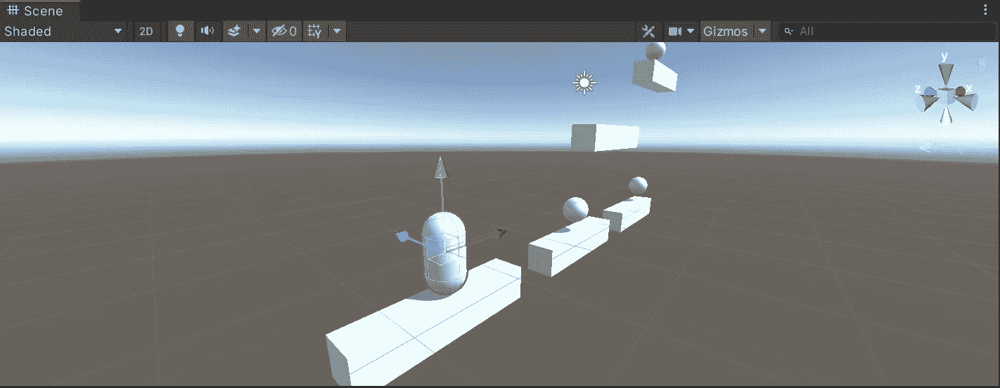
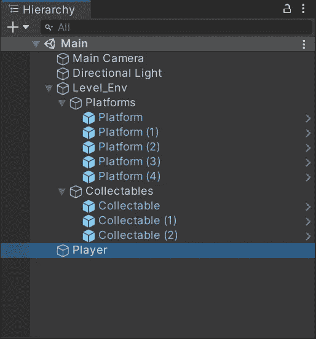
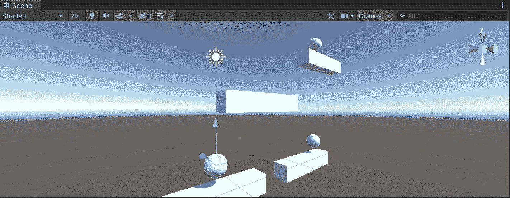
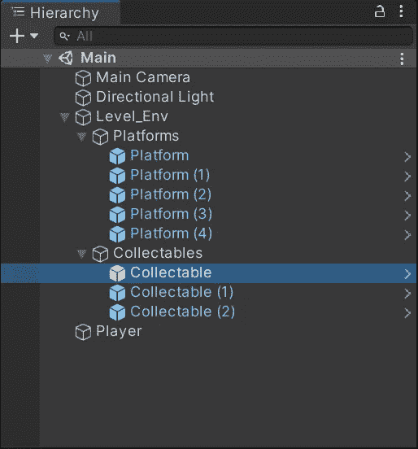
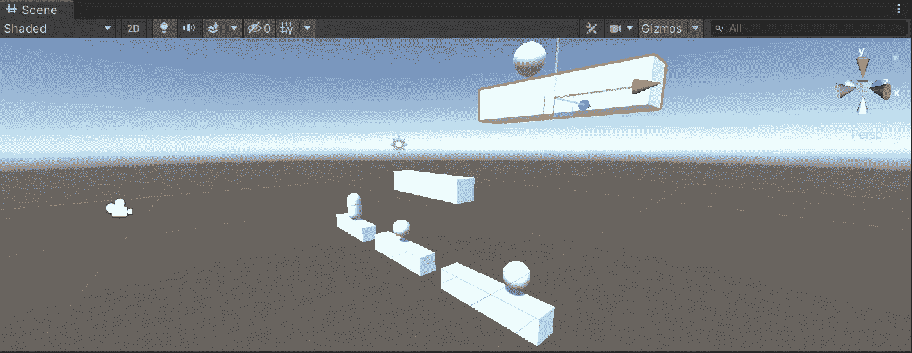
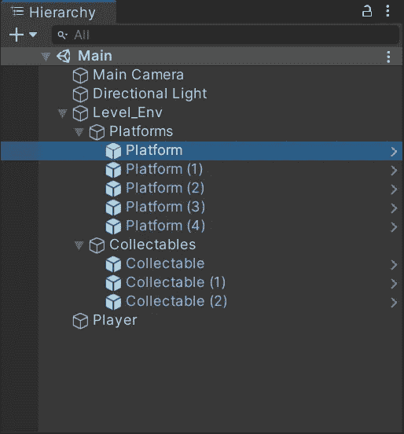
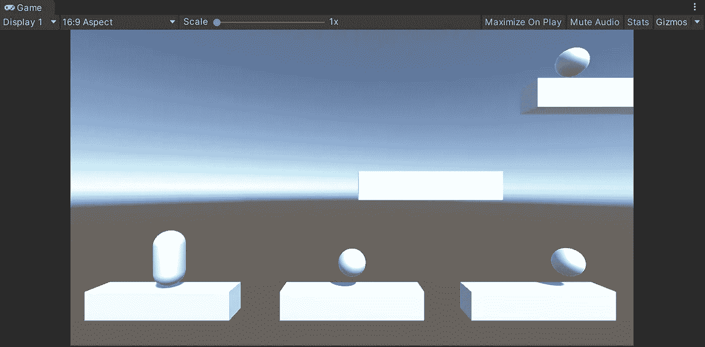
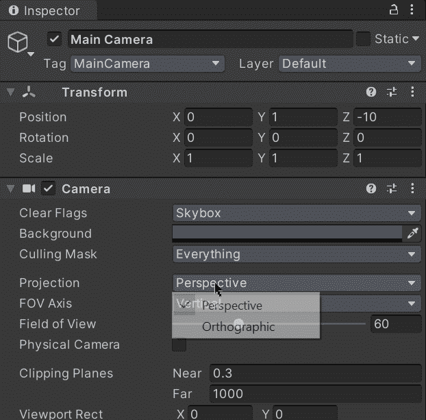
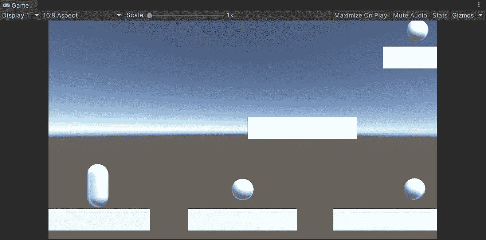

# 新项目时间| Unity

> 原文：<https://medium.com/nerd-for-tech/time-for-a-new-project-unity-e6bbd9611224?source=collection_archive---------11----------------------->

## 一致

## 快速浏览我与 Unity 的下一个项目

**目标**:推广我和 Unity 一直在做的游戏，看看下一个。

# 完成的游戏

如果你一直在关注我的关于与 Unity 合作的帖子，你可能想知道我在每个帖子中构建的游戏在哪里。嗯，我很高兴地说，我已经完成了 ***【大羊毛】*** (我上一篇帖子的游戏)，如果你想玩，你可以访问下一页在线或本地玩:

 [## 伟大的羊毛

### 你的技术足够潜入比阿特丽斯拍卖行的主金库吗？站在达伦的角度想想…

fernandoalcasan.itch.io](https://fernandoalcasan.itch.io/the-great-fleece) 

另外，在做 ***大羊毛*** 之前，我做了一个名为 ***空间阴影*** 的 2D 游戏，你也可以通过访问这个页面来尝试一下:

 [## 空间阴影

### 太空阴影是一个生存空间射击游戏在 2D。在浏览器中播放

fernandoalcasan.itch.io](https://fernandoalcasan.itch.io/space-shadow) 

# 那么，下一步是什么？

在我的下一个项目中，我将开发一个 2.5D 平台游戏，在这个游戏中，我将控制一个玩家跨平台移动并收集物品。

我已经通过使用原始对象来表示播放器、平台和收藏品开始了开发:

请记住，为了在开始真正的生产状态之前理解和处理不同的因素，在没有资产的情况下开始原型制作是非常有用的。

您可以在此处查看在 Unity 中不使用资产的情况下构建创意原型的一些好处:

 [## Unity 中无资产原型的优势

### 快速分析在 Unity 中使用原始资产制作原型的好处

fas444.medium.com](https://fas444.medium.com/benefits-of-prototyping-without-assets-in-unity-4c04c1d70a94) 

因此，由于当前场景是 3D 的，我们有了下一个游戏视图:

此外，为了消除 2.5D 游戏中的深度，我们需要在接下来的步骤中使用正交相机:

就这样，我希望你能跟随我的 Unity 新 2.5D 项目的下一步！我将在下一篇文章中看到你，在那里我将展示如何用 Unity 创建一个基于物理的角色控制器。

> *如果你想了解我更多，欢迎登陆*[***LinkedIn***](https://www.linkedin.com/in/fas444/)**或访问我的* [***网站***](http://fernandoalcasan.com/) *:D**