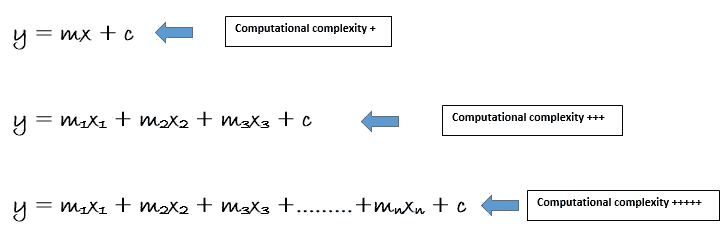

# 时间就是金钱—数据科学—时间复杂性解码

> 原文：<https://medium.com/nerd-for-tech/time-is-money-data-science-time-complexity-decoding-52c189ab3c47?source=collection_archive---------9----------------------->

卢卡斯·布拉塞克在 [Unsplash](https://unsplash.com?utm_source=medium&utm_medium=referral) 上的照片

> 在大型系统中，机器学习任务中的算法复杂性一直是一个主要的担忧来源。通过增强数据维度，将重点放在构建计算高效的学习模型上。复杂性不是小规模学习环境的障碍。然而，随着世界变得越来越“数字化”，可供学习的数据量激增。因此，大规模学习问题中的数据非常丰富，计算复杂性成为一个关键的瓶颈。当考虑学习可能使用的时间和资源量时，计算效率的必要性成为主要和明显的需求。人们的兴趣已经转向计算效率更高的方法，尤其是在实时学习的情况下。
> 
> **根据 M. J. Kearns 的说法，计算复杂性是对计算机如何完成有效学习的数学研究。为了衡量算法在学习方面的效率，他指定了基于计算复杂性的推理模型。**

根据龚和黄的说法，即使是不平衡的数据，分类的复杂性对算法性能也有决定性的影响。他们证明了将一个大任务分解成多个小任务可以提高系统的整体性能。

这是一个星期六，另一场黑客马拉松即将开始；我签了名，急切地等待开始时间，这样我就可以把手弄脏，回答问题声明。这是问题陈述中编号为“n”的财务数据集之一。当我第一次开始在数据周围徘徊并解决机器学习的每个阶段时，代码正在处理并浪费了太多时间，这让我从解决方案中分心。在这篇博客中，我将讨论时间复杂性:

> **时间就是金钱**

时间就是金钱！不是吗？您可以使用 Python 或 r 中的库或包来提升数据科学。但是，如果我们知道这些库如何构建特定的算法，那么您就可以构建自己的算法，这将是一个额外的优势，例如:

*   **节省时间**
*   **解码复杂度**
*   **功能选择**

在比较算法性能时，我们感兴趣的是算法执行的操作数量。这叫做**时间复杂度**。在这种范式中，每个基本操作(加法、乘法、比较、赋值等等)都需要给定的时间量，并且计算这种操作的次数。这个数字通常表示为输入大小的函数，我们称之为 n。不幸的是，随着 n 的增加，这个数字频繁地增加到无穷大(如果不增加，则该方法称为 O(1))。

我们将我们的算法分为大-O 速度等级:当我们谈论一个“O(n2)算法”时，我们暗示它作为 n 的函数执行的操作数是 O(n2)。这意味着我们的方法与执行几个等于输入大小平方的运算的算法一样快，甚至更快。因为我用了 Big-O 而不是 Big-Theta，所以“或更快”部分是存在的，尽管大多数人用 Big-O 来表示 Big-Theta。
我们通常在最坏的情况下计算操作:例如，如果我们有一个最多可以运行 n 次的循环，包含 5 个操作，我们计算 5n 个操作。快速算法执行较少的运算；因此，如果运算次数更快地增加到无穷大，算法就更慢:O(n)比 O(n2)好。我们偶尔会对算法的空间复杂度感到好奇。为此，我们使用 Big-O 来计算该方法使用的内存字节数，作为输入大小的函数。

照片由[迈克尔·泽兹奇](https://unsplash.com/@lazycreekimages?utm_source=medium&utm_medium=referral)在 [Unsplash](https://unsplash.com?utm_source=medium&utm_medium=referral) 拍摄

> **时间——机器学习算法的复杂度**

**监督学习**

线性模型

法线方程计算 X-转置 X 的逆，它是一个(n + 1) × (n + 1)矩阵(其中 n 是特征数)。对这样的矩阵求逆具有大约 O(n 的 2.4 次幂)到 O(n 的 3 次幂)的计算复杂度，这取决于实现方式。换句话说，特征数量增加一倍，计算时间也会增加一倍。4 的 2.4 次方= 27.8 到 4 的 3 次方= 64。

Scikit-Learn 中的 **LinearRegression** 类使用的 **SVD** 技术大约为 O (n 的 2 次方)。当特征的数量增加一倍时，计算时间通常增加四倍。

当特征的数量变得巨大时，法线方程和 SVD 方法都变得非常缓慢(例如，100，000)。从好的方面来看，两者在训练集中的出现次数(O(m))都是线性的，这意味着如果它们适合内存，它们可以有效地处理巨大的训练集。

一旦训练好线性回归模型(使用正规方程或任何其他算法)，预测也非常快:计算复杂性在实例数量和特征数量方面都是线性的。换句话说，为两倍数量的实例(或特征)生成预测将花费将近两倍的时间。

做出预测需要从**决策树**的根到叶的工作方式。因为决策树通常是相对平衡的，所以遍历一个决策树需要遍历大约 O(log2(m))个节点。不管特征的数量是多少，总的预测复杂度是 O(log2(m))，因为每个节点只需要检查一个特征的值。因此，即使在处理庞大的训练集时，预测也能很快做出。
训练过程在每个节点比较所有样本的所有特征(如果指定了最大特征，则比较更少)。当在每个节点比较所有样本的所有特征时，训练复杂度是 O(n m log2(m)。Scikit-Learn 可以通过对数据进行预排序(set pre sort=True)来加快小训练集(少于几千个实例)的训练，但是，这将显著减慢较大训练集的训练。

**无监督学习**

当 d 显著低于 n 时，PCA 比全 SVD 快得多，因为它的计算复杂度是 O(m d2) + O(d3)，而不是全 SVD 的 O(m n2) + O(n3)。

**K-Means**算法的计算复杂度通常在实例数 m、聚类数 K 和维数 n 方面是线性的。然而，只有当数据包含聚类结构时才是这样。否则，在最坏的情况下，随着实例数量的增加，场景的复杂性会呈指数级增长。实际上，这并不常见，K-Means 是可用的最快的聚类技术之一。

DBSCAN 的计算复杂度约为 O(m log m)，使其在实例数量方面接近线性，但如果 eps 很大，Scikit-implementation Learn 可以占用 O(m2)内存。

实例的数量 m、维度的数量 n、聚类的数量 k 以及对协方差矩阵的约束都影响训练**高斯混合**模型的计算复杂度。如果协方差类型为“球形”或“诊断”，并且数据具有聚类结构，则该值为 O(kmn)。因为协方差类型在“绑定”或“完整”时为 O(kmn2 + kn3)，所以它不会扩展到大量的要素。

暂停一下，思考以下查询:

**如果你有一个百万特征的训练集，可以用哪种线性回归训练算法？**

> 如果您的训练集包含数百万个特征，您可以利用随机梯度下降、小批量梯度下降或批量梯度下降(如果训练集适合内存)。然而，由于计算复杂度随着特征数量的增加而快速攀升(超过二次方),因此无法利用正规方程或奇异值分解方法。

你应该使用 SVM 问题的原始或对偶形式，在拥有数百万个实例和数百个特征的训练集上训练一个模型吗？

> 因为核化支持向量机只能使用对偶形式，所以这个问题只涉及线性支持向量机。SVM 问题的原始形式具有与训练实例数量 m 成比例的计算复杂度，但是对偶形式具有与 m2 和 m3 之间的数量成比例的计算复杂度。如果有数百万次出现，应该使用原始形式而不是对偶形式，因为对偶形式会慢得多。

**如果在有 100 万个实例的训练集上训练一个决策树需要一个小时，那么在有 1000 万个实例的训练集上训练另一个决策树需要多长时间？**

> 训练决策树的计算复杂度为 O(n m log(m))。因此，如果将训练集大小乘以 10，则训练时间将乘以 K =(n 10m log(10m))/(n m log(m))= 10 log(10m)/log(10m)= 10 log(10m)/log(10m)= 10 log(10m)/log(10m)= 10 log(10m)/log(10m)= 10 log(10m)/log(10m)= 10 log(10m)/log(m)。如果 m = 106，那么 K = 11.7，这意味着训练持续时间大约为 11.7 小时。

照片由[奥拉夫·阿伦斯·罗特内](https://unsplash.com/@olav_ahrens?utm_source=medium&utm_medium=referral)在 [Unsplash](https://unsplash.com?utm_source=medium&utm_medium=referral) 拍摄

随着可用数据的指数级增长，机器学习任务的复杂性已经成为算法质量的决定性因素。在资源受限情况下的实时学习中，面向复杂性的分析变得越来越流行。将样本大小减少到训练数据的代表性部分是解决时间复杂性问题的一种技术。在选定的情况下，将只使用与学习过程最相关的数据。

**想想你为了考试做了多少后台工作；同样，如果你理解机器学习算法背后的事情是如何运作的，你可能会以一种 *SMART (S:具体，M:可衡量，A:可实现，R:现实，T:有时限)*的方式工作。**