# 带叶子的时移热图

> 原文：<https://medium.com/nerd-for-tech/time-lapse-heat-maps-with-folium-1847f53ec956?source=collection_archive---------0----------------------->

# 这是一个教程，面向那些对使用 Python 创建带时间推移的热图感兴趣的人。

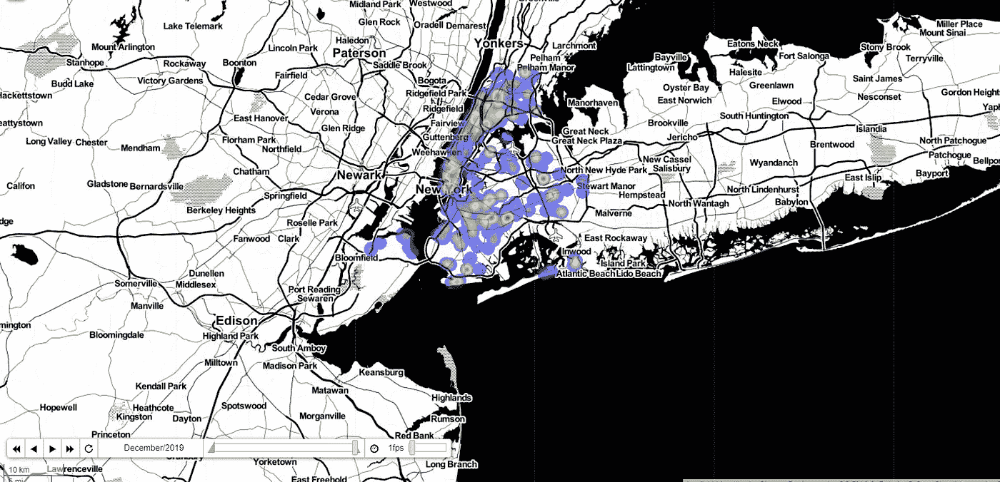

写这一步一步的想法来自对纽约市逮捕数据的探索性分析。在一个数据科学项目中，我决定用一个数据集块测试一些空间可视化 python 库。所以我试着创建一个纽约抢劫案的延时热图。正如我们将看到的，这种产品可以提供一些有价值的见解。

## 纽约市逮捕数据集

使用的数据集可在以下链接中找到:

 [## NYPD 逮捕数据(历史)|纽约市公开数据

### 编辑描述

data.cityofnewyork.us](https://data.cityofnewyork.us/Public-Safety/NYPD-Arrests-Data-Historic-/8h9b-rp9u) 

我们总结一下:

数据集包含超过 4，000，000 行和以下各列:

**逮捕密钥:**为每次逮捕随机生成的永久 ID

**逮捕日期:**报告事件的确切逮捕日期

**PD_CD:** 三位内部分类代码(比关键代码更细)

**PD _ desc:**PD 代码对应的内部分类描述(比罪行描述更细化)

**KY_CD:** 三位数内部分类代码(比 PD 代码更通用的类别)

**OFNS _ desc:**KY 代码对应的内部分类描述(比 PD 描述更一般的类别)

**法律 _ 代码:**法律代码费用对应于 NYS 刑法、VTL 和其他各种当地法律

**LAW_CAT_CD:** 犯罪等级:重罪、轻罪、违规

**拘捕 _ 博罗:**拘捕区。b(布朗克斯)，S(斯塔滕岛)，K(布鲁克林)，M(曼哈顿)，Q(皇后区)

**逮捕 _ 辖区:**逮捕发生的辖区

**辖区 _ 代码:**负责逮捕的辖区。管辖区代码 0(巡逻)、1(过境)和 2(住房)代表 NYPD，而代码 3 及以上代表非 NYPD 管辖区

**年龄组:**犯罪人的年龄在某一类别内

**犯罪者 _ 性别:**犯罪者的性别描述

**犯罪者种族:**犯罪者的种族描述

**X_COORD_CD:** 纽约州平面坐标系统的中区 X 坐标，长岛区，NAD 83，单位英尺(FIPS 3104)

**Y_COORD_CD:** 纽约州平面坐标系的中间区块 Y 坐标，长岛区，NAD 83，单位英尺(FIPS 3104)

**纬度:**全球坐标系的纬度坐标，WGS 1984，十进制度(EPSG 4326)

**经度:**全球坐标系的经度坐标，WGS 1984，十进制度(EPSG 4326)

**Lon_Lat:** 基于经度和纬度字段的地理参考点列

*   该数据集包含 2006 年至 2019 年间的逮捕信息。
*   它包含犯罪类型(抢劫、袭击等..).
*   它包含一些细节，如种族、性别和年龄。
*   它包含逮捕的地理信息(坐标和邻居)。

让我们现在检查一下

## 导入库

*   Pandas 库用于数据操作和清理数据集的不一致性。
*   使用了叶库来创建热图。
*   Geopandas 对于解决地理信息中的一些问题是必要的。

## 数据准备

首先，我们将从纽约开放数据网站下载的 CSV 文件中创建一个数据帧，并将它赋给一个名为“prisoes”的变量。

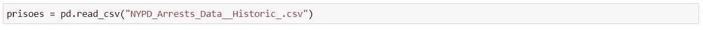

让我们检查一下数据帧:

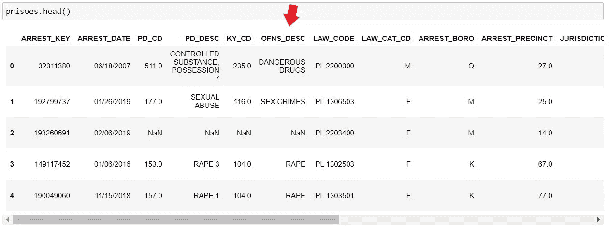

正如我们所看到的，逮捕被归类在 OFNS_DESC 一栏。我们将很快更好地检查它。但是首先，我们需要使用下面的代码检查 dataframe 上是否有空值。

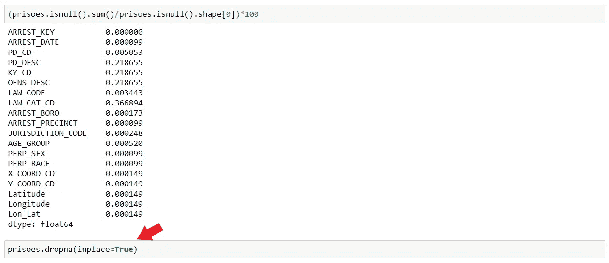

我发现了一些丢失的值，所以我们可以使用 *dropna* (红色箭头)函数从 dataframe 中删除这些行。有时，如果我们有更多的缺失值，最好使用其他技术来处理，但是因为这不是本教程的主题，所以让我们从最简单的解决方案开始。

现在让我们检查 OFNS_DESC 专栏。我们希望在这个练习中只使用抢劫逮捕，所以我们需要。 *loc* 功能选择这些行。

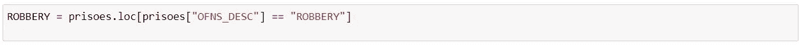

你可以看到逮捕的日期是按年月日详细记录的。

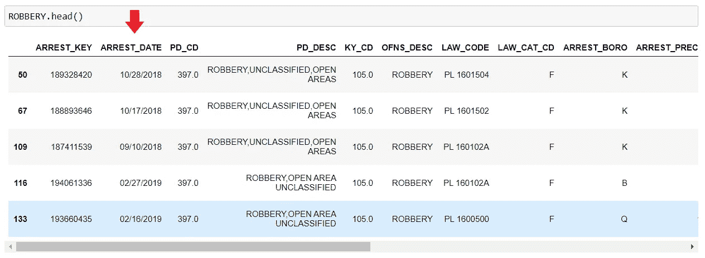

在这个练习中，我们需要年份和月份。因此，我们必须提取这些信息，并将其放在各自的列中。我们还需要月份的信函格式以及月份和年份的列。我们需要它来创建索引，该索引将显示在热图中的时间滑块上。

红色箭头表示年份和月份代码，绿色箭头表示索引事项代码。

之后，我使用了一个 *groupby* 函数来检查这些年来的出现次数。我发现了一些不一致的地方，2007 年和 2008 年有少量的逮捕。可能有一些丢失的寄存器。

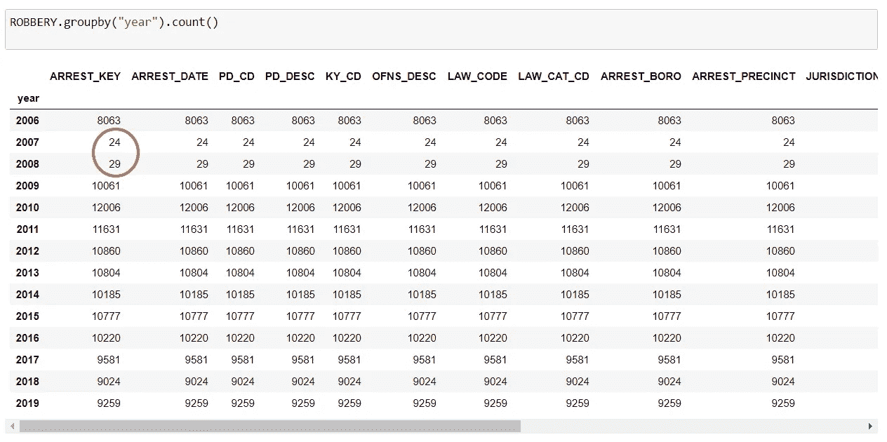

为了解决这个问题，我决定从 2009 年工作到 2019 年。并为这些时期创造了另一个变量。

# 随时间变化的热图

为了创建映射，首先我们需要用下面的代码行创建 ou 索引列和我们的索引列表:

索引列表将如下所示:

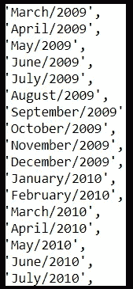

现在，我们需要创建一个名为“weight”的列，在这里我们将按地点添加这些年的发生次数。我们将把坐标和这些重量添加到一个按年份排序的列表中。最后，这个列表允许创建地图。

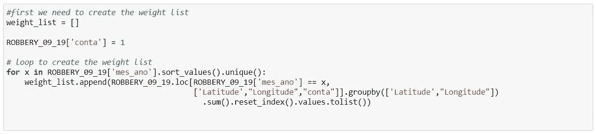

## 现在是我们期待的时刻…

现在我们有了列表，我们终于可以分两步制作我们的交互式地图了。首先，我们必须创建一个带有一些参数的底图，如起始位置、起始缩放和样式。之后，我们创建热图并添加参数。

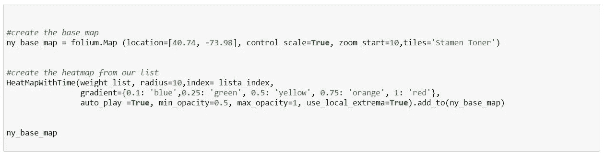

PS:有几个瓷砖选项，您可以在下面的链接中找到一些示例:

 [## 树叶地图切片-分离

### 使用不同的地图分块是更改或改善地图外观的好方法。这篇文章向你展示了如何…

deparkes.co.uk](https://deparkes.co.uk/2016/06/10/folium-map-tiles/) 

## 现在让我们检查一下热图

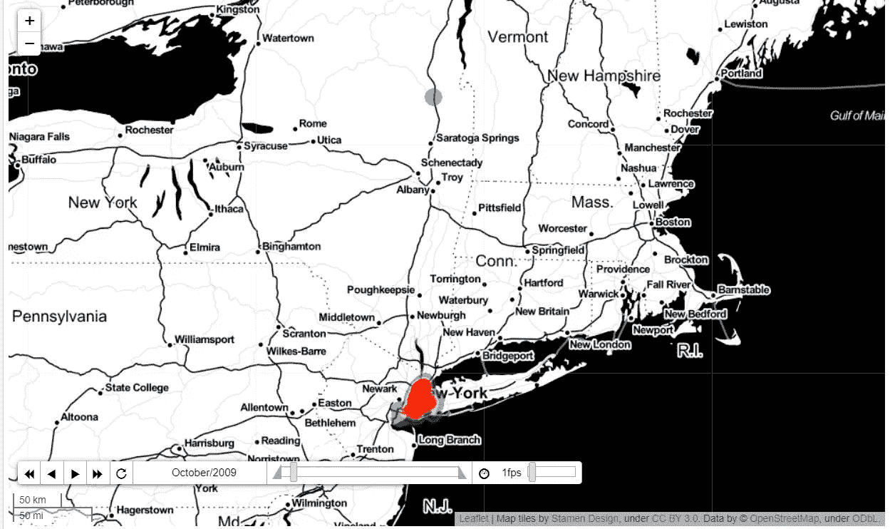

好的，我们有我们的地图，但是…如果你注意的话，你会发现在几个月中有一些地点在纽约市之外。这表明坐标列存在一些问题。但是不用担心，有了 Geopandas，很容易修复它

# 修复坐标错误

要过滤纽约市边界内的坐标，我们需要从纽约市形状文件中获取这些边界，该文件可在以下链接中找到:

 [## 邻域制表区域(以前称为“邻域投影区域”)

### 邻里制表区(NTAs)是为了在一个小区域水平上预测人口而创建的，从 2000 年到 2030 年…

www1.nyc.gov](https://www1.nyc.gov/site/planning/data-maps/open-data/dwn-nynta.page) 

现在我们需要 Geopandas 来读取 shapefile，将其转换为地理数据框架。

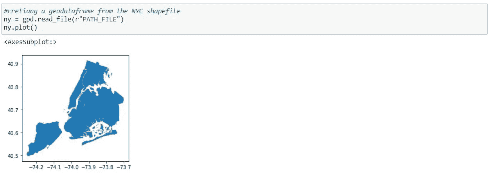

现在我们有了处理地理配准问题的工具，因此必须使用 Geopandas 中的叠加功能将我们的抢劫地理数据框架分成两个新的地理数据框架，并考虑抢劫数据集和 NYC shapefile 之间的空间关系。

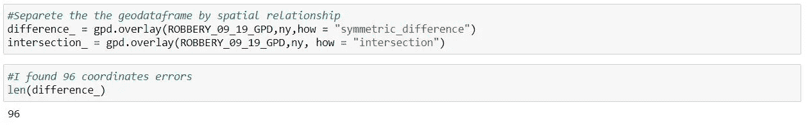

如你所见，我们发现了 96 个问题。因此，对于本例，我们不考虑 then，我们可以只保留*交集*数据集。

## PS:在我的项目中，这种地理参考问题很常见。在商业项目中，我强烈建议在数据准备步骤中处理这个问题。

最后，我们需要使用交集数据集重复该过程来创建热图。

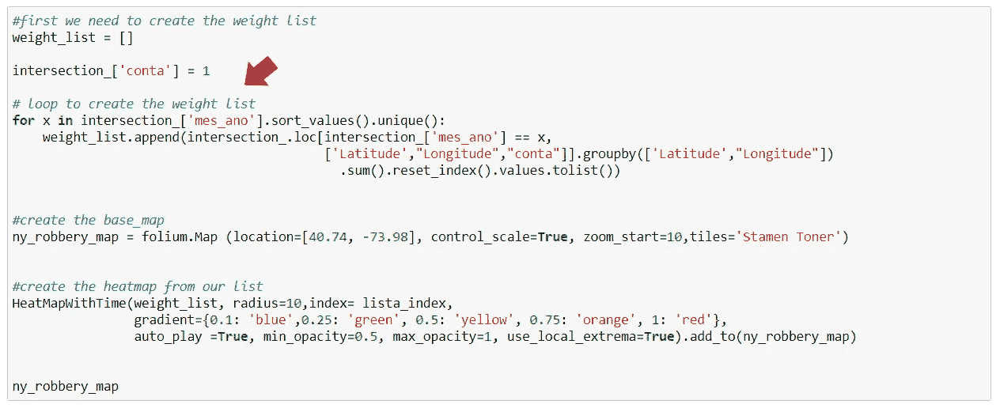

# 最终意见

我认为这篇文章的想法并不是要深入到纽约市逮捕的数据分析方面。这个想法更多的是激发读者去享受这个工具，自己获得洞察力，重现和改进这个方法。

## 你可以在我的 Github 查看结果:

https://eduardovirtuoso.github.io/Testes_Folium/