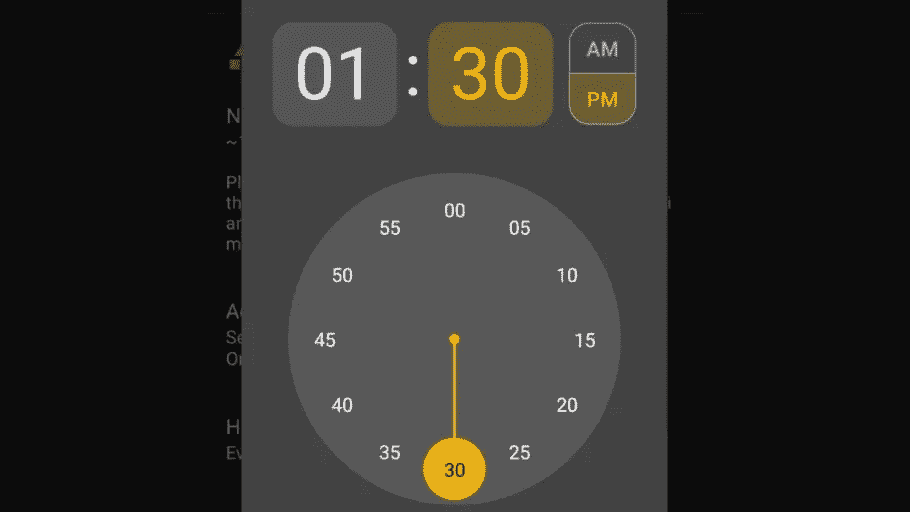
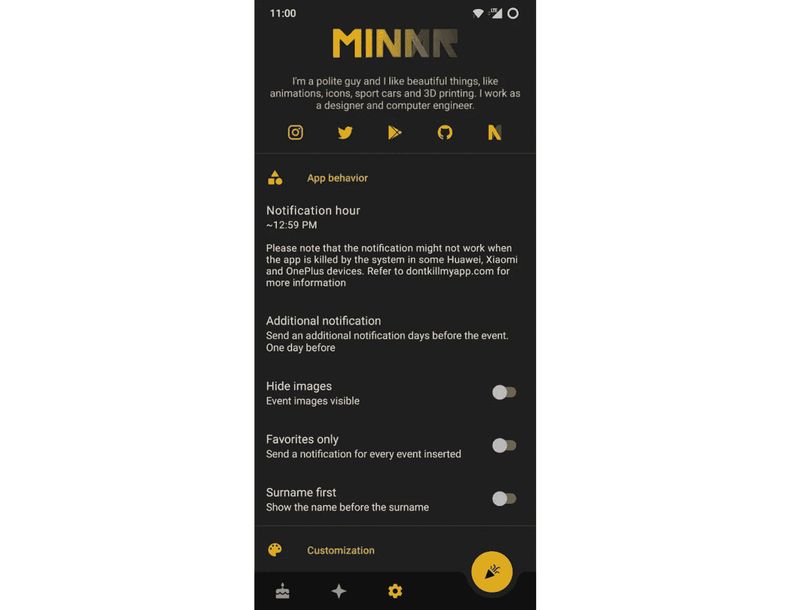
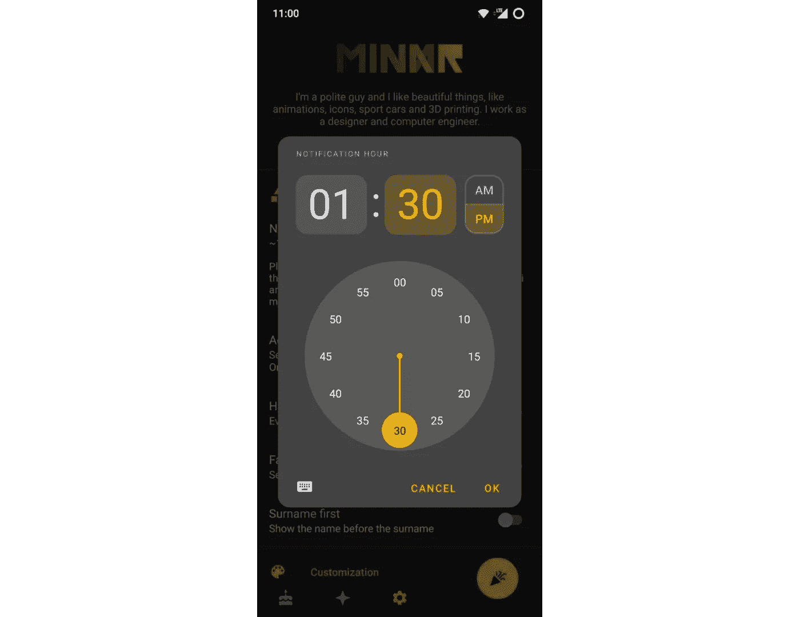

# 简化了首选项片段中的时间选择器和自定义条目🕒

> 原文：<https://medium.com/nerd-for-tech/time-picker-and-custom-entries-in-preference-fragment-made-simple-1e0e125ff2ac?source=collection_archive---------2----------------------->

## 以一个(主题化的)时间选择器为例，概述了在 Android 中实现自定义偏好设置的最快、最干净的方法



材料时间选取器

使用 Android 中的 PreferenceFragmentCompat 实现的标准首选项肯定是一个很好的快速解决方案，可以获得功能设置屏幕。然而，以这种方式实现的标准设置屏幕有一些限制:例如，只支持有限的设置类型，并且屏幕布局不受我们的控制。



自定义首选项屏幕示例

在本文中，我将重点关注**时间选择器**，因为它是自定义首选项输入的一个很好的例子，但是同样的方法可以应用于几乎所有类型的自定义首选项。我将发布并评论代码和一个项目的链接，在这个项目中，我最初使用这个解决方案来实现这个和其他自定义首选项。会很简单的，放心吧！我将使用**科特林**和我所知道的每一个最佳实践。我们走吧！

# 第一步:设置偏好屏幕

首先，您需要一个使用 **PreferenceFragmentCompat** 实现的首选项屏幕，在撰写本文时，这是最现代的解决方案。这意味着您应该:

1.  **实现 PreferenceFragmentCompat 的设置片段**

```
class SettingsFragment : PreferenceFragmentCompat*()*, OnSharedPreferenceChangeListener {
    // Create the screen, given the xml containing the preferences
    override fun onCreatePreferences*(*savedInstanceState: Bundle?, rootKey: String?*) {* setPreferencesFromResource*(*R.xml.*preferences*, rootKey*)
    }* override fun onResume*() {* super.onResume*()* // Set up a listener whenever a key changes
        *preferenceScreen*.*sharedPreferences* .registerOnSharedPreferenceChangeListener*(*this*)
    }* override fun onPause*() {* super.onPause*()* // Unregister the listener whenever a key changes
        *preferenceScreen*.*sharedPreferences* .unregisterOnSharedPreferenceChangeListener*(*this*)
    }* override fun onSharedPreferenceChanged*(*sharedPreferences: SharedPreferences, key: String*) {* when *(*key*) {* "theme_color" -> activity.recreate*()* "accent_color" -> activity.recreate*()
        }
    }*
```

2.**RES/XML/preferences . XML 中包含屏幕结构的 XML**

```
*<?*xml version="1.0" encoding="utf-8"*?>
<*PreferenceScreen xmlns:android="http://schemas.android.com/apk/res/android"
    xmlns:app="http://schemas.android.com/apk/res-auto"*>

    <*PreferenceCategory
        android:key="app_behavior"
        android:title="@string/app_behavior"
        app:icon="@drawable/ic_app_behavior_24dp"*>

        <*SwitchPreference
            android:defaultValue="false"
            android:key="hide_images"
            android:summaryOff="@string/hide_images_off"
            android:summaryOn="@string/hide_images_on"
            android:title="@string/hide_images"
            app:iconSpaceReserved="false" */>

        <*SwitchPreference
            android:defaultValue="false"
            android:key="only_fav"
            android:summaryOff="@string/only_fav_off"
            android:summaryOn="@string/only_fav_on"
            android:title="@string/only_fav"
            app:iconSpaceReserved="false" */>

        <*SwitchPreference
            android:defaultValue="false"
            android:key="surname_first"
            android:summaryOff="@string/surname_first_off"
            android:summaryOn="@string/surname_first_on"
            android:title="@string/surname_first"
            app:iconSpaceReserved="false" */>

    </*PreferenceCategory*>

    <*PreferenceCategory
        android:key="customization"
        android:title="@string/customization"
        app:icon="@drawable/ic_customization_24dp"*>

        <*ListPreference
            android:defaultValue="system"
            android:entries="@array/themes"
            android:entryValues="@array/themeValues"
            android:key="theme_color"
            android:summary="%s"
            android:title="@string/theme_name"
            app:iconSpaceReserved="false" */>

        <*ListPreference
            android:defaultValue="aqua"
            android:entries="@array/accents"
            android:entryValues="@array/accentValues"
            android:key="accent_color"
            android:summary="%s"
            android:title="@string/accent_name"
            app:iconSpaceReserved="false" */>
    </*PreferenceCategory*>
</*PreferenceScreen*>*
```

在上面的例子中，屏幕(它只是一个普通的片段，可以是应用程序普通导航的一部分)是使用包含首选项的 xml(它是**而不是**一个布局)创建的，并且每当主题或重点改变时，监听器被用来刷新活动。只有当某个设置需要**进一步的步骤**时，这种操作才是必要的，而不是简单地更新 SharedPreferences 条目。XML 用一个(可选)图标定义了两个选项类别。“%s”代表选项的**实际值**，取自可能值列表。

# 步骤 2:为自定义首选项定义布局

添加时间选择器的第一步是定义一个自定义的“行”用于首选项屏幕。布局将只包含行本身的设计。让我们设计一个类似于**普通首选项行**的布局:

```
*<?*xml version="1.0" encoding="utf-8"*?>
<*LinearLayout xmlns:android="http://schemas.android.com/apk/res/android"
    android:id="@+id/timePicker"
    android:layout_width="match_parent"
    android:layout_height="wrap_content"
    android:orientation="vertical"
    android:paddingHorizontal="@dimen/settings_row_padding"
    android:paddingVertical="@dimen/settings_row_padding"
    android:hapticFeedbackEnabled="false"
    android:background="?attr/selectableItemBackground"*>

        <*TextView
            android:id="@+id/timePickerTitle"
            android:layout_width="match_parent"
            android:layout_height="wrap_content"
            android:text="@string/notification_hour_name"
            android:textAppearance="@style/TextAppearance.MaterialComponents.Body1" */>

        <*TextView
            android:id="@+id/timePickerDescription"
            android:layout_width="match_parent"
            android:layout_height="wrap_content"
            android:text="@string/notification_hour_description"
            android:textAppearance="@style/TextAppearance.MaterialComponents.Body2"
            android:textSize="@dimen/custom_preference_text_size"*/>

</*LinearLayout*>*
```


上述布局的结果

外观符合标准文本，大小为 14sp，填充为 16dp，仅供参考。文本比通常的要长一点，但是你可以使用一个标准的单行描述。当然，换行符是使用字符串中的“\n”获得的，我写的警告与通知相关，因为这个特定的时间选择器将包含发送通知的时间。此外，请记住，该行文本中的任何更改都必须手动管理。

# 步骤 3:为我们的时间选择器首选项创建一个类

现在我们需要一个类来管理与我们正在创建的自定义行的交互。该类应该实现**首选项**和 **OnClickListener** ，并管理时间选择器本身和行中文本的更新。不多不少。

```
// A custom preference to show a time picker
class TimePickerPreference*(*context: Context?, attrs: AttributeSet?*)* : Preference*(*context, attrs*)*,
    View.OnClickListener *{* private lateinit var sharedPrefs: SharedPreferences
    private lateinit var currentHour: String
    private lateinit var currentMinute: String
    private lateinit var binding: TimePickerRowBinding
    val formatter: DateTimeFormatter = DateTimeFormatter.ofLocalizedTime*(*FormatStyle.*SHORT)* override fun onBindViewHolder*(*holder: PreferenceViewHolder*) {* sharedPrefs = PreferenceManager.getDefaultSharedPreferences*(context)* currentHour = sharedPrefs.getString*(*"notification_hour", "8"*)*.*toString()* currentMinute = sharedPrefs.getString*(*"notification_minute", "0"*)*.*toString()* super.onBindViewHolder*(*holder*)* binding = TimePickerRowBinding.bind*(*holder.itemView*)* // Format the time correctly
        val currentTime = LocalTime.of*(*currentHour.*toInt()*, currentMinute.*toInt())* binding.timePickerDescription.*text* =
            String.*format(
                context*.getString*(*R.string.*notification_hour_description)*,
                "~*${*formatter.format*(*currentTime*)}*"
            *)* binding.*root*.setOnClickListener*(*this*)
    }* override fun onClick*(*v: View*) {* val act = *context* as MainActivity
        currentHour = sharedPrefs.getString*(*"notification_hour", "8"*)*.*toString()* currentMinute = sharedPrefs.getString*(*"notification_minute", "0"*)*.*toString()* // Show the time picker
        val isSystem24Hour = is24HourFormat*(context)* val clockFormat = if *(*isSystem24Hour*)* TimeFormat.*CLOCK_24H* else TimeFormat.*CLOCK_12H* val picker =
            MaterialTimePicker.Builder*()* .setTimeFormat*(*clockFormat*)* .setHour*(*currentHour.*toInt())* .setMinute*(*currentMinute.*toInt())* .setTitleText*(context*.getString*(*R.string.*notification_hour_name))* .build*()* picker.addOnPositiveButtonClickListener **{** val editor = sharedPrefs.edit*()* editor.putString*(*"notification_hour", "*${*picker.*hour}*"*)* editor.putString*(*"notification_minute", "*${*picker.*minute}*"*)* editor.apply*()* // Format the selected hour and update the text
            val currentTime = LocalTime.of*(*picker.*hour*, picker.*minute)* binding.timePickerDescription.*text* =
                String.*format(
                    context*.getString*(*R.string.*notification_hour_description)*,
                    "~*${*formatter.format*(*currentTime*)}*"
                *)* **}** picker.show*(*act.*supportFragmentManager*, "timepicker"*)
    }

}*
```

上面的代码使用了 [**视图绑定**](https://developer.android.com/topic/libraries/view-binding) ，但是您可以使用标准的“findViewById”方法，这没有任何问题。当用户点击该行时，时间选择器被配置(使用本地时间格式)并显示。当用户点击时间选择器的正按钮(“确定”按钮)时，时间被保存，文本被更新。我选择在两个不同的 SharedPreference 条目中节省分钟和小时，但这取决于你:在我的情况下，避免破坏以前版本的应用程序和正确管理通知调度是很方便的。关于时间选择器如何工作的完整概述，请参考[官方文档](https://material.io/components/time-pickers/android)。

# 步骤 4:使用 preference.xml 中的自定义首选项

最后，是时候将我们的自定义参数链接到包含标准参数的 xml 了。很简单，只需使用完全限定的类名和对布局的引用！结果如下:

```
*<?*xml version="1.0" encoding="utf-8"*?>
<*PreferenceScreen xmlns:android="http://schemas.android.com/apk/res/android"
    xmlns:app="http://schemas.android.com/apk/res-auto"*>

    <*PreferenceCategory
        android:key="app_behavior"
        android:title="@string/app_behavior"
        app:icon="@drawable/ic_app_behavior_24dp"*>

        <*com.author.example.utilities.TimePickerPreference
            android:layout="@layout/time_picker_row"
            android:selectable="true" */>* *<*SwitchPreference
            android:defaultValue="false"
            android:key="hide_images"
            android:summaryOff="@string/hide_images_off"
            android:summaryOn="@string/hide_images_on"
            android:title="@string/hide_images"
            app:iconSpaceReserved="false" */>

        <*SwitchPreference
            android:defaultValue="false"
            android:key="only_fav"
            android:summaryOff="@string/only_fav_off"
            android:summaryOn="@string/only_fav_on"
            android:title="@string/only_fav"
            app:iconSpaceReserved="false" */>

        <*SwitchPreference
            android:defaultValue="false"
            android:key="surname_first"
            android:summaryOff="@string/surname_first_off"
            android:summaryOn="@string/surname_first_on"
            android:title="@string/surname_first"
            app:iconSpaceReserved="false" */>

    </*PreferenceCategory*>

    <*PreferenceCategory
        android:key="customization"
        android:title="@string/customization"
        app:icon="@drawable/ic_customization_24dp"*>

        <*ListPreference
            android:defaultValue="system"
            android:entries="@array/themes"
            android:entryValues="@array/themeValues"
            android:key="theme_color"
            android:summary="%s"
            android:title="@string/theme_name"
            app:iconSpaceReserved="false" */>

        <*ListPreference
            android:defaultValue="aqua"
            android:entries="@array/accents"
            android:entryValues="@array/accentValues"
            android:key="accent_color"
            android:summary="%s"
            android:title="@string/accent_name"
            app:iconSpaceReserved="false" */>
    </*PreferenceCategory*>
</*PreferenceScreen*>*
```

当然，用你的包名替换“com.author.example ”,用你用来存储我们之前讨论过的类的包**替换“utilities”。我决定将它存储在一个通用的“实用工具”包中，但这不是最佳实践。如果您需要在自定义首选项更新时添加更多的逻辑，您可以在自定义类本身或 PreferenceFragmentCompat 中使用我们之前设置的侦听器来完成。**



时间选择器在工作！

下面是**最终结果**。当单击该行时，时间选择器打开，选择得到完美的管理。根据你的主题/颜色，拾色器在你的应用程序中会有所不同，我将在文章的最后一部分，奖金部分涉及这个主题。显然，只有当设备使用 12 小时制时,“AM/PM”选择器才可见。

# 奖金:主题的时间挑选！

时间选择器可以主题化，以匹配应用程序中的其他对话框。虽然文档中包含了基本的主题化(主要是颜色相关的)来主题化**角落**和**背景**你将需要一些额外的主题化。这是我的主题:

```
<!-- Base app theme --> *<*style name="AppTheme" parent="Theme.MaterialComponents.DayNight.NoActionBar"*>
...* name="materialTimePickerTheme"*>*@style/ThemeOverlay.App.TimePicker*</*item*>
...
</*style*>*<!-- Time picker theme -->
*<*style name="ThemeOverlay.App.TimePicker" parent="@style/ThemeOverlay.MaterialComponents.TimePicker"*>
    <*item name="shapeAppearanceMediumComponent"*>*@style/ShapeAppearance.App.MediumComponent*</*item*>
    <*item name="boxCornerRadiusBottomEnd"*>*@dimen/text_field_corner*</*item*>
    <*item name="boxCornerRadiusTopEnd"*>*@dimen/text_field_corner*</*item*>
    <*item name="boxCornerRadiusBottomStart"*>*@dimen/text_field_corner*</*item*>
    <*item name="boxCornerRadiusTopStart"*>*@dimen/text_field_corner*</*item*>
    <*item name="colorSurface"*>*?android:colorBackgroundFloating*</*item*>
</*style*>**<*style name="ShapeAppearance.App.MediumComponent" parent="ShapeAppearance.MaterialComponents.MediumComponent"*>
    <*item name="cornerSize"*>*@dimen/rounded_corners*</*item*>
</*style*>*
```

这将基本上使**对话框角**和**文本字段角**变圆，并使用浅灰色作为背景(默认比标准偏好对话框暗)。

我要说的差不多就是这些了！这个和其他自定义首选项的完整源代码在 [**这个资源库**](https://github.com/m-i-n-a-r/birday) 中，查看一下，如果你愿意，可以随意留下一个**star**⭐；)