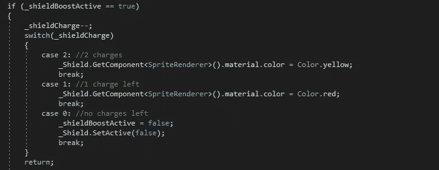
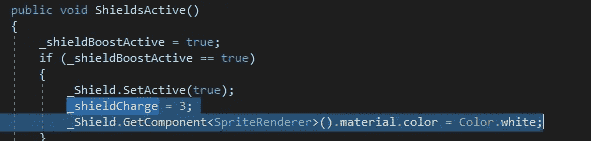
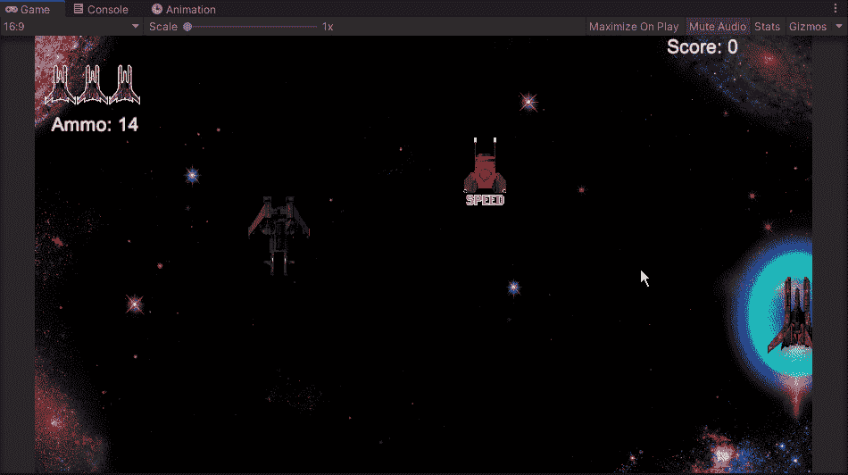
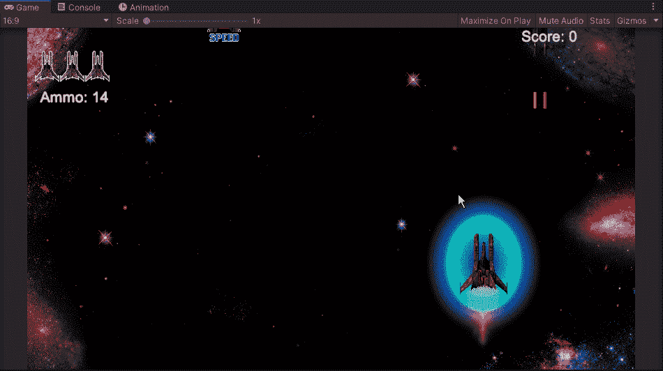

# 该加护盾费了

> 原文：<https://medium.com/nerd-for-tech/time-to-add-shield-charges-57f86a0fdcbc?source=collection_archive---------26----------------------->

今天我们要看看如何增加我们的护盾的能量，并给玩家一个视觉队列，这样他们就知道护盾什么时候会被摧毁。首先，我们需要进入我们的玩家脚本，添加一个盾牌电荷变量:

从这里，我们可以进入脚本的玩家伤害部分，并添加一个切换语句来循环显示盾牌的不同电荷:

从这里开始，我们将在我们最初放入屏蔽时创建的屏蔽活性空隙中设置所需的电荷值，这篇文章可以在这里[看到](/nerd-for-tech/shields-up-10bf97d47ecb)。

我们必须确保在适当的位置调整精灵的渲染，这样每当我们收集一个新的盾牌能量时，我们就不会让我们的盾牌最初产生不同的颜色，就像这样:

现在我们已经实现了所有的新代码，我们可以在游戏中测试它，看看它是否如预期的那样工作:

