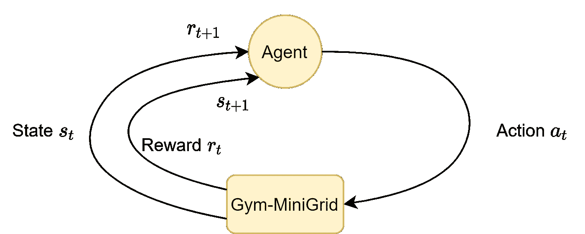
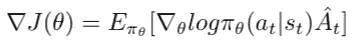
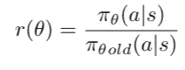
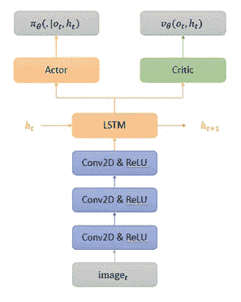
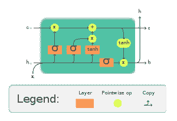
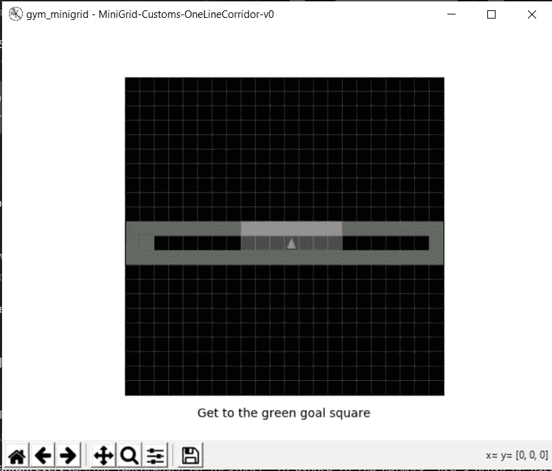
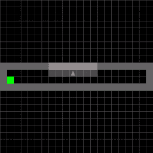
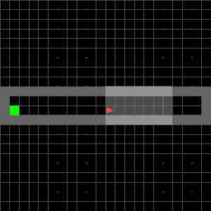
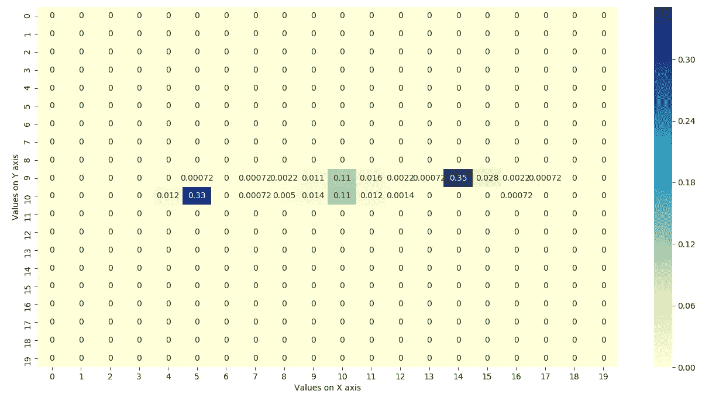
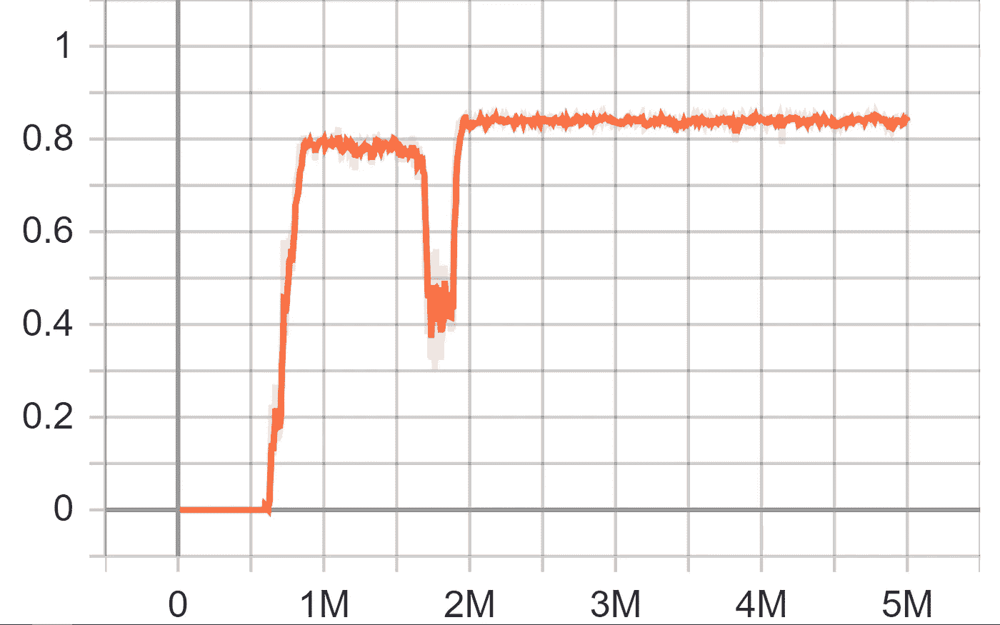

# 时间旅行

> 原文：<https://medium.com/nerd-for-tech/time-travel-376c94e21682?source=collection_archive---------25----------------------->

*Handy Kurniawan，Tamazi Sepiashvili，Shumpei Morimoto(*[*Github link*](https://github.com/utnnproject/Time-Travel/blob/main/README.md)*)
主管:奥里奥尔·科尔·安德勒*

# 介绍

乍看之下，这个项目的名称似乎是某种幻想，而且目前是一个不可能谈论的话题。你基本上是对的，但是嘿，你听说过强化学习吗？我们的团队聚集在一起探索深度学习的可能性，并研究人工智能代理是否可以从过去犯下的“错误”中学习。

在这个项目中，我们将创建一个自定义环境。环境是琐碎的，并且为代理提供了定义的规则和“游戏”的设计。这里我们有起点和终点。人工智能的目标是到达终点，并在强化学习的帮助下，可能返回几个决策并提高其性能。我们最终想要模仿的是人类在根据奖励信号的经验做决定时的思维方式。正如所料，我们的模型将在奖励系统的帮助下设计，这意味着代理人做出的每一个决定都会有一个奖励分数。这将是对人工智能有多少动力做出类似决定的一种衡量。所有的方法和模型将在下面的章节中描述。

# **方法论**

让我们从强化模型概念的描述开始。

## 强化学习

强化学习是一种机器学习技术，它使代理能够使用来自其动作和经验的反馈，通过反复试验在交互式环境中学习。它被各种软件和机器用来寻找在特定情况下它应该采取的最佳行为或路径。在我们的项目中，我们将对代理人的每一步给予奖励，以便代理人能够在更好的路径上达到目标。您可以在图 1 中查看强化学习方法的一般设计。

图一。强化学习模型

在航行中伴随我们的另一个重要策略当然是最近策略优化，在下面的部分我们将简要描述它。

## 近似策略优化(PPO)

PPO 是一种策略梯度方法，其中策略被显式更新。等式 1 示出了具有优势函数的普通政策梯度的目标函数或损失函数。

等式 1。具有优势函数的标准政策梯度的损失函数

普通政策梯度 RL 的主要挑战是高梯度方差。减少梯度估计方差的标准方法是使用优势函数。advantage 函数估计某个动作与特定状态的平均动作相比有多好。这里的想法是减少旧政策和新政策之间的梯度估计的高方差。PPO 是一个一阶优化，简化了它的实现。它定义了新政策和旧政策之间的概率比，并将其称为 r(θ)(等式 2)。

等式 2。新旧政策的概率比

## 演员兼评论家

行动者-批评家方法是强化比较法对 TD 学习和完全强化学习问题的自然延伸。Actor-critic 方法是 TD 方法，具有独立的内存结构，独立于值函数显式地表示策略。政策结构被称为行动者，因为它用于选择行动，而估计值函数被称为批评家，因为它批评行动者所做的行动。请查看图 2 中模型的架构。

图二。演员兼评论家

## 长短期记忆(LSTM)

LSTM(长短期记忆)是一种人工递归神经网络结构。LSTM 使记忆过去的数据变得更容易。RNN 的消失梯度问题得到了解决，它非常适合于对过程进行分类和预测给定未知持续时间的时间序列。它通过使用反向传播来训练模型。在 LSTM 网络中，使用了三个门，即输入门、遗忘门和输出门。输入门发现输入中的哪个值应该用于修改存储器。忘记门发现什么细节要从块中丢弃。输出门、输入和块的存储器用于决定输出。您可以在图 3 中看到。LSTM 是如何组织起来的？

图 3。LSTM

## 环境

图 4。健身房迷你网格样本

在这个项目中，我们使用的环境来自我们制作自定义地图的健身房迷你网格。我们用几个死胡同做了一个迷宫。最大步长为 100 步。它只是从简单的单线迷宫开始。

## 方法

在这里，我们使用演员-评论家模型来训练代理。首先，我们尝试用第一种方法中的固定目标和起始位置来制作一个较小的迷宫。当然，死路一条会给我们带来惩罚，或者让我们选择稍微偏离一下，但这将有助于长期发展，也是一个更直接的选择，因为它会让我们直奔目标，但得到的回报会更少。第二，使用巨型地图，我们随机放置一个目标位置。因此，每次代理失败或成功时，它都会不断变化。

加上 LSTM，我们希望代理人将利用时间旅行来学习获得全部报酬的最佳方式。

# 结果

让我们首先观察代理如何在没有时间旅行实现的情况下行动，然后将其与使用时间旅行概念的代理进行比较。

图 5。没有时间旅行的探索

在图 5 中。您可以观察到，在某些时间点，代理会额外转弯和转圈以到达最终点。这样它会花额外的时间到达终点。相比之下，当使用时间旅行(图 6。)代理人倾向于回到他的决策变得无效的点，并继续其他选择。您可以在图 6 中看到。在某些时间点，代理只是返回几步来重新考虑它的行为。

图 6。利用时间旅行进行探索

从长远来看，这种微小的可观察到的差异造成了巨大的差异。当环境非常大时，代理节省了大量的时间，而不是花费在矩阵中无用的点上。

与此同时，我们一直在追踪特工的热图。作为我们的第一项措施，我们感兴趣的是代理人决定时间旅行的时间点(图 7。).对于我们使用热图的第二个测量，我们想要记录地图上代理最常使用的点(图 8。).

图 7。时间旅行热图

在图 7 中。我们可以清楚地观察到，代理返回的次数最多的是在点(5，10)和(14，9)。这可以用一个事实来解释，代理人看到了 4-5 步，如果它继续前进，它会撞到墙上，这将是一个额外的时间花费，因此它返回到初始状态，并继续其他选择。

您也可以在图 7 中观察到。在(10，9)和(10，10)这两个点上，大部分时间都是初始点，代理人适度地使用了时间旅行的动作。这可以简单地解释为代理只选择正确的决策，它从顶部和底部面对墙壁，因此它使用时间旅行来重写它的决策，以防它选择向上或向下的方向。

图 8。位置热图

在图 8 中，点(10，9)和(10，10)是最常用的。同样，正如我们提到的，这些通常是起点，因此在当前的实验中，大多数时间代理人都站在这些点上。此外，请注意端点(0，9)、(0，10)、(19，9)和(19，10)也经常被同一逻辑使用。

我们跟踪的最后一个衡量标准(但并非最不重要)是帧的奖励值。

图 9。按帧奖励值

在图 9 中，您可以看到，从 200 万帧开始，奖励点数不再显著增加。这是我们停止训练过程时的指标。

# 未来的工作

1.  **在更复杂的环境中生成和训练**——为了确认时间旅行如预期的那样工作，在一个环境中需要更多的指令和假设来提高性能。通过为代理创建复杂的障碍和环境，它将能够根据这些环境进行训练和归纳，以做出正确的决策
2.  增加更多的剧集 -代理人接受的训练越多，通常表现越好。这里我们必须注意不要过度拟合，但从最初的观察和检查来看，我们肯定可以通过在过程中添加更多的剧集来提高代理的性能。
3.  **拥有一个基本的 UI/UX 应用程序设计** -当前项目的另一个好的补充将是添加一个基本的交互式图形界面，它将更容易为开发人员以及不了解技术细节的普通用户更改、修改参数和属性
4.  **优化和增加训练时间** -目前该模型正如预期的那样工作，然而，要进一步发展，它肯定需要一些代码优化。我们必须确保实现是可伸缩的、可扩展的，并且易于重用。此外，如果我们让代理训练更多的时间，正如我上面提到的，这将提高性能，而不会过度拟合。

# 感谢

作者要感谢教学团队提供了令人惊叹的课程内容，并概述了他们为使课程更好所做的辛勤工作。

我们还要感谢我们的主管，他对我们面临的问题进行了清晰的解释和描述，并给了我们前进的方向和道路。

# 参考资料:

*   [分布式强化学习中的循环经验重放](https://openreview.net/pdf?id=r1lyTjAqYX)
*   [稳定基线](https://github.com/DLR-RM/stable-baselines3)
*   [RL 启动器](https://github.com/lcswillems/rl-starter-files)