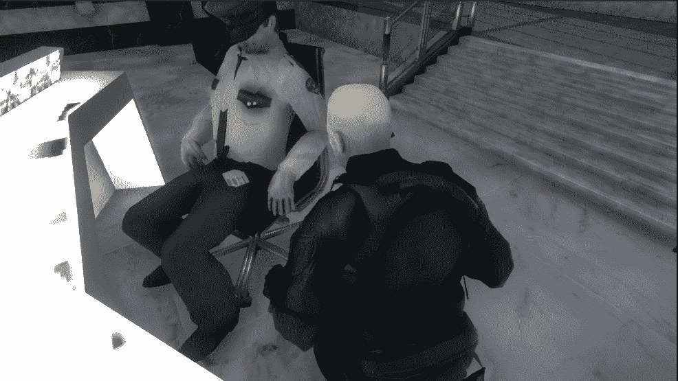
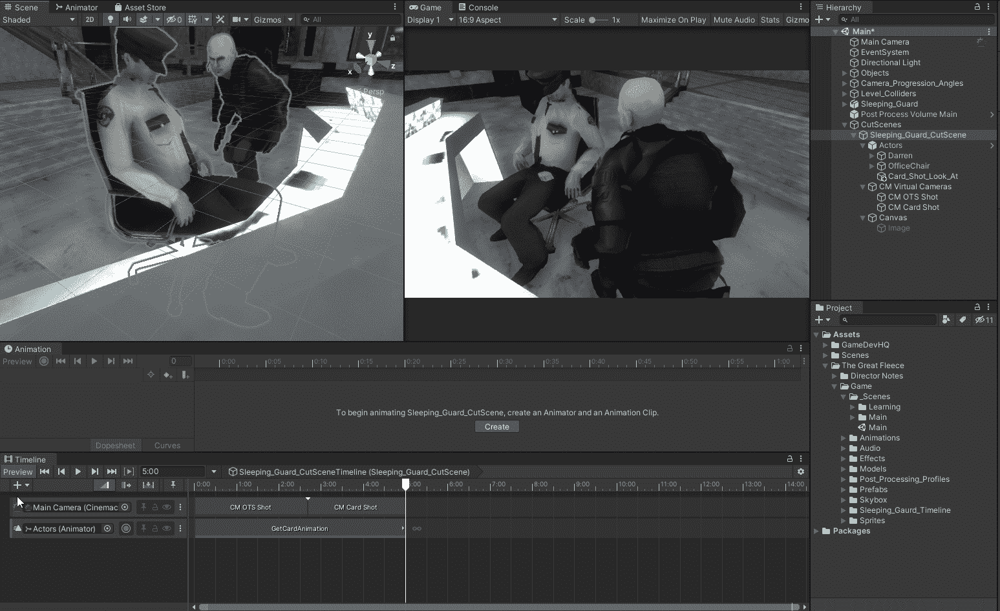

# 时间轴统一:给虚拟摄像机添加平移效果

> 原文：<https://medium.com/nerd-for-tech/timeline-unity-adding-a-panning-effect-to-a-virtual-camera-fc4b7ee466b?source=collection_archive---------9----------------------->

**目标:**创建一个相机摇摄，以获得更好的外观和感觉。

根据导演的笔记，他们希望镜头向上移动，越过肩膀。这将使镜头看起来更像电影。

OTS 相机摇镜头向上

我需要做的第一件事是添加一个动画轨道到时间线。然后将虚拟摄像机(厘米 OTS 拍摄)添加到时间轴上的动画轨道。

为厘米 OTS 拍摄添加动画轨道

接下来，我将记录摄像机的平移动画，这是通过单击动画轨迹上的红色记录按钮来完成的。然后将关键帧线移动到我想要设置新的摄像机位置的关键帧，并移动摄像机位置。按下录制按钮停止录制。

录制动画

现在一切都设置好了，我们可以按播放图标来查看时间线的运行情况。

厘米 OTS 拍摄摇摄

接下来，我将向你展示如何使用一个注视对象来调整摄像机的移动，从而产生平移效果。

编码快乐！！！！！