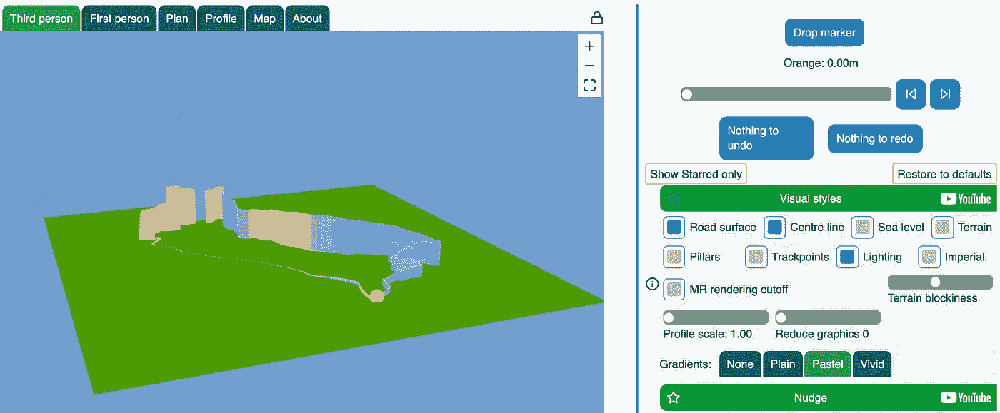

# 及时优化，第 3 部分

> 原文：<https://medium.com/nerd-for-tech/timely-optimization-part-3-e856ccea2f88?source=collection_archive---------7----------------------->

## 避免昂贵的列表操作



GPXmagic 中的渲染选项

以前，我写过从简单的列表搜索切换到使用二维索引(一种四叉树)的效果，以及将代码从应用程序整体移动到数据结构的影响，减少了创建结果集的开销，这些结果集只是为了以某种方式过滤或减少它们，但实际上是被丢弃的。

然而，列表的广泛使用是 GPXmagic 的一部分。它是 GPS 坐标列表的编辑器和可视化工具；这就是 GPX 文件*的含义*被过早优化咬了很多次，我通常会相当小心地避免任何过早优化。例如，正如你在上面的截图中看到的，有几个选项可以显示一个音轨。

到目前为止，我还没有尝试优化这一点。我的大部分功能测试都是在中小赛道上进行的，大概有几千个 GPS 点。这是我用来渲染的一段代码。

```
...     
        scene =
            List.concat
                [ graphNodes
                , if options.centreLine then
                    mapOverPairs (centreLineBetween gradientColourPastel) else
                    []
                , if options.roadTrack then
                    mapOverPairs paintSurfaceBetween else
                    []
                , if options.curtainStyle /= NoCurtain && not options.terrainOn then
                    mapOverPairs (curtainBetween floorPlane gradientFunction) else
                    []
                , if options.roadPillars && not options.terrainOn then
                    mapOverPoints (roadSupportPillar floorPlane) else
                    []
                , if options.roadCones && not options.terrainOn then
                    mapOverPoints trackPointCone else
                    []
                ]
    in
    scene
```

它遍历列表中五个可能元素中的每一个，每个元素生成一个 WebGL 可视元素的列表，这些元素在末尾连接在一起。相当清楚。它跑得相当快。有什么问题吗？

想象一下，这超过了我的一个更大的例子。它有 23000 点。最坏的情况下，我们要遍历五次。每次遍历都会构造一个更长的可视元素列表。然后，我们可能有五个(比如说)各有 50，000 个元素的列表。这些元素然后被连接成 250，000 个元素的最终结果。然后，部分列表被丢弃，供垃圾收集器回收。我们的峰值内存使用远远高于它所需要的。

这实际上更糟，因为`mapOverPairs`不经意地增加了开销:

```
mapOverPairs f =
            List.concat <| List.map2 f track (List.drop 1 track)
```

言归正传，我正在努力减少一般的内存使用，从浏览器开发人员控制台可以明显看出，添加图形元素会消耗数十兆字节，因此这似乎是值得一试的事情。

我们所需要做的就是重组控制流程，这样我们就可以在赛道上运行一次，并为每个点应用所有的活动选项，同时消除`mapOverPairs`。然而，我不想仅仅移动遍历中的`if ...`结构；这看起来很傻，因为他们不可能在手术过程中改变。

我以这个结尾:

```
scenePainterFunctions : List (TrackPoint -> Scene)
        scenePainterFunctions =
            [ if options.centreLine then
                Just (centreLineBetween gradientColourPastel) else
                Nothing
            , if options.roadTrack then
                Just paintSurfaceBetween else
                Nothing
            , if options.curtainStyle /= NoCurtain && not options.terrainOn then
                Just (curtainBetween floorPlane gradientFunction) else
                Nothing
            , if options.roadPillars && not options.terrainOn then
                Just (roadSupportPillar floorPlane) else
                Nothing
            , if options.roadCones && not options.terrainOn then
                Just trackPointCone else
                Nothing
            ]
                |> List.filterMap identity paintScenePart : TrackPoint -> Scene -> Scene
        paintScenePart pt accum =
            -- This is intended to allow us to touch each TP once, create all the
            -- active scene elements, and build a scene list with minimal overhead.
            scenePainterFunctions
                |> List.map (\fn -> fn pt)
                |> combineLists
                |> reversingCons accum scene : Scene
        scene =
            List.foldl paintScenePart [] track.trackPoints
```

三个街区来解释。

首先，`scenePainterFunctions`是原始的`if ...`语句，根据选项集修改为返回`Just <function>`或`Nothing`，然后对其进行过滤，留下一个将描绘所选特征的函数列表。

其次，`paintScenePart`是我们用来对这些点进行单次遍历的函数。*对于每个点*，它应用每个选择的渲染函数，每个函数返回一个小的可视元素列表。对于每个点，这些被组合成一个单个列表，并被推到我们的累积列表的开始。

第三，`scene`仅仅对每个点应用`paintScenePart`操作。

助手函数`combineLists`和`reversingCons`只是有效地将列表放在一起，而元素的顺序并不重要。

```
reversingCons : List a -> List a -> List a
reversingCons xs ys =
    -- Use this for speed when order can be ignored.
    case ( xs, ys ) of
        ( [], _ ) ->
            ys ( _, [] ) ->
            xs ( x :: moreX, _ ) ->
            reversingCons moreX (x :: ys) combineLists : List (List a) -> List a
combineLists lists =
    List.foldl reversingCons [] lists
```

大问题:有区别吗？老实说，我很难搞清楚这个问题。浏览器开发工具不会不合理地假设您是 JavaScript 开发人员。我没有。我是一名 Elm 开发人员，Elm 编译成密集、晦涩的 JavaScript。因此，查看内存分配的相当智能的工具很难解释。结果是“我想是的”，尽管其中有“我非常希望它是这样的”的成分。尽管如此，我喜欢代码的形状，我会睡得更香。