# 角度计时器。小而简单。

> 原文：<https://medium.com/nerd-for-tech/timer-in-angular-small-and-simple-ef98682261b5?source=collection_archive---------3----------------------->

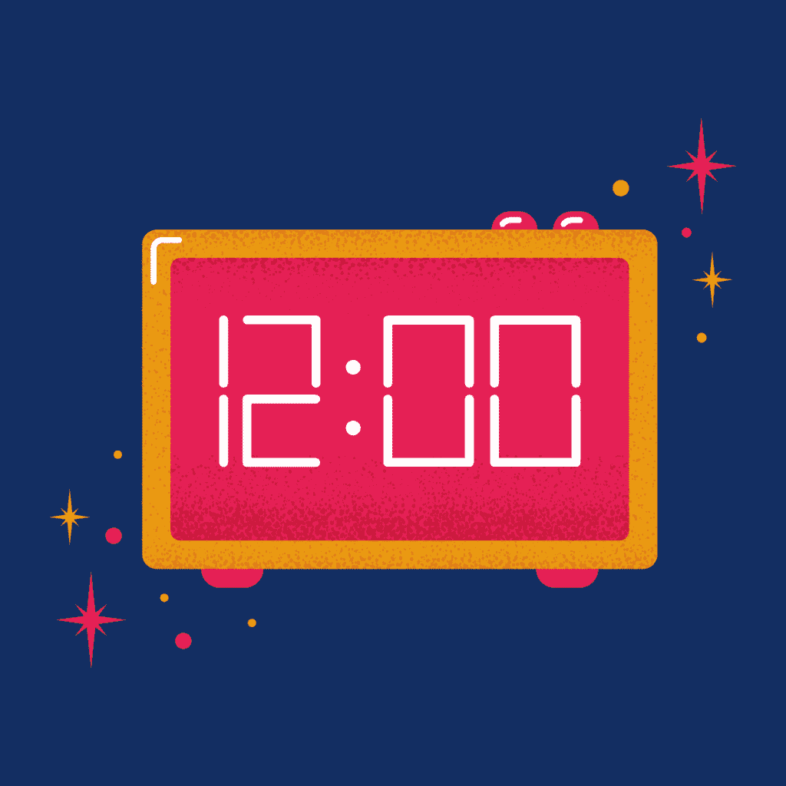

今天我们要做一个角度计时器。我们制作一个计时器组件。这个组件能够倒计时时间，显示固定时间和清除时间。

**型号**

模型有几个状态。一种状态定义了定时器应该做什么，另一种定义了我们想要向用户显示多少个数字。属性“endTime”用于倒计时，“totalTime”用于显示固定时间。我们将使用计时器中的函数“setTimeout”。该函数返回 id。这个 id 保存在属性“id”中。

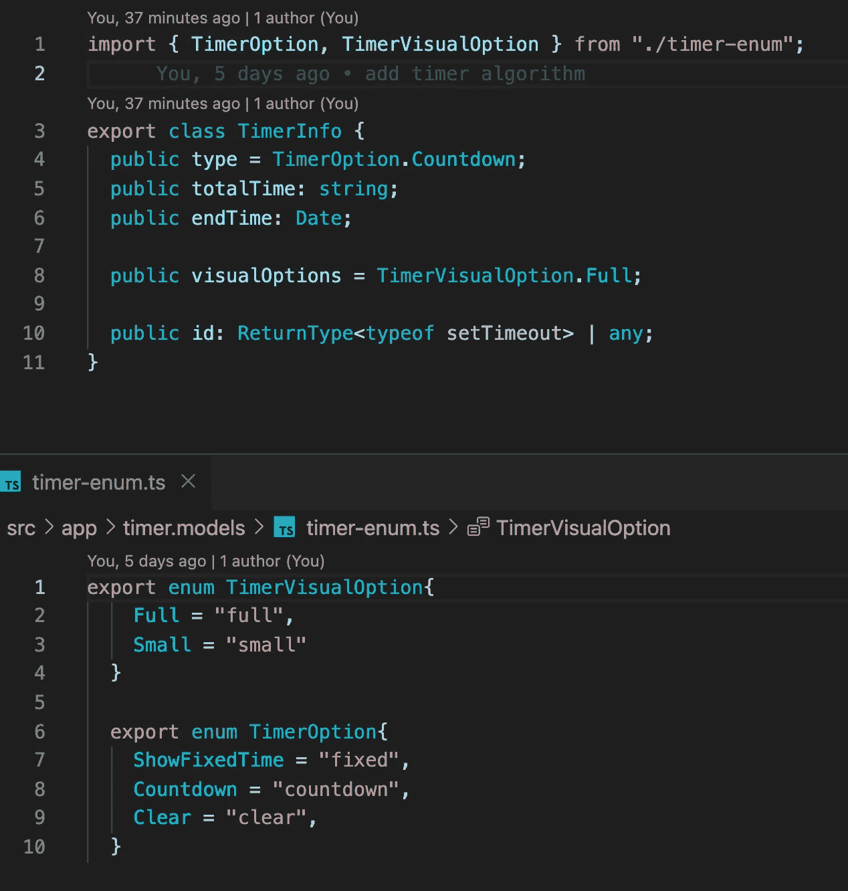

**AppComponent**

AppComponent 帮助我们定义了一个定时器，并控制它们中的每一个。

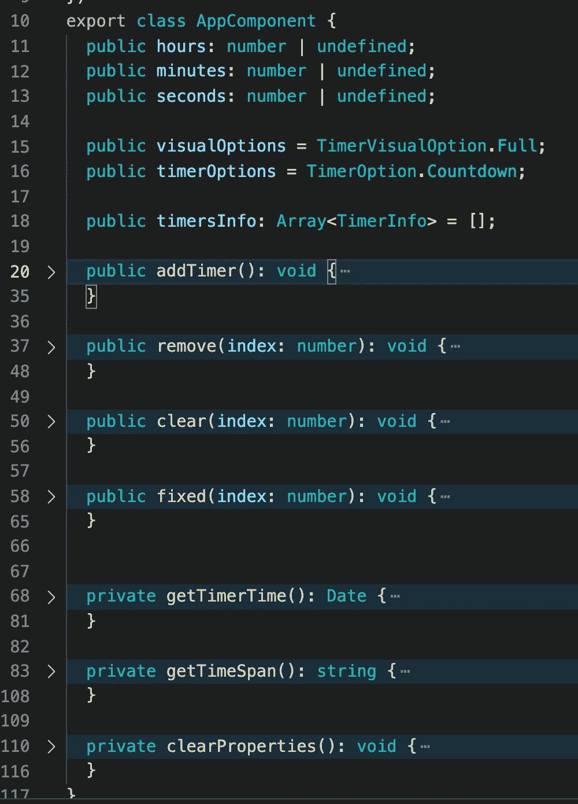

函数“删除”从定时器数组中删除项目。功能“清除”是清除时间和消除倒计时，“固定”显示定义的时间和消除倒计时。

函数“addTimer”设置一个定时器，并在数组中添加一个新的定时器。之后，我们清除 UI 上的所有属性。

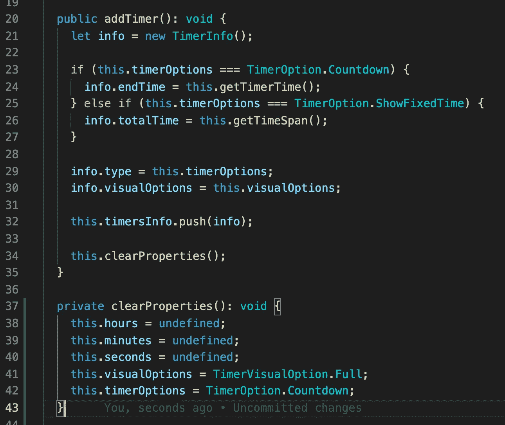

在这个组件中，我们还有两个函数可以帮助我们设置“结束时间”(getTimerTime)和“总时间”(getTimeSpam)。

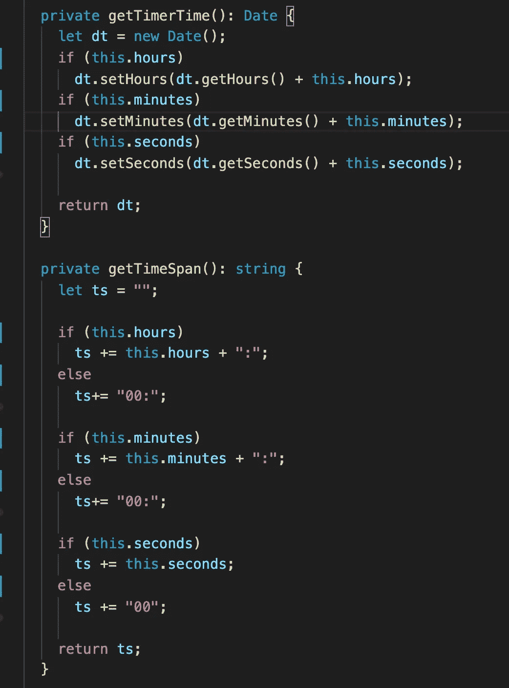

在 html 中，我们有 3 个输入，2 个下拉菜单，它们建立了一个定时器模型。我们从 bootstrap 库中获得的所有 CSS 样式。

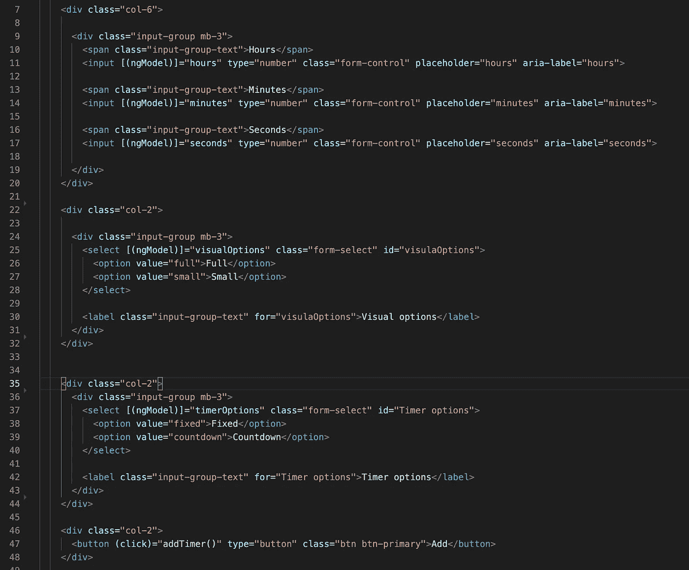

我们还展示了一个带有改变状态按钮的定时器列表。

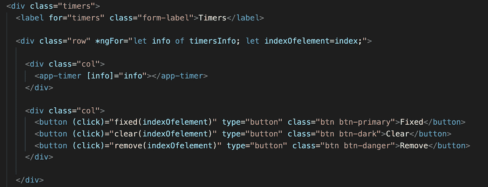

在 css 中，我们只是从 bootstrap 库添加了一个导入来使它更漂亮

@ import " ~ bootstrap/dist/CSS/bootstrap . CSS "

**定时器**

所有的定时器逻辑都在这里。当我们设置一个新的定时器信息时，我们检查类型。

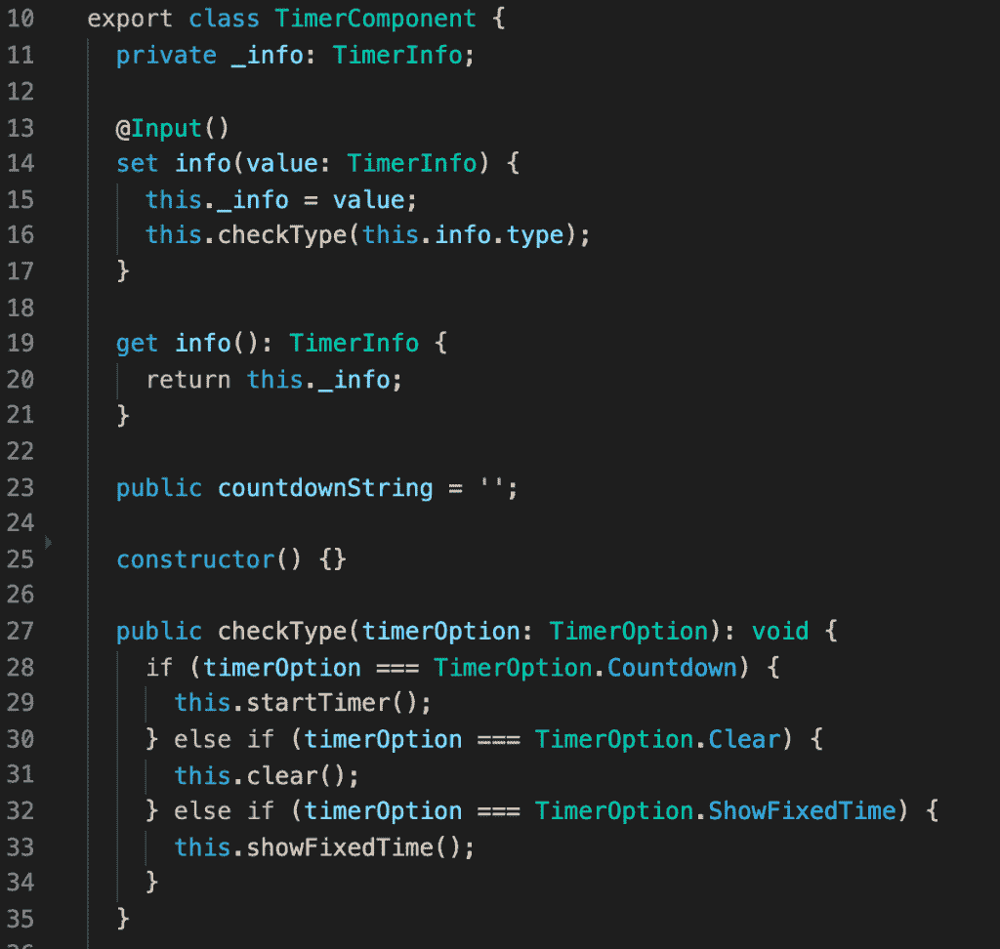

对于每一种类型，我们都有一个执行该操作的方法。启动方法设置时间间隔，时间间隔 id 保存在计时器信息模型中。每隔一秒钟就进行一次倒计时。

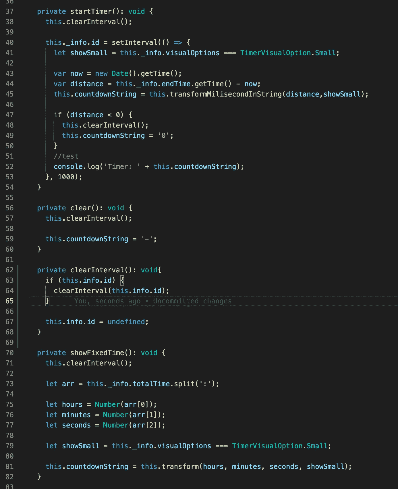

因为我们使用毫秒，所以我们将它们转换成可读的小时、分钟和秒。之后，我们将它们添加到一个字符串中。如果我们没有足够的空间，我们将显示一个小的倒计时值。

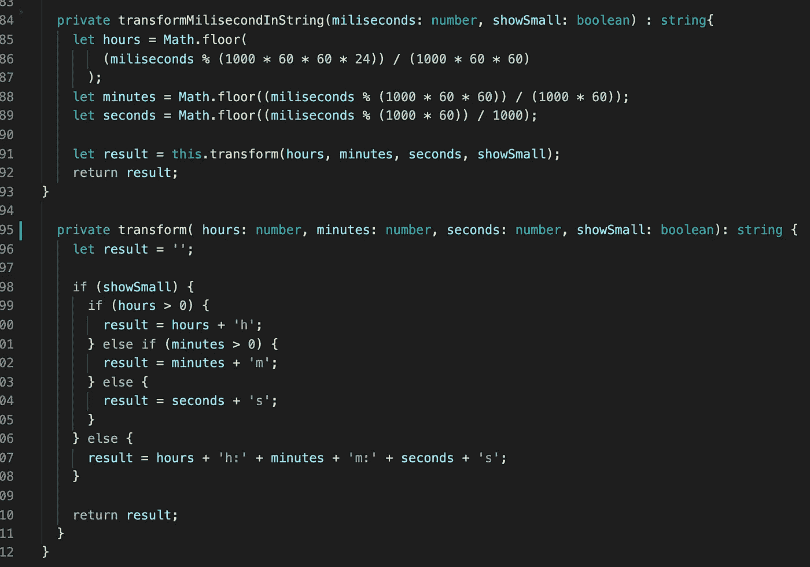

计时器 css 为空。在 html 中，我们只显示倒计时。

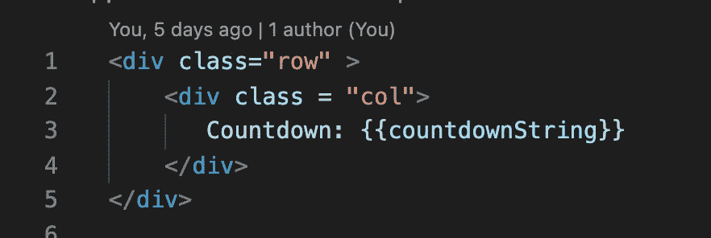

计时器准备好了。

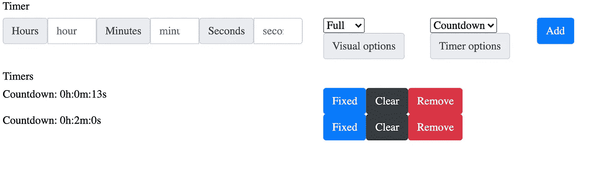

现在你知道如何制作几个定时器了。如果你需要仔细看看项目[，这里有链接。](https://github.com/8Tesla8/angular-timer)

*原载于 2021 年 5 月 9 日 http://tomorrowmeannever.wordpress.com**的* [*。*](https://tomorrowmeannever.wordpress.com/2021/05/09/timer-in-angular-small-and-simple/)