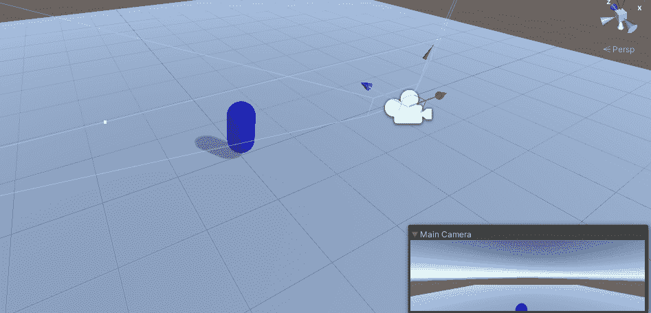
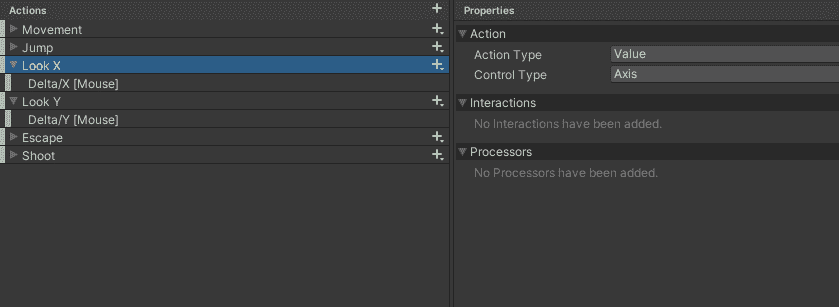
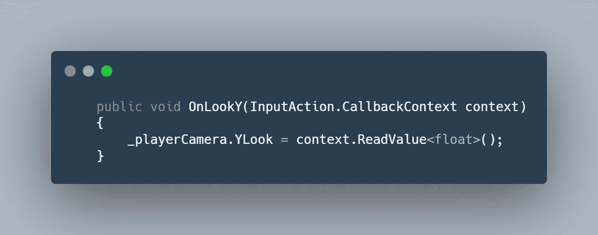
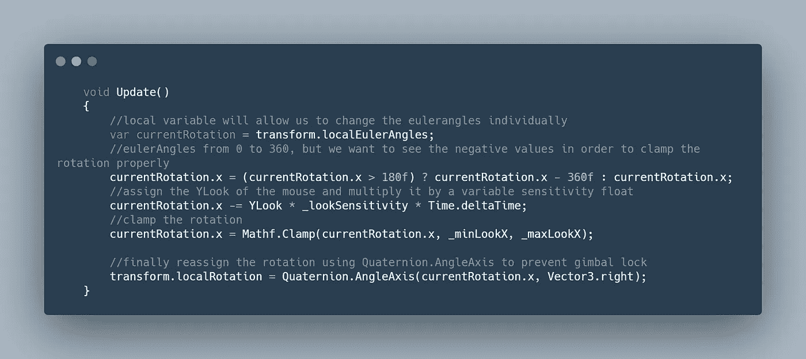
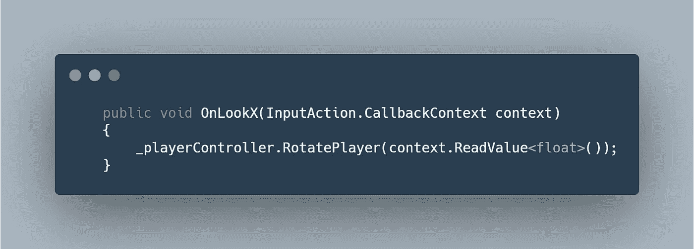
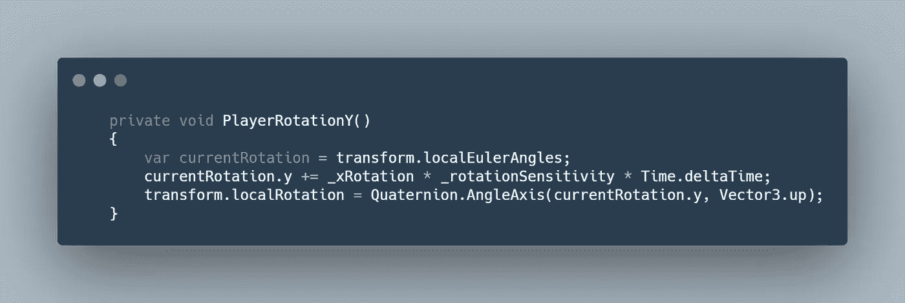
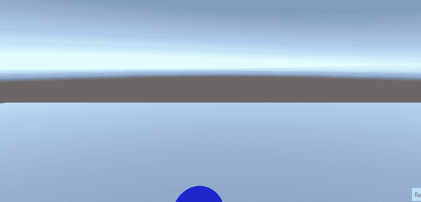

# 日积月累:Unity 3D 中的肩上摄像系统

> 原文：<https://medium.com/nerd-for-tech/tip-of-the-day-above-the-shoulder-camera-system-in-unity-3d-41b28b907915?source=collection_archive---------6----------------------->

Cinemachine 是一个很棒的 Unity 工具，可以用作相机系统，但有时你想通过代码控制相机的每个方面。在这篇文章中，我们将探讨如何做到这一点，以及如何使一个三维人以上的肩膀相机。

> 设置

首先，让我们创建一个原型玩家，并使用角色(Unity 中的[角色控制器](/codex/tip-of-the-day-character-controller-in-unity-4516644f695))给他一些动作。

下一个孩子主摄像头在播放器下面。这将允许摄像机跟随你的球员。

主摄像机作为播放器的子设备

现在让我们将摄像机的位置固定在玩家肩膀的上方。

将摄像机设置在肩膀上方

有了这个设置，玩家既不能旋转也不能抬头，所以让我们来解决它。

> 球员轮换

## 上下打量

垂直观察将直接由相机在其轴上的局部旋转来控制。这将由鼠标位置的增量/y (y 轴)控制。我们将使用新的输入系统来记录鼠标在 x 轴(控制播放器的水平旋转)和 y 轴(控制播放器的垂直外观)上的位置变化

输入动作

首先创建一个 C#脚本，将其命名为 PlayerCameraController，并将其附加到播放器上的子摄像机上。创建一个公共 auto 属性，并将其命名为“YLook”(public float YLook { get；设置；}).

现在创建事件方法，该方法将记录 Delta/y 鼠标位置，并将其分配给相机脚本中的一个 float 变量。

事件方法

在更新中，我们希望通过更改 tranform.localEulerAngle 来控制相机局部旋转的 x 轴。

## 向左和向右旋转

为了控制玩家在 Y 轴上的旋转，我们要做和上面一样的事情，但是是为了玩家。在播放器脚本中创建一个变量 _xRotation，并将其赋给鼠标位置的 Delta/X。

记录鼠标的增量/X，并将其分配给 _xRotation

应用我们在摄像机中使用的相同方法来旋转播放器。(不要忘记将该方法添加到播放器脚本的更新中)。

它看起来是这样的:

