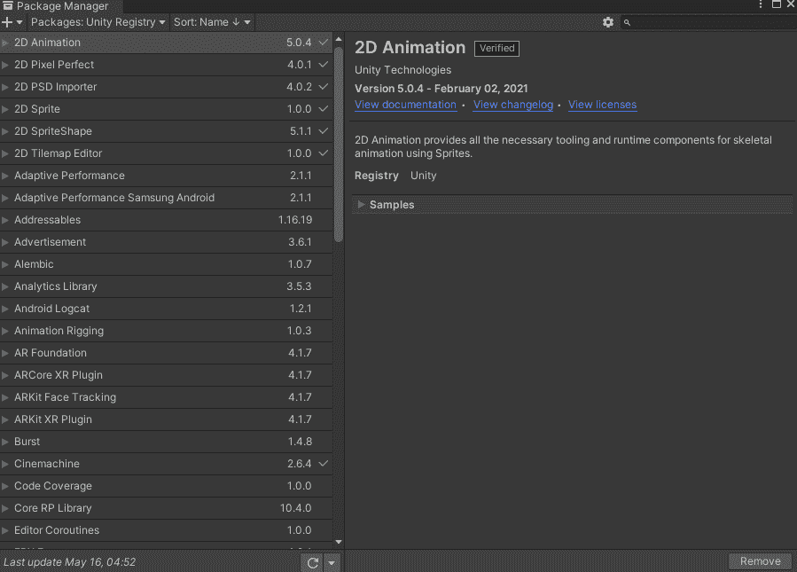
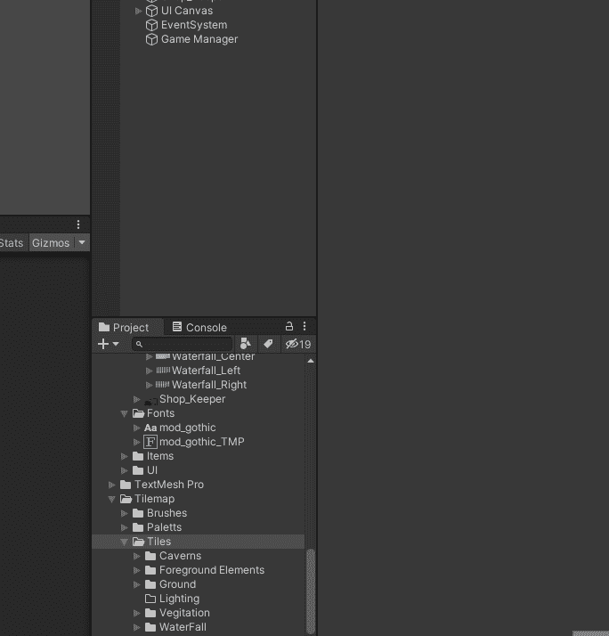
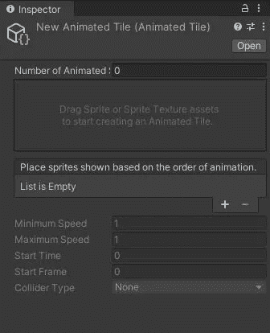
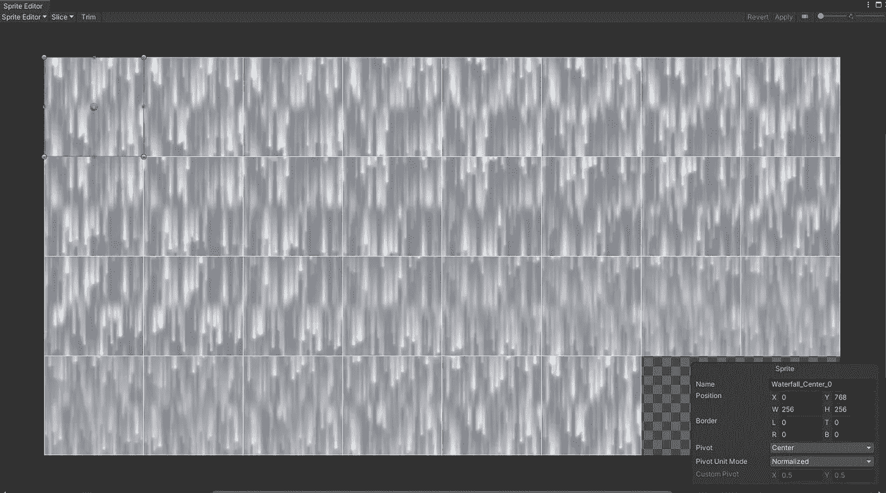
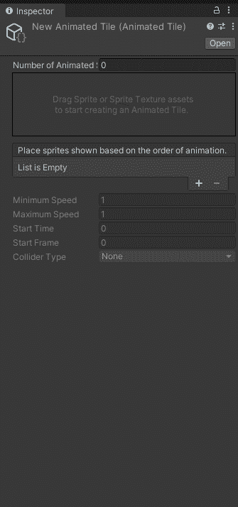
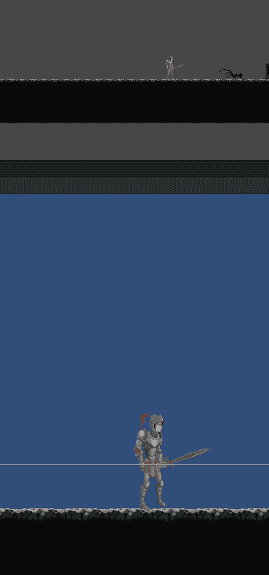

# 日积月累:动画瓷砖托盘单元 2D

> 原文：<https://medium.com/nerd-for-tech/tip-of-the-day-animated-tile-pallets-unity2d-3650ba894517?source=collection_archive---------25----------------------->

如果你正在创建一个依赖于使用 Tilemap 的 2D 游戏([你可以在这里阅读 tile map 的文章](/nerd-for-tech/tip-of-the-day-tile-maps-101-unity2d-c59aadc999e4))，那么你肯定会想要动画一些瓷砖。这里最好的例子可能是一个瀑布，或者是一扇闪闪发光的窗户。

> 目标:创建动画瓷砖

当你开始一个 2D 项目时，你不会找到一个可以让你制作动画瓷砖的工具。允许你这么做的工具在一个叫做“2D Tilemaps Extra”的预览包中。

1.  打开你的*包装器管理器*，然后按下齿轮图标。
2.  选择*高级项目设置*，从那里*启用预览包*。
3.  找到 *2D Tilemap Extras* 预览包并将其安装到您的项目中。

2D Tilemap Extras 包将提供新类型的图块(包括动画图块)，以及许多不同的笔刷，包括一个游戏对象笔刷。

现在，在您的项目资源中，您可以创建一个 2D 动画单幅图块。

**右键>创建> 2D >平铺>动画平铺**

创建动画单幅图块

这将创建一个新的动画单幅图块。

为了填充它，你需要一个包含所有动画精灵的 2D 精灵电子表格。让我们看一个例子。

> 瀑布动画瓷砖示例

这里我们有一个电子表格，其中包含了 30 帧我们想要制作动画的瀑布。

单击您刚刚创建的动画方块。在动画的数量中，选择 30 帧；这将添加 30 个空框架供您填充。现在，您可以将每个框架添加到它的位置。或者，你可以用更有效的方法。

1.  选取您创建的新动画互动程序，并在检查器中“锁定它”。这将允许您选择其他对象，同时保持动画分块的检查器打开。
2.  选择所有要制作动画的精灵。
3.  只需将这些精灵纹理拖动到盒子中，动画瓷砖将被填充。
4.  确保调整动画的最小和最大速度。

现在，在 Tilemap 窗口中，创建一个新的托盘，并将这个新的动画图块拖动到 Tilemap 窗口中。你可以像对待任何其他 2D Tilemap 一样对待它，你可以把它画进你的世界。

这就是你要的，你可以很容易地把动画瓷砖画进你的世界。