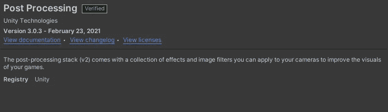
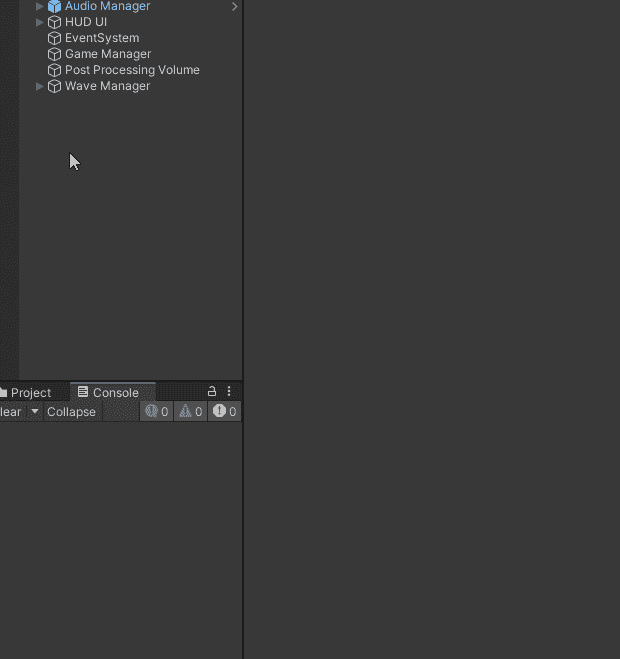
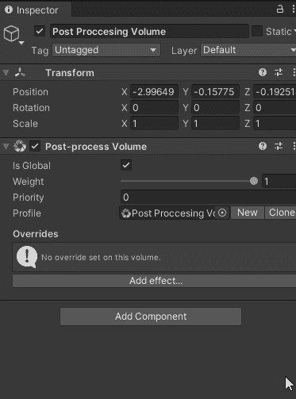
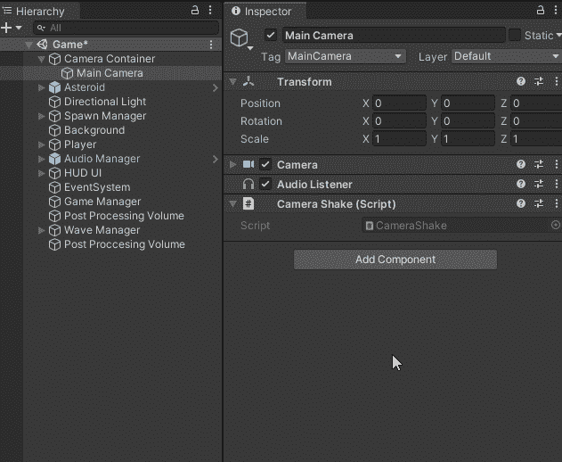
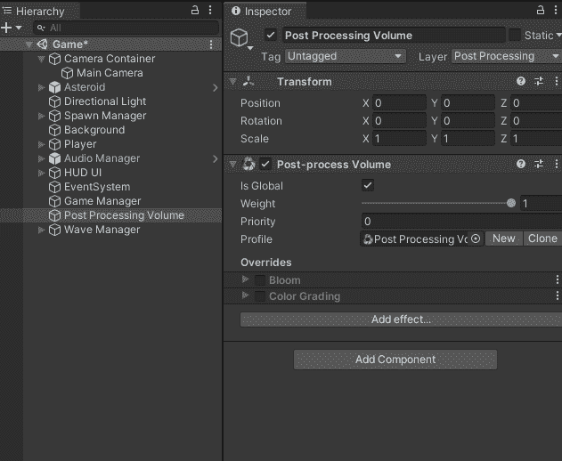

# 日积月累:从“meh”到团结的 AAA

> 原文：<https://medium.com/nerd-for-tech/tip-of-the-day-from-meh-to-aaa-in-unity-5f99286746dc?source=collection_archive---------17----------------------->

就像 Unity 中的所有东西一样，将你平庸的游戏提升到一个非常好看的游戏总是一个直截了当的行动。

> 目标:后处理基础

在你开始为你的游戏添加令人惊奇的后期处理之前，你需要确保你已经安装了它(通常是这样，但总是要仔细检查)。转到“软件包管理器/软件包:在 Unity 或 Unity 注册表中”,并确保安装了后处理

安装后处理

在这之后，你必须完成 3 个基本步骤。

A. 给一个空的游戏对象添加一个后处理卷。添加一个“后处理卷”。现在检查“是全局的”以使它在你的整个场景中工作(你可以使体积特定于某个区域)，然后添加一个轮廓。

B. 创建一个新层，例如调用 is 后处理层，并将其分配到您创建的后处理卷。

后处理层

C. 在你的主相机上，添加一个后处理层组件，给这个主相机分配触发器，选择你上面创建的后处理层。

魔法开始了。在你创建的后处理体积游戏对象上，你可以开始添加图形效果，并根据你的喜好操纵它们。

图形效果

快速看一下这些是如何影响游戏的感觉和外观的。

后处理开/关

稍后，我们将看看 Unity 中的通用渲染管道和高清渲染管道，它们比内置的后期处理功能更强大。