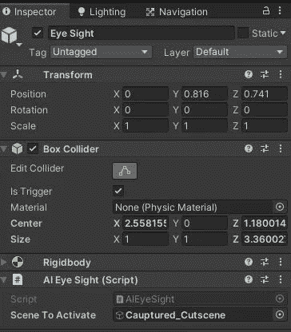
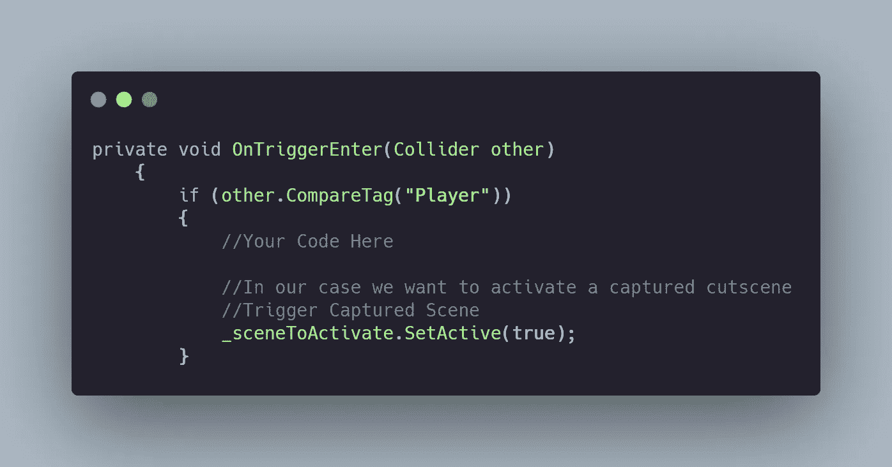
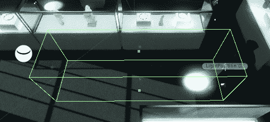
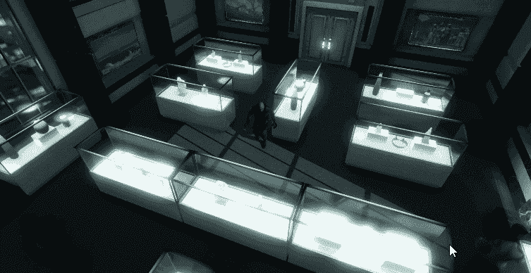

# 日积月累:给你的 AI 一个统一的视野

> 原文：<https://medium.com/nerd-for-tech/tip-of-the-day-give-your-ai-sight-in-unity-534ce3ef0b9?source=collection_archive---------11----------------------->

今天的提示很快。AI 瞄准器在潜行游戏中最有用，但是它也可以在其他领域使用。

我们将创建一个非常简单有效的方法来实现这一点。但是如果你想要一个更精确的视力，那么你可以使用光线追踪(我们稍后会看到它是如何实现的)

> 目标:让你的人工智能看到

首先，让我们在敌人 AI 上创建一个空的游戏对象，并将其命名为眼睛视线。

为了让这个方法工作，我们需要添加一个碰撞器作为触发器和一个运动学刚体组件。还要创建一个 C#脚本，附加到敌方 AI 上。

编写脚本相当简单。例如，我们将利用 Unity 的触发方法来检测眼睛视力游戏对象的盒子碰撞器是否与我们的玩家发生了碰撞。而当这种碰撞发生的时候，只有你可以为所欲为。

调整视力距离就像编辑碰撞器一样简单。我们使用了一个箱式碰撞器，但是你可以使用任何你认为最适合你的项目的碰撞器。

这是在敌人人工智能使用这种方法探测到玩家后的情况。

敌人 AI 看到玩家，玩家被抓。

使用上述方法，我们还可以让我们的安全摄像机检测到玩家，并触发我们捕获的过场动画。

