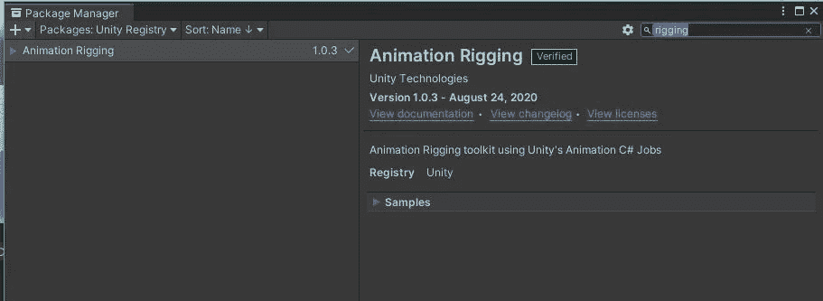
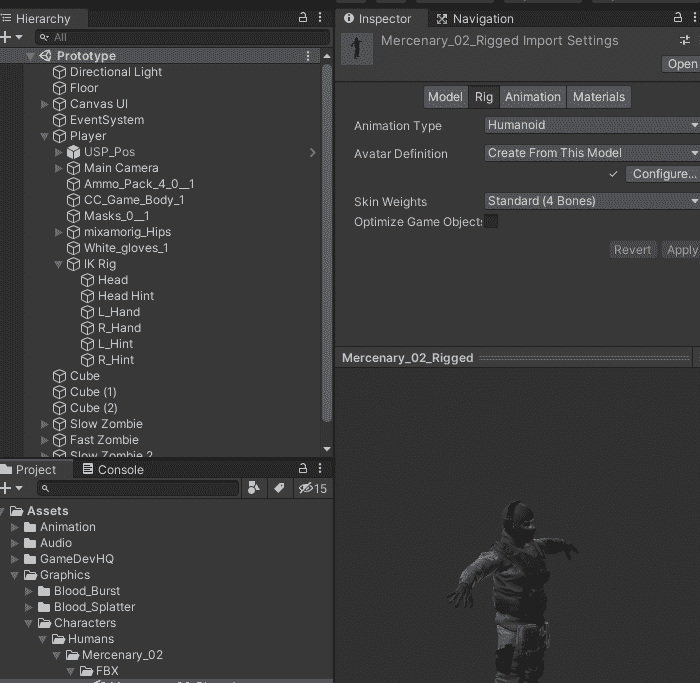
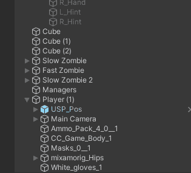
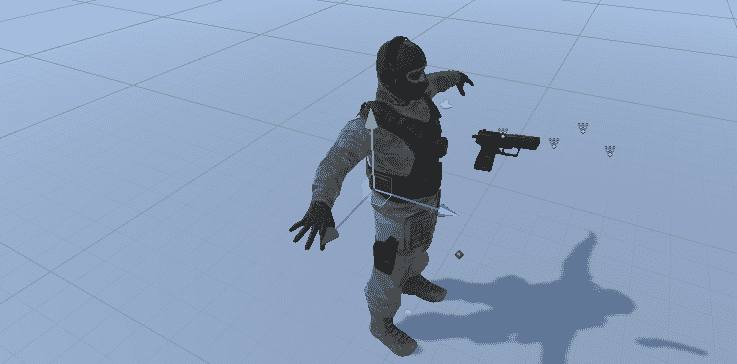
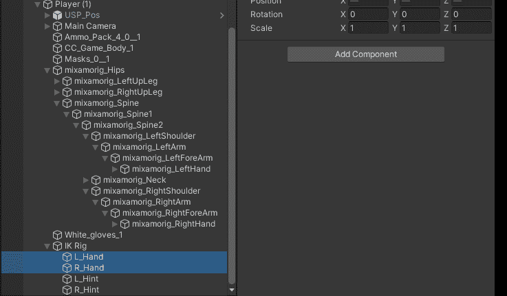
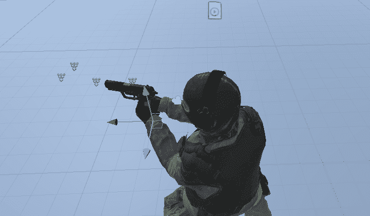

# 日积月累:在团结 IK 101

> 原文：<https://medium.com/nerd-for-tech/tip-of-the-day-ik-101-in-unity-3f79c42ae0ce?source=collection_archive---------7----------------------->

Ik 动画或反向运动学动画是“寻找一种有效的方式来确定关节的方向，使端点位于该位置。当你想让一个角色在用户选择的点接触一个物体，或者把它的脚令人信服地放在一个不平坦的表面上时，这可能是有用的。”(Unity 文档)

换句话说，以手臂为例，它由肩膀、手臂和手组成。可以使用它们的关节分别设置动画。但是使用 IK 你可以在手上增加一个控制点，通过控制这个点你可以控制整只手。

> 让我们设置它

A.您需要确保您的项目中安装了动画装配包。

动画装配包

B.我将在这个例子中使用的角色，是一个使用 Mixamo 动画制作的“人形”角色。现在将“装备构建器”组件添加到你的游戏对象中。

在我们的示例中，我们希望手的动画与枪一起出现，并使其感觉自然。关于 IK 装配很酷的一点是，你可以使用一个端点控制三个动画骨骼，这些骨骼将相应地移动和动画。

C.由于我想控制角色的双臂，我将创建一个 IK 装备空游戏对象作为角色的子对象，并在 IK 装备下创建另外四个子对象:两个用于手，两个用于肘(肘称它们为“提示”)。这些提示将负责确保肘部的位置，以便它们在设置 IK 动画时不会发疯。至于他们的位置，把手放在手上，提示放在手肘后面。

IK 装配子对象

IK 装备放置

D.在双手上添加“两个 Bon IK 约束”,并指定必要的对象。

右手也这样做。

这将允许我们只移动 L_hand 点，从而相应地移动整个手臂。

E.最后，在打开动画窗口，并在播放模式，开始动画你的 IK 点，你想他们在哪里。

正如你所看到的，手臂的 3 块骨骼只在一个点上移动，这可以给你的角色和动画带来很大的灵活性和生命力。