# 日积月累:实现 Unity 广告

> 原文：<https://medium.com/nerd-for-tech/tip-of-the-day-implementing-unity-ads-3cf97c1814ea?source=collection_archive---------6----------------------->

在处理移动项目时，战略性地投放广告将有助于你的玩家获得一些奖励，同时也有助于你为项目提供资金。

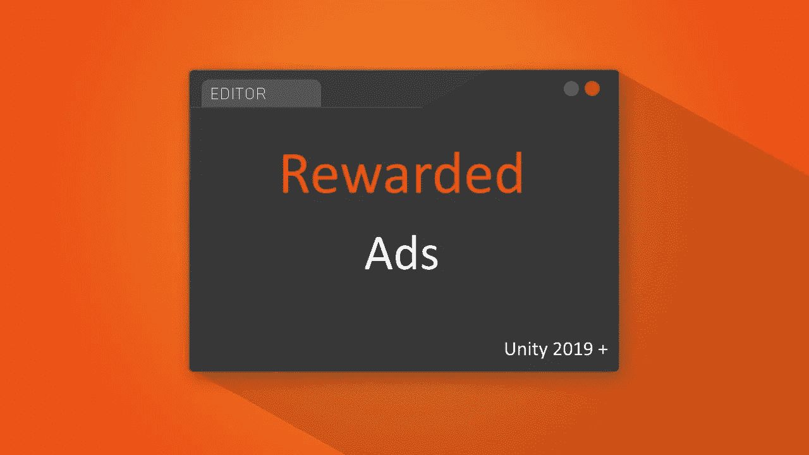

在 Unity 2019 之后，Unity 改变了你实施广告的方式，给你更多的自由和更多的选择来定制你的广告。让我们马上开始。

> A.团结服务

首先，我们需要启用 Unity Ads 和 IAP 服务。

A. 确保您的广告包是最新的并已安装。去**软件包管理器/ Unity 注册表/广告**。

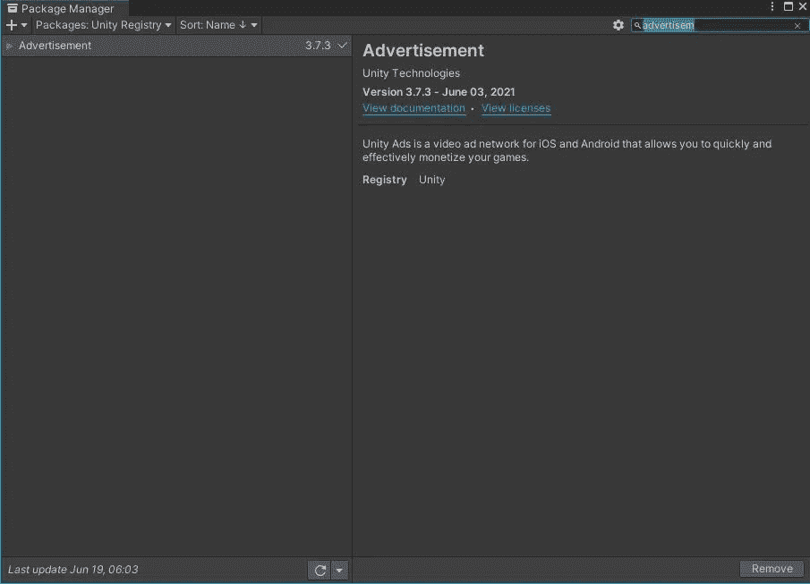

**B.** 打开**服务**选项卡。转到**窗口/通用/服务**。

**C.** 创建您的组织，并设置年龄目标(如果低于 13 岁或以上)。

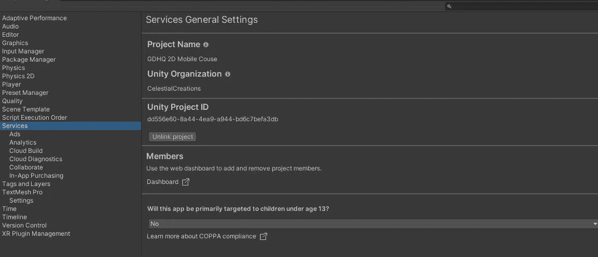

**D.** 在您的服务选项卡中，点击广告选项卡:

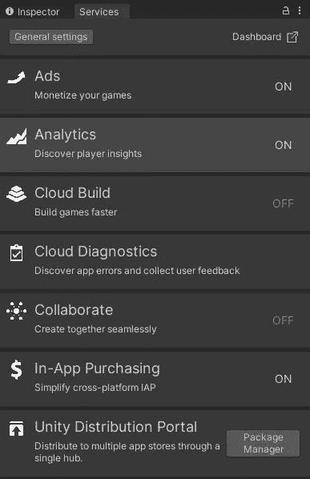

1.  打开广告
2.  打开“让你的游戏赚钱”
3.  如有必要，更新 Ads 包
4.  启用*测试模式*，以便在编辑器中测试您的广告。
5.  最后，从“游戏货币化”中打开仪表板。这将在您的浏览器中打开一个新窗口，并确保选择您正在处理的项目。

**E.** 在您的仪表板中，您需要确保执行以下步骤，以确保顺利实施和测试 Ads。

1.  打开项目设置
2.  广告提供商:把它改成 Unity(目前，你可以以后再改)
3.  测试模式:选择谷歌 Play 商店(或者苹果应用商店，如果你想的话)并启用测试模式

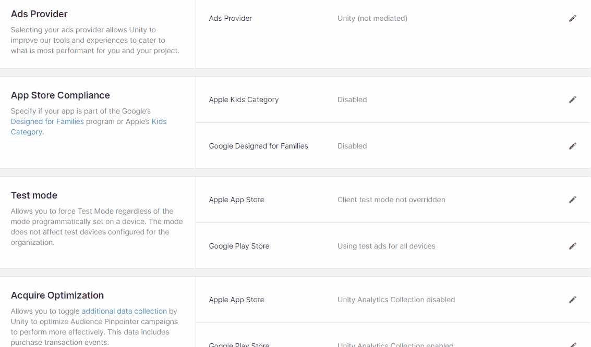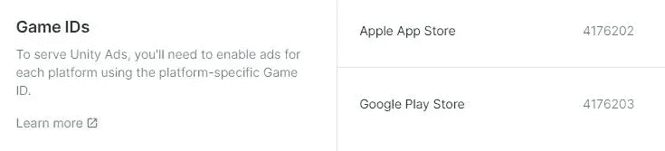

游戏 id

如果你做得好，这将会给你 google store 和 apple store 的项目游戏 ID，我们将在以后的实现中使用它们。

**F.** 最后，在你的仪表盘中，进入**位置**并定制你的广告。现在请注意奖励广告位置及其 ID。

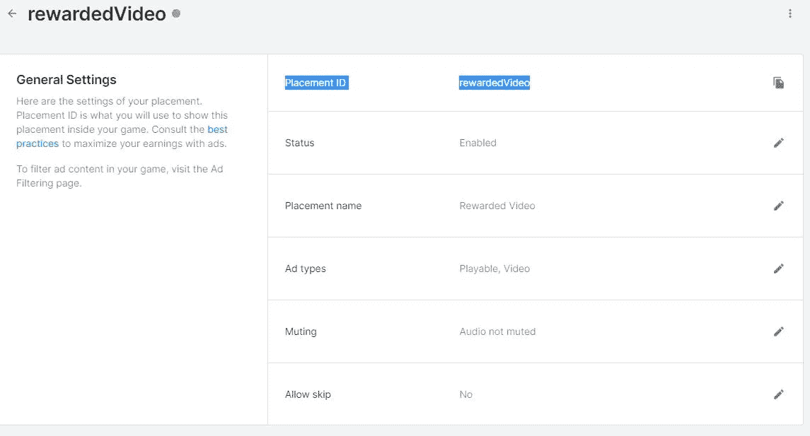

奖励广告

> 奖励广告的 ode 实现

在您实现代码之前，我们需要首先确定两件事。

1.  在**构建设置**中，确保切换到**安卓**或**苹果**。
2.  在服务选项卡中，转到**添加采购**，然后根据需要启用并更新它。

现在，创建一个 C#脚本，将其命名为“ *AdsManager* ”，并将其添加到一个游戏对象中，我们也将其命名为“AdsManager”。

快速解释一下:在 Unity 2019 之后，Unity 使用了一个接口“IUnityAdsListerner”，你必须在你的脚本中实现这个接口，以便“收听”和“初始化”你的奖励广告。

> 根据 Unity Docs 的说法:奖励观看广告的玩家增加了用户参与度，从而带来更高的收入。例如，游戏可以用游戏中的货币、消耗品、额外的生命或经验乘数来奖励玩家。有关如何有效设计奖励广告的更多信息，请参见广告最佳实践文档。
> 
> 为了奖励完成视频广告的玩家，使用 *ShowResult* 结果实现一个回调方法，以检查用户是否完成了广告并应该得到奖励。

A.使用 UnityEngine 添加命名空间。广告；

B.将 IUnityListerner 接口添加到脚本中。这将迫使您实现我们稍后将使用的四个方法。

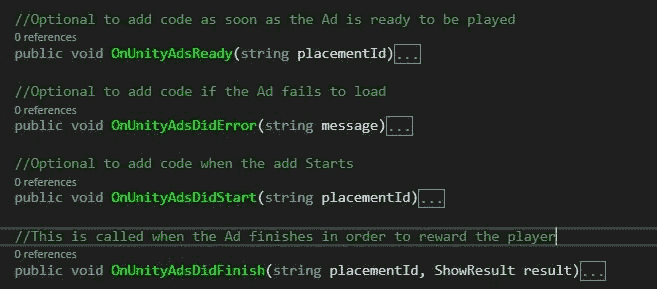

C.添加以下变量:

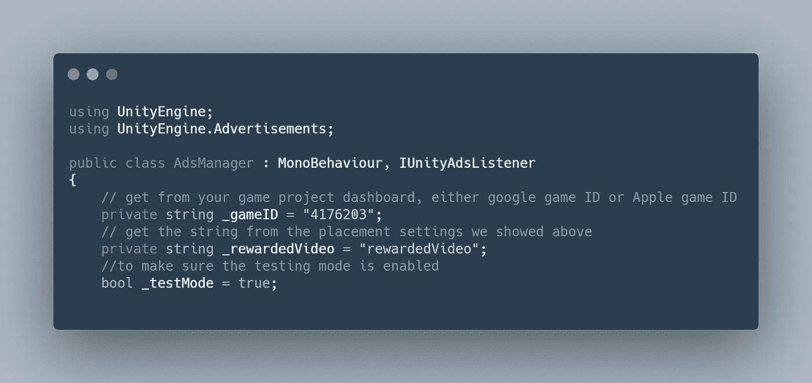

D.将脚本作为广告监听器添加到 Enable 中，将其从 Disable 中移除，并使用 gameID 初始化广告

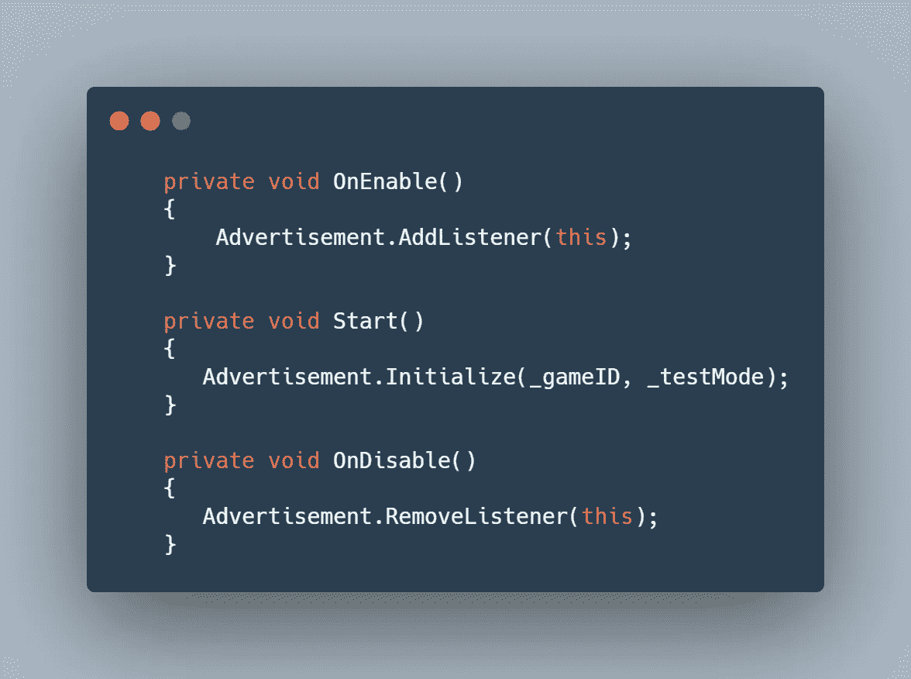

E.创建一个公共方法“ShowRewardedVideo ”,该方法将检查广告是否准备好，然后“显示”奖励的广告。

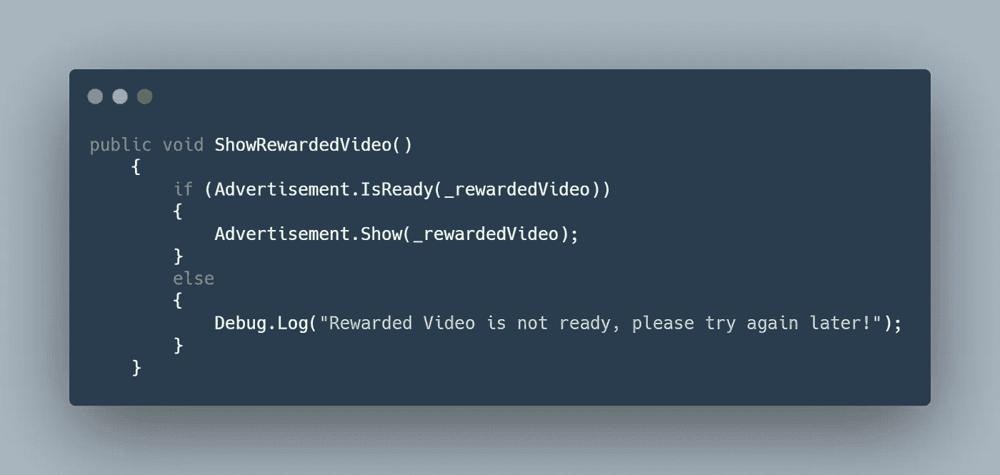

F.最后，在我们的项目中，使用完成方法上的接口的 IUnityAdsListner，当广告完成时，将奖励玩家 100 个钻石，如果广告失败，将显示一个警告。

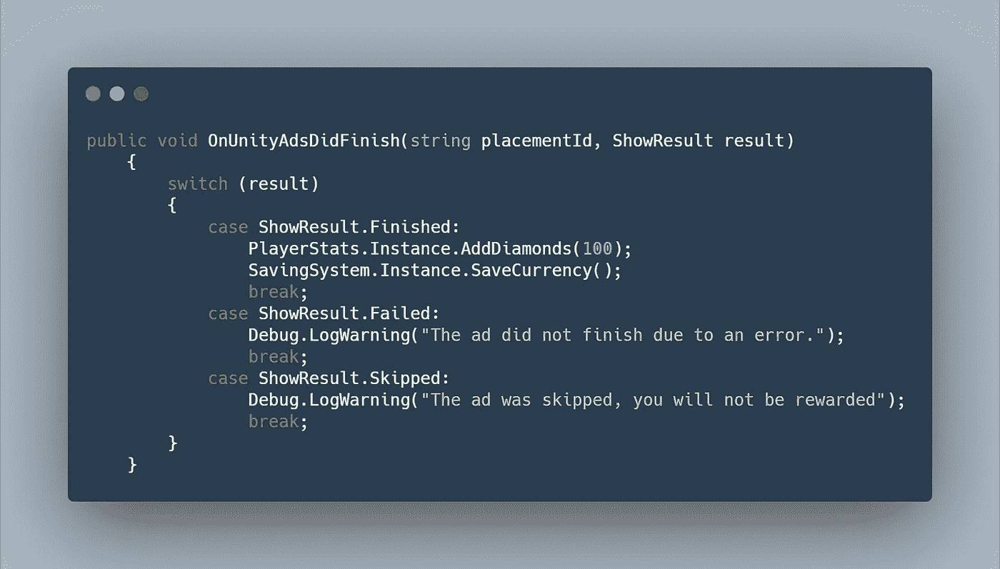

你可以点击以下链接在 pastebin 上查看最终剧本:【Pastebin.com[奖励广告](https://pastebin.com/WPhNrErz)

这是它在 Unity 编辑器中测试时的样子= >

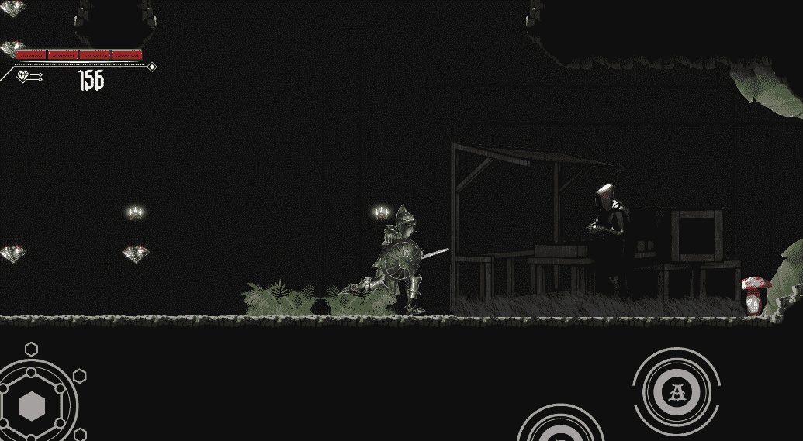

玩家在完成奖励广告后奖励 100 颗钻石