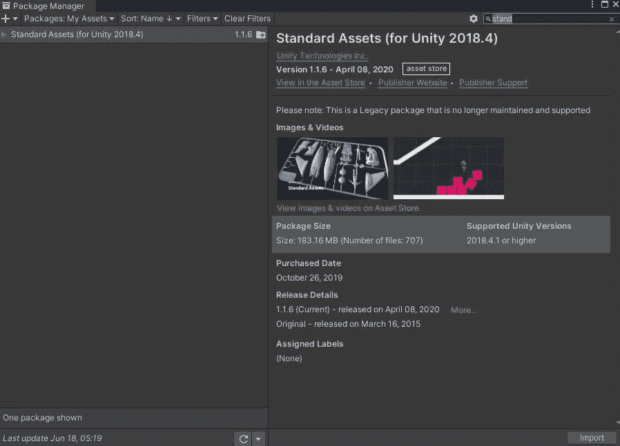
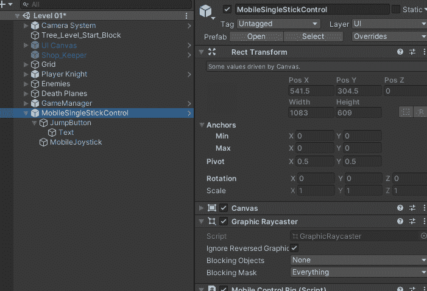
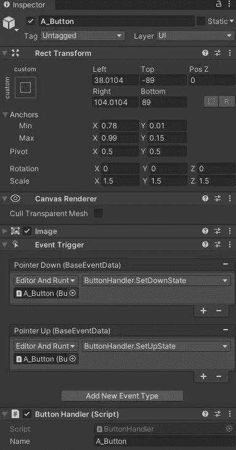

# 日积月累:手机输入 2D

> 原文：<https://medium.com/nerd-for-tech/tip-of-the-day-input-on-mobile-unity2d-3b7bf3c2f8cf?source=collection_archive---------10----------------------->

你已经在你的 PC/Mac 上完成了你的项目或原型，你想让你的玩家在他的移动设备上移动。你会怎么做？

如果你仍然没有在 Unity 中使用新的输入管理器，那么有一个快速简单的方法来做到这一点，这里是你如何使用 Unity 的跨平台输入。

## A.下载标准资产

转到[标准资产(适用于 Unity 2018.4) |资产包| Unity 资产商店](https://assetstore.unity.com/packages/essentials/asset-packs/standard-assets-for-unity-2018-4-32351)，并将资产添加到您的资产中。在 Unity 中，打开你的软件包管理器，切换到“我的资产”,找到标准资产，下载并点击导入。



您不需要导入所有内容，如果您愿意，您可以导入与“ *CrossPlatformInput* ”相关的所有内容。

## B.将游戏杆 UI 添加到您的游戏中

现在你已经在你的资产文件夹中有了标准资产，转到**资产/标准资产/交叉平台输入/预置，并把"*MobileSingleStickControl*"**"拖到你的场景中。添加到您的 UI 中，并确保它是 UI 中的最后一个项目，这样它就不会被其他 UI 元素阻止



预设将有一个操纵杆和一个跳跃按钮。现在你可以随意改变游戏杆和按钮精灵，还可以添加更多的按钮。


它在我的项目中的外观

## C.代码实现

在处理玩家输入的脚本中，首先也是最重要的是，您需要使用 UnityStandardAssets 添加名称空间"*。CrossPlatformInput*”。这将允许您访问跨平台输入管理器。

对于操纵杆，就像您从 unity 的输入管理器中获取轴一样，您也可以对 CrossPlatformInput 的水平和垂直输入进行同样的操作。

```
_xHorizontal = CrossPlatformInputManager.GetAxisRaw("Horizontal");
```

在我的例子中，我想控制水平移动，所以我从 CrossPlatformInputManager 访问 GetAxis。



至于按钮，MobileSingleStickControl 中的每个按钮都有一个 ButtonHandler 脚本，该脚本带有一个名称变量，您可以更改该变量并将其编程为您的输入。

在我的例子中，我将第一个按钮重命名为 A_Button。

为了使用按钮，我们将使用下面的代码

```
CrossPlatformInputManager.GetButtonDown("A_Button")
```

就像你注册键盘上的按钮一样。

这样你就可以在游戏中设置更多的按钮。

这是它在我的项目中的样子:


跨平台输入管理器