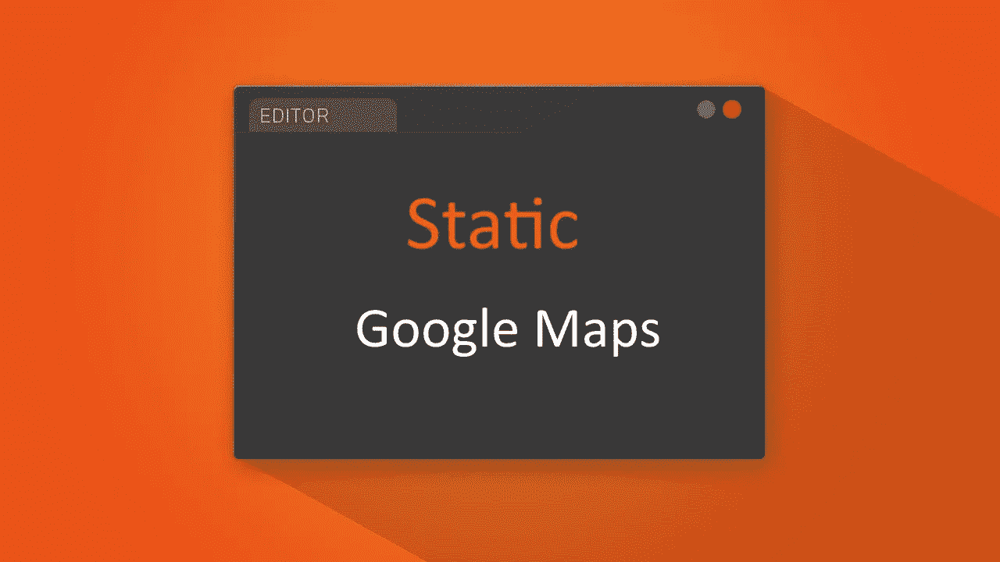
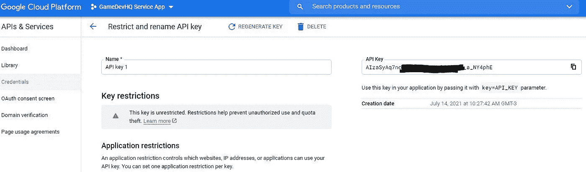
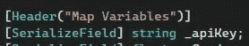
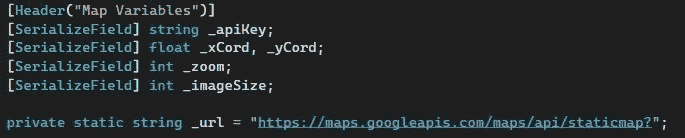
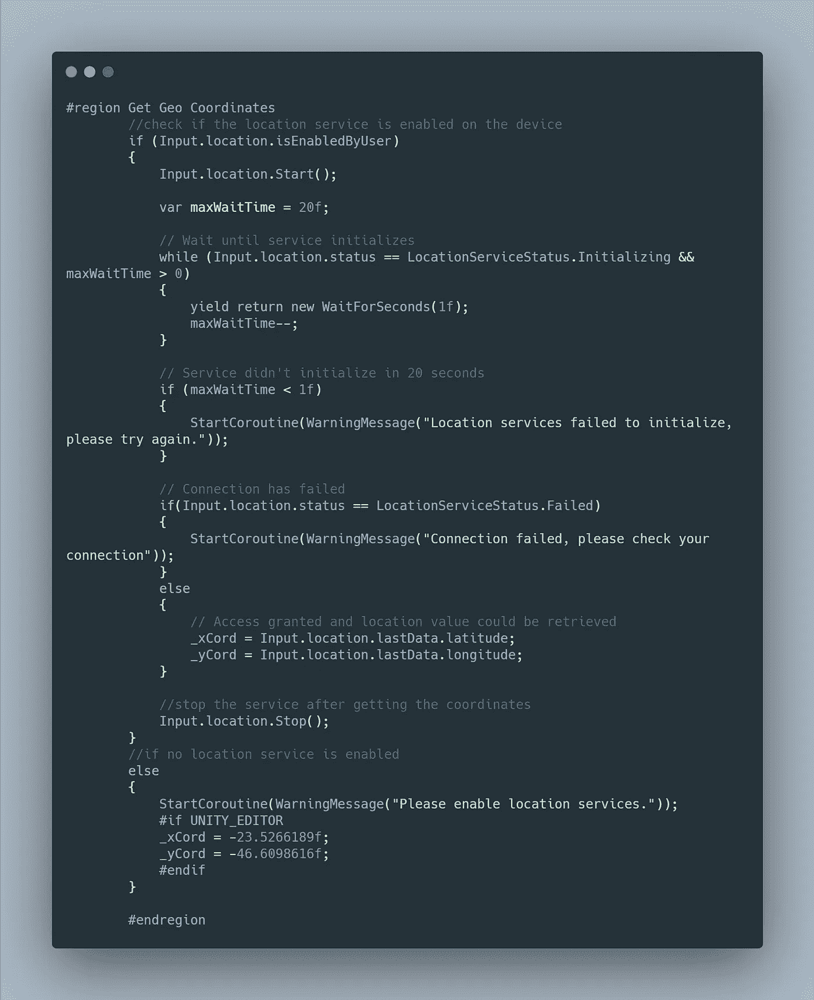
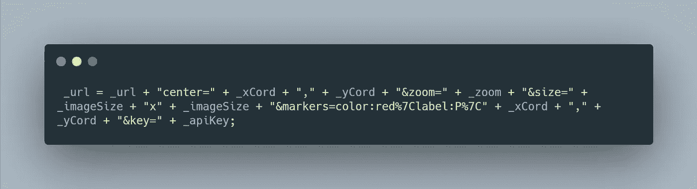
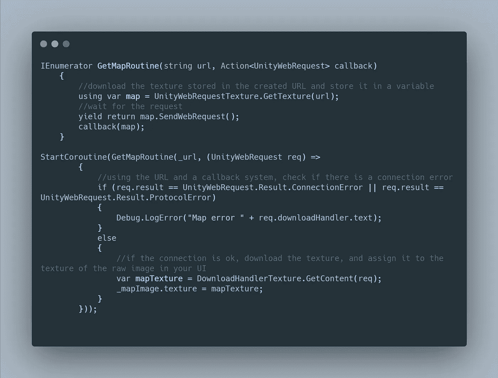
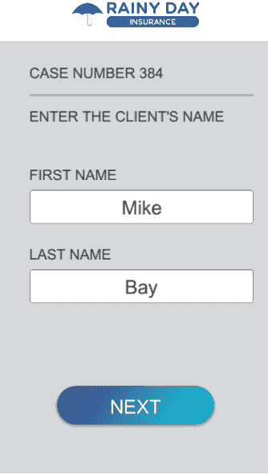

# 每日要闻:将静态谷歌地图集成到 Unity 中

> 原文：<https://medium.com/nerd-for-tech/tip-of-the-day-integrating-static-google-maps-into-unity-5505957b14f?source=collection_archive---------11----------------------->

如今，许多应用程序和一些游戏都实现了一个静态地图，可以直接从谷歌地图下载地理位置信息。该信息然后显示在一个单一的图像上，因此单词“静态谷歌地图”。在本文中，我们将看到如何让静态谷歌地图应用编程接口工作，并在您的统一项目中实现它。



作为一个快速概述，这种方式是通过 unity 发送一个 URL 请求，这是一个 HTTP 请求，将返回我们所在或想要的地图位置的图像。

> 谷歌地图应用编程接口密钥

首先，您需要获取一个称为谷歌地图应用编程接口密钥的认证密钥。为此，请遵循以下链接[中的说明开始使用谷歌地图平台|谷歌开发者](https://developers.google.com/maps/gmp-get-started)。在那里，您将需要创建一个项目，并生成一个“静态谷歌地图应用编程接口密钥”。你需要确保这是一个静态的谷歌地图项目。



静态映射应用编程接口密钥

现在复制您的 API 并暂时保存在您的机器上。

> 统一设置

以我们的示例([Unity Progression Report 中的移动应用开发](https://aws.plainenglish.io/mobile-apps-development-in-unity-progression-report-2-1be62611dcaa))为例，我们希望允许用户拍摄其位置的快照，以便将其保存在案例数据概览中。

在我们用来抓取地图的 C#脚本中，创建一个变量来存储您可以在检查器中指定的 API。



存储应用编程接口密钥

## 有待采取的步骤

A.使用 url 请求下载静态地图

B.将下载的地图应用于项目中的 rawImage UI 元素。(普通图像元素不起作用，原始图像 UI 元素必须用于接受下载的地图纹理)

## 下载地图

如果我们按照使用静态谷歌地图的概述([概述|地图静态 API](https://developers.google.com/maps/documentation/maps-static/overview) )进行操作，您会发现您发送网络请求时将使用的 URL。

```
URL: https://maps.googleapis.com/maps/api/staticmap?
```

该网址将采用参数来下载地图。这些参数是位置参数纬度和经度、地图缩放级别和图像大小。我们将使用这 4 个参数，将它们作为字符串附加到上面的链接中。下面是一个例子:

```
https://maps.googleapis.com/maps/api/staticmap?center=Brooklyn+Bridge,New+York,NY&zoom=13&size=600x300
&key=YOUR_API_KEY
```

1.  让我们为参数和 URL 创建变量，以便于构建它。创建一个 xCord(代表纬度)、yCord(代表经度)、zoom、imageSize 和一个静态字符串作为 URL 的基础。在检查器中将缩放设置为 14，将图像大小设置为 400。



因素

2.在我们将参数添加到 URL 之前，我们需要获取实时地理坐标，并将它们分配给 xCord 和 yCord。



分配 xCord 和 iCard

3.现在我们已经获得了坐标，我们可以很容易地用我们将用来下载地图图像的参数构造 URL。



向 URL 添加坐标、缩放级别、图像大小和 API 键

4.使用这个 URL，我们将使用一个 Unity Web 请求，它使用该 URL 请求下载该 URL 存储的数据。



下载地图纹理

完成所有这些步骤后，一旦用户到达地图页面，地图将自动下载到原始图像上。



静态地图

这里是您实验的全部代码的链接:[静态谷歌地图—Pastebin.com](https://pastebin.com/SaR2pC8R)