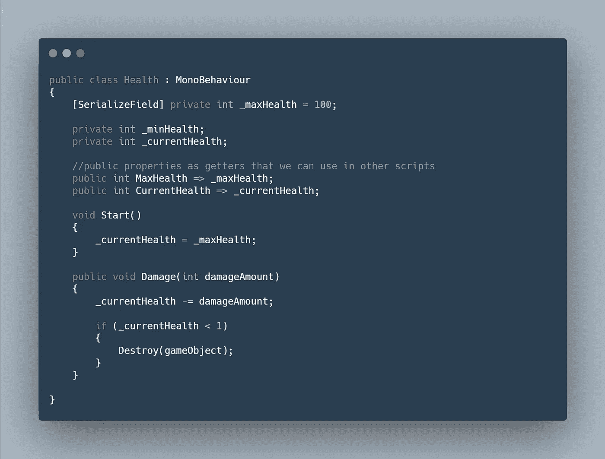
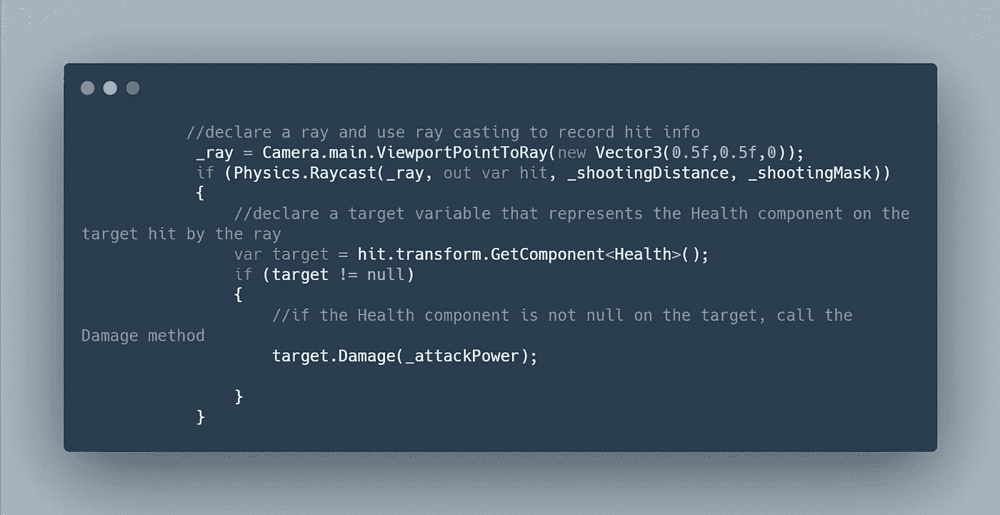
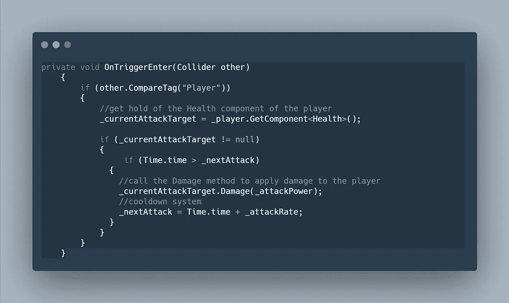
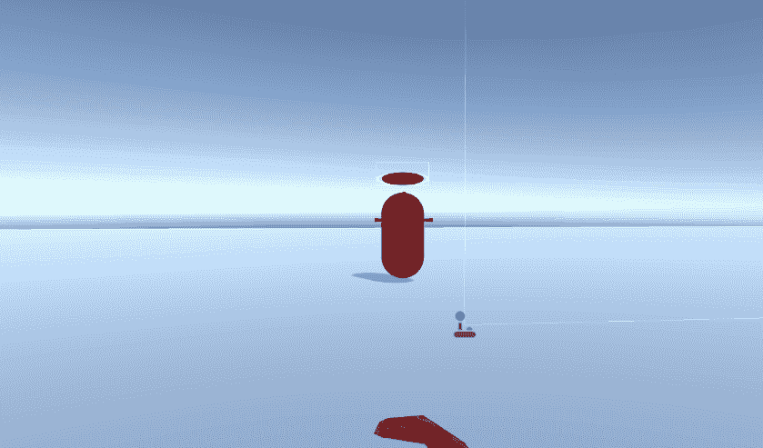

# 日积月累:模块化卫生系统单元

> 原文：<https://medium.com/nerd-for-tech/tip-of-the-day-modular-health-system-unity-8f5d2f187027?source=collection_archive---------4----------------------->

如果你一直关注我们的游戏开发总部项目([僵尸进展报告:玩家运动&射击](/geekculture/zombie-progression-report-player-movement-shooting-unity-3d-3e4f2925a4a2))，那么你会知道我们正在创建一个 FPS 动作原型。

当然，我们必须在游戏中加入一个健康系统。僵尸会攻击你，你会攻击他们。为了更加高效和多产，我们将创建一个模块化的健康系统，既可以用于敌人，玩家，也可以扩展到易碎物品。

> 目标:创建一个模块化的卫生系统

一般来说，玩家和敌人都有一些共同点，比如最大生命值、当前生命值和受到的伤害。因此，我们将利用这些来创建卫生系统。

A.创建一个 C#脚本，并将其命名为 Health。

B.创建两个 int 变量(如果愿意，可以选择 floats)。一个是 _maxHealth(序列化它，这样你可以在检查器中设置它)，第二个是 _currentHealth，它将保持私有，我们将使用它来跟踪玩家或敌人的当前健康。

C.开始时，确保将 _currentHealth 设置为 _maxHealth。

D.最后，创建一个伤害方法，该方法将伤害量作为一个参数，我们将使用它来降低当前的生命值，并在生命值为零时摧毁该对象。现在将脚本附加到玩家和敌人身上。

代码是:

> 我们如何利用这一点？

F 或者玩家:我会用我们僵尸项目里用的例子(这里读= > [射线投射](https://levelup.gitconnected.com/tip-of-the-day-ray-casting-in-unity-abcdc8700366))我用射线投射是为了开枪。利用击中信息，它给出了光线和目标之间碰撞的信息，我们将得到击中目标的“健康”成分，并调用损害方法。

F 或者敌人:敌人会基于一个触发来攻击玩家，所以我们会利用碰撞信息来检测玩家的生命值成分，并调用其中的伤害方法。

使用这个系统，你可以杀死敌人，而敌人也可以用一个健康脚本杀死你。现在，从技术上来说，你可以将这个健康脚本添加到不同的对象中，例如，如果你想破坏它们。

我们将在以后的文章中深入探讨我是如何创建健康栏的。