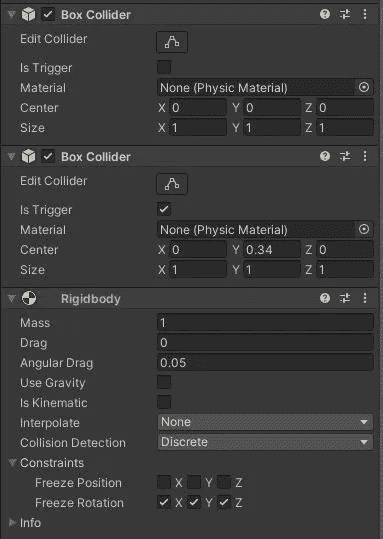
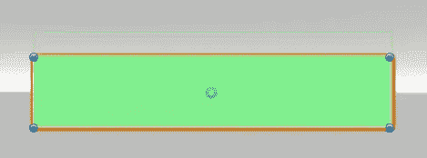
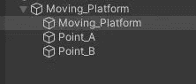
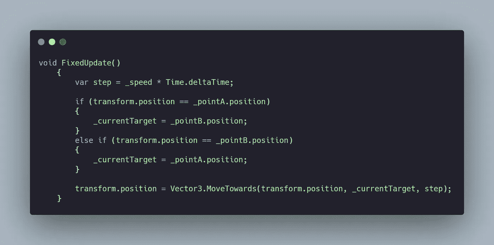
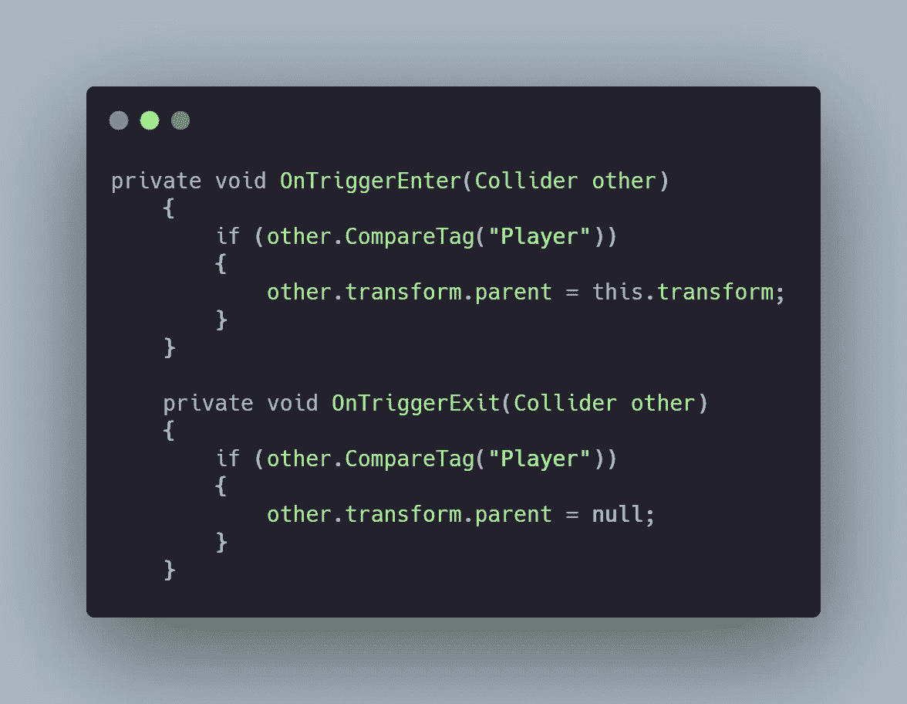

# 日积月累:移动平台统一 2D

> 原文：<https://medium.com/nerd-for-tech/tip-of-the-day-moving-platforms-unity-2d-257d23b5be1b?source=collection_archive---------2----------------------->

一个非常酷的功能，你可以随时添加到你的 2D 游戏是一个移动平台。在两点之间水平或垂直移动的平台。我们来看看如何实现。

> 目标:移动平台

1.  创建父游戏对象来控制平台和航路点。右键单击>创建空。

2.在父对象中创建一个立方体或任何你想要的平台精灵，并确保它有两个碰撞器和一个刚体(确保不要使用重力，否则平台会掉下来)。一个碰撞器将允许玩家站立，并设置第二个碰撞器触发，并确保触发碰撞器的边界在平台上方，以便它可以检测到玩家(稍后将解释原因)。

一个普通碰撞器和另一个触发碰撞器

触发碰撞器边界在平台上方

3.在父平台中创建两个空对象，作为我们的路点。

存放移动平台和路径点的父容器。

4.创建一个 C#脚本，并将其附加到将实际移动的子移动平台。序列化速度值和路点的两个变换。

## 代码

我们将依赖于矢量 3。移动朝向方法，允许平台以规定的速度从初始位置移动到目标位置。为了改变目标航路点，我们简单地检查平台是否在航路点 A，然后目标是航路点 B，反之亦然。为了平稳移动，让我们使用*固定更新*()。

步长是计算出的速度

最后非常重要的一步。我们添加的触发碰撞器，我们现在将使用它来检测玩家是否在平台上。如果他在上面，那么我们把玩家的父变换设置为平台，如果不是，那么我们把它设置为空。这将确保当玩家跳到平台上时，他呆在上面，不会掉下来。

这就是结果=== >

