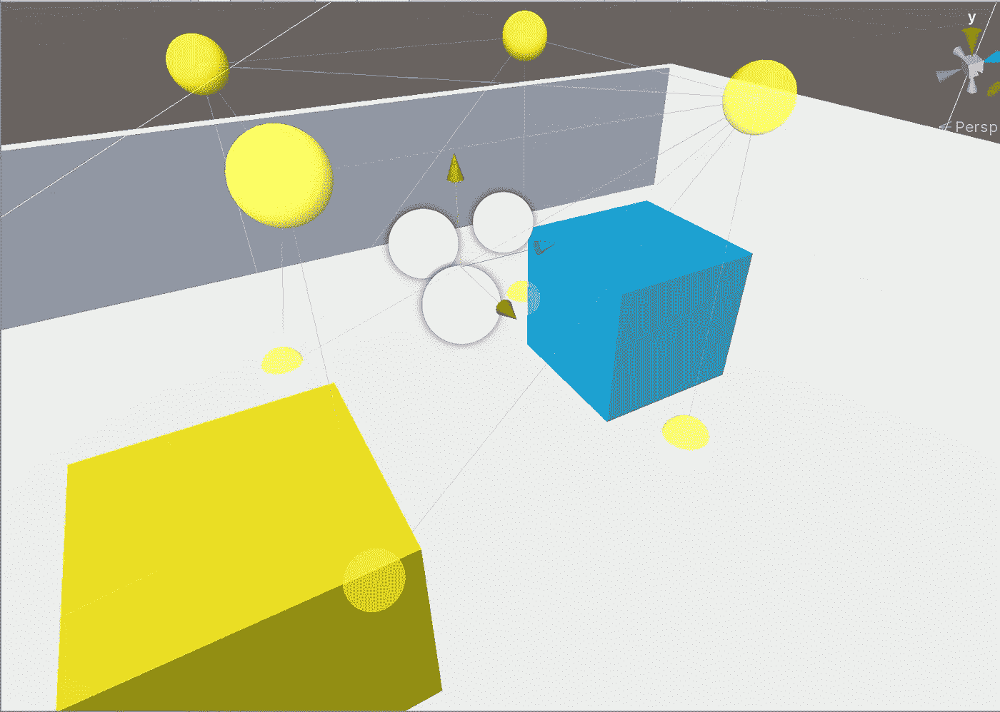
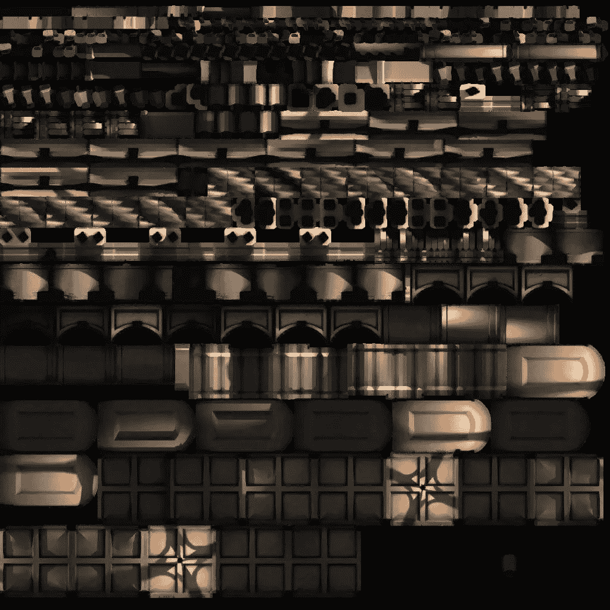
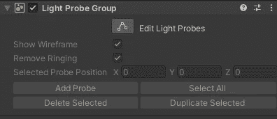
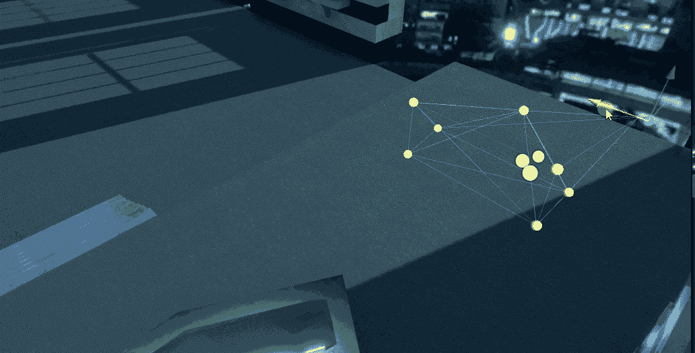

# 日积月累:Unity 中光探针的力量

> 原文：<https://medium.com/nerd-for-tech/tip-of-the-day-power-of-light-probes-in-unity-ac60515475f9?source=collection_archive---------5----------------------->

照明通常是影响你游戏的最费力的特性之一。所以给你的游戏增加很多光源肯定会影响你游戏的性能。在游戏中使用实时照明的一个非常有效的方法是使用光探头。

光探头组

> 光探针:它们是什么？你如何使用它们？

现在不要进入太多的细节，你的场景中的光是通过一个烘焙光的过程存储的，Unity 通过这个过程将你的场景中的光的数据存储在高质量的大纹理贴图中，并覆盖在你的对象上。

光照贴图示例

这些烘焙的灯光对你所有的静态物体(地形，环境等)非常有用。

但是你的移动物体比如你的玩家或者敌人呢？增加更多的光源肯定会影响你的表现。

光探头的好处来了。

灯光探头将使用场景中烘焙照明的存储信息，有效地为移动对象添加高质量的灯光。它们照亮穿过场景的对象。

要创建光探头组，请转到**创建>照明>光探头组。这将在你的场景中添加一个光探测器组，然后你可以根据自己的喜好进行配置。**

单击编辑光探头开始编辑您的探头

轻松移动探针和创建新探针

使用光探头时，请记住以下几点:

1.  将探针放在光线不同的地方，例如一个探针在红光区，另一个在蓝光区或从亮到暗的过渡区。
2.  不要将探头放在物体内部，因为这将导致探头变暗
3.  为了获得最佳效果，请确保在烘焙之前将静态对象标记为静态，这将确保场景的光照贴图被正确烘焙
4.  慢慢放置探针

如果你想知道更多关于光探针的细节，请在评论中告诉我。