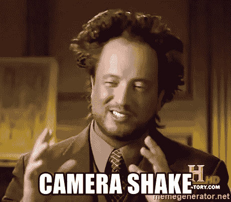
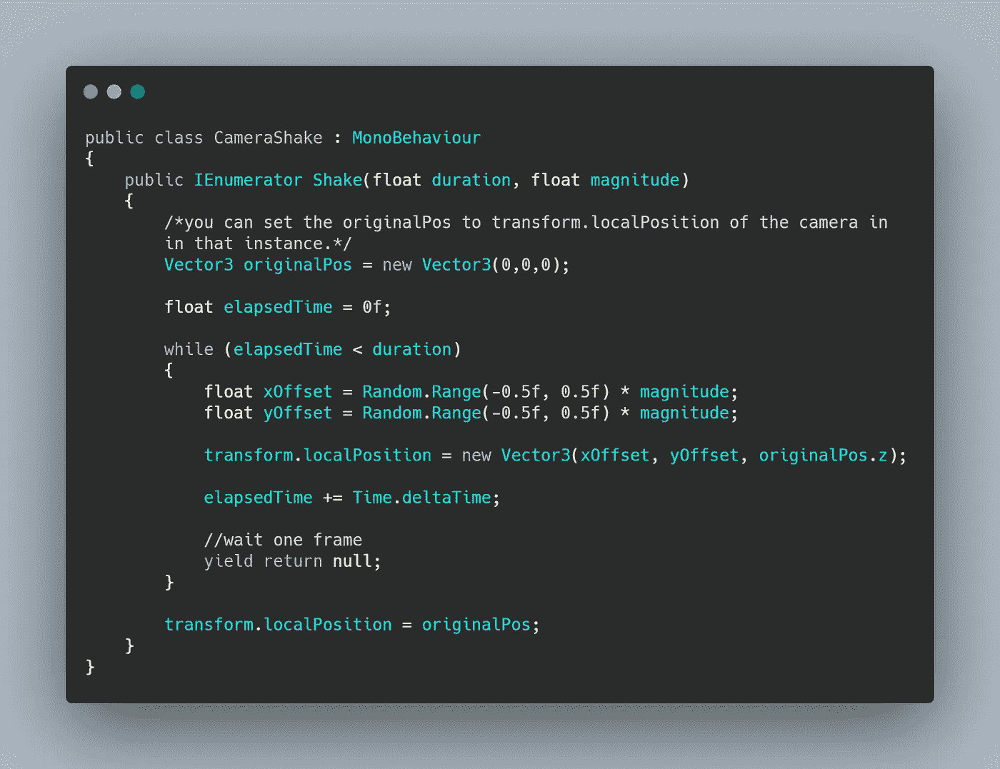

# 日积月累:在 Unity 简单的 2D 相机抖动

> 原文：<https://medium.com/nerd-for-tech/tip-of-the-day-simple-2d-camera-shake-in-unity-521d454ac89b?source=collection_archive---------5----------------------->

增加玩家在游戏中沉浸感的最好方法之一是相机抖动。

当玩家受到伤害时，相机抖动对于爆炸或者收藏品特别有用。

如果你没有使用 Cinemachine，这里有一个简单的方法。



从创建一个 C#脚本开始，称它为 CameraShake(或者任何你想叫的名字),并把它连接到你的主摄像头上。

```
//This script will only hold the function that you are going to call when needed from other scripts// Create an IEnumerator that takes two variables
// A variable to control the duration of the shake
// Another variable to control the magnitude of the shake// Start the method by declaring a new Vector3 originalPos to determine the camera's starting position 
//Declare a float for elapsedTime and set it to 0f//For the shake: best do it in a while loop as long as the elapsedTime is less than the duration of the shake//In the while loop, set two floats, one for the xOffset and one for the yOffset and multiply each by the magnitude (it is good to use a random range for each offset// Set the localPosition of the camera based on these two offsets
// finish the loop by incrementing the elapsedTime with Time.deltaTime//Finally after the loop is done, set the localPosition to the originalPos and close the IEnumerator method
```

使用这个脚本在你需要的时候调用 shake。如果你准备好迎接挑战，那么试着用上面的伪代码写代码。

这是最终的结果



摧毁小行星或受到伤害时，相机会抖动

最后要注意的是，为了在主摄像机回到初始位置时获得最佳效果，你需要在它自己的父游戏对象中添加子摄像机

