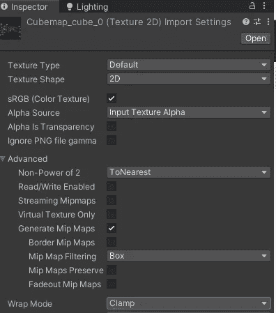
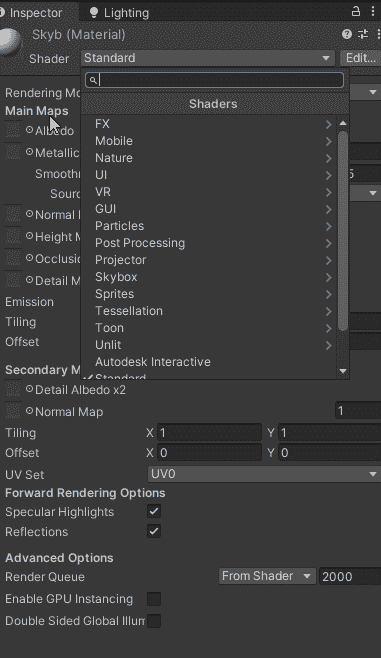
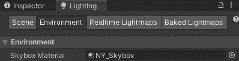
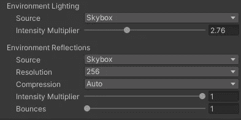

# 日积月累:Unity3D 中的 Skybox 101

> 原文：<https://medium.com/nerd-for-tech/tip-of-the-day-skybox-101-in-unity3d-d0b043ece592?source=collection_archive---------5----------------------->

让你的游戏充满活力的最好方法之一就是通过天空盒。这几乎就像给人一种错觉，好像在你游戏的远处地平线上有什么东西，但实际上它只是一个天空盒。

> 那么 Unity3D 中的 Skybox 是什么，怎么用？

基本上一个天空盒包裹着你的整个场景。它呈现在所有游戏对象的后面，显示在你游戏的地平线和天空中。

它可以是 6 面纹理或镶嵌球体。

## 怎么用？

*   首先，你需要将你的 6 个纹理(图像)导入到项目的资产文件夹中。

为了获得更好的效果，将每个纹理的*包裹模式*改为*夹钳*，这将确保每个纹理边缘的颜色与其他纹理匹配。

*   接下来创建一个**材质创建- >材质。**
*   在创建的材质的检查器中，将着色器更改为**天空盒/6 面。**

*   现在将每个纹理分配到其对应的纹理槽中。
*   创建了新的天空盒材质后，在**窗口/渲染/光照**中分配它。在“照明”选项卡中，选择您创建的天空盒材质。

你甚至可以利用来自天空盒的灯光和反射来改变场景的外观。

这是有和没有天空盒时场景的样子。

> 根据 Unity 文档的快速提示

*   你可以添加一个 skybox 组件到你的任何一台相机上，当你想让每台相机都有不同的外观和感觉时，这是很有用的
*   确保将相机的清晰模式设置为天空盒
*   匹配你的雾的颜色到你的天空盒